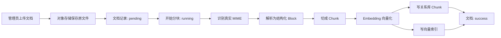
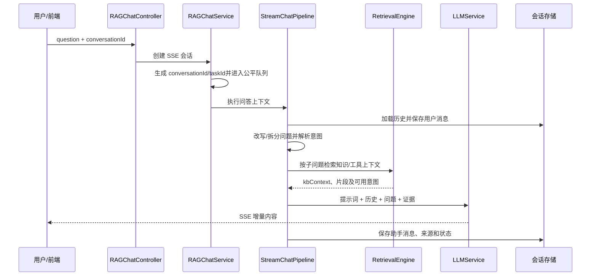
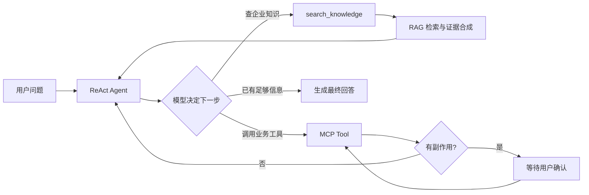
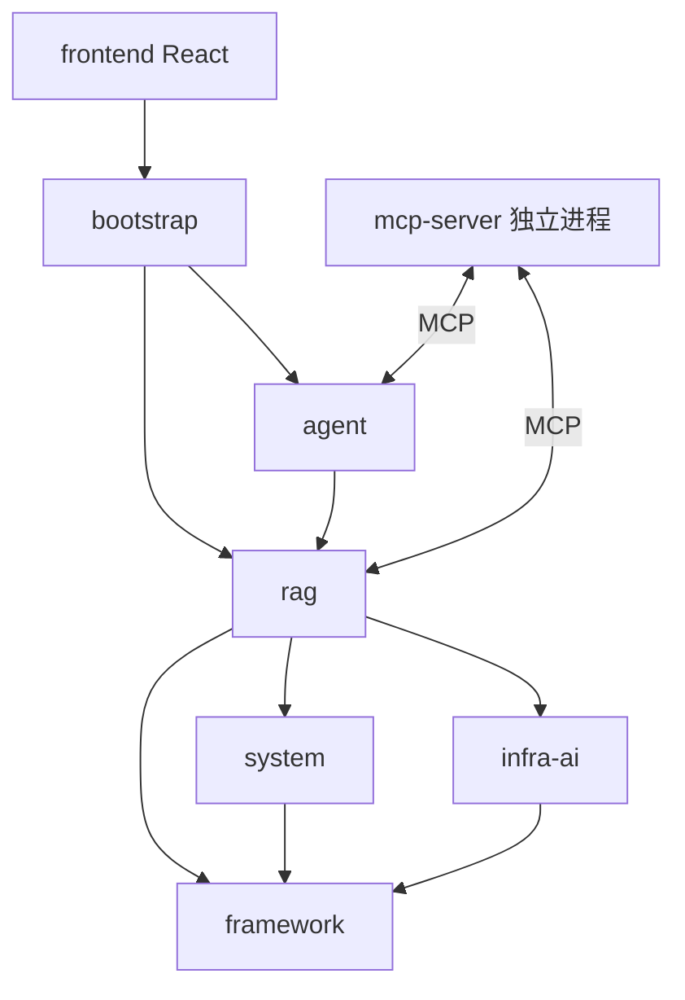

# 原项目分析

## 1. 一句话定位

Ragent 是一个 Java 实现的企业知识助手平台：它把文件和远程内容加工成可检索知识，让用户基于企业资料获得带来源的流式回答；在 Agent 模式下，还能由模型自行选择知识检索或外部业务工具来完成任务。

## 2. 用户与核心需求

### 普通用户

- 用自然语言询问企业制度、产品、售后或业务数据。
- 连续追问，不必每轮重复上下文。
- 尽快看到流式回答，并能停止生成。
- 查看回答依据，判断答案是否可信。
- 在 Agent 场景中让系统查询或修改外部业务数据；写操作执行前能确认。

### 管理员/知识运营人员

- 创建知识库，上传文件或配置远程文档。
- 观察文档是否成功解析、分块并建立索引。
- 管理知识片段、意图、模型和系统设置。
- 通过反馈、Trace 和审计判断效果与定位问题。

## 3. 最重要的 Happy Path

### 3.1 知识进入系统



关键源码坐标：

- `rag/.../knowledge/controller/KnowledgeDocumentController.java`：上传与开始分块入口。
- `rag/.../knowledge/service/impl/KnowledgeDocumentServiceImpl.java`：文件记录、事务消息和文档状态。
- `rag/.../knowledge/mq/KnowledgeDocumentChunkConsumer.java`：异步消费分块任务。
- `rag/.../core/ingest/DefaultIngestionKernel.java`：MIME → parse → chunk → embed → index 的固定主链。
- `rag/.../knowledge/sink/RelationalChunkSink.java`：写 `t_knowledge_chunk`。
- `rag/.../rag/core/vector/sink/VectorChunkSink.java`：写向量存储。

当前实现的重要事实：知识文档的 `processMode=pipeline` 在 `KnowledgeDocumentServiceImpl.runChunkTask` 中会显式失败，注释说明该模式正在重构；因此稳定主链是直接分块内核，不应把自定义 Pipeline 误判为此入口当前可用的 Happy Path。仓库另有独立的摄取 Pipeline API 和执行引擎，可作为设计参考。

### 3.2 固定工作流 RAG 问答



其中存在两个正常短路：问题有歧义时先返回澄清提示；全部属于系统/闲聊意图时不检索知识，直接调用模型。检索为空时返回“未检索到相关内容”，避免无证据生成。

关键源码坐标：

- `rag/.../rag/controller/RAGChatController.java`
- `rag/.../rag/service/impl/RAGChatServiceImpl.java`
- `rag/.../rag/service/pipeline/StreamChatPipeline.java`
- `rag/.../rag/core/retrieval/RetrievalEngine.java`
- `rag/.../rag/core/retrieval/MultiChannelRetrievalEngine.java`
- `rag/.../rag/service/handler/StreamChatEventHandler.java`

### 3.3 Agent 问答



Agent 模式不是把固定管线整体删除，而是把 RAG 封装为 `search_knowledge` 工具。主 Agent 通过 ReAct 循环决定何时查知识、何时调用 MCP、何时完成；会话状态保存在 PostgreSQL。技能中间件只在手册加载后暴露相应工具，写工具可进入人工确认流程。

关键源码坐标：

- `agent/.../controller/AgentChatController.java`
- `agent/.../service/impl/AgentChatServiceImpl.java`
- `agent/.../config/ReActAgentProvider.java`
- `agent/.../tool/KnowledgeSearchTool.java`
- `agent/.../tool/McpToolBridge.java`

## 4. 问答数据如何流动

一个问题以普通字符串进入，随后逐渐获得上下文：

```text
"公司的退货期限是多少？"
  ↓ 加载近期 ChatMessage
RewriteResult(rewrittenQuestion, subQuestions)
  ↓ 意图解析
List<SubQuestionIntent>
  ↓ 多通道召回与后处理
List<RetrievedChunk>
  ↓ 上下文格式化
RetrievalContext(kbContext, mcpContext, intentChunks, eligibleIntentIds)
  ↓ Prompt 组装
List<ChatMessage>(system, history, evidence, user)
  ↓ 模型流式输出
message/thinking SSE delta
  ↓ 完成收尾
ConversationMessage + SourceRef + messageStatus
```

最关键的边界是：

- 原始文档不是直接送给模型，先被解析和切成片段。
- 向量只是检索手段，真正送给聊天模型的是命中的文本上下文。
- 检索片段 `RetrievedChunk`、用户可见来源 `SourceRef`、数据库消息不是同一种数据。
- `conversationId` 表示长期对话，`taskId` 表示一次正在运行且可取消的生成任务。

## 5. 模块关系



| 模块 | 核心职责 | 复杂度来源 |
|---|---|---|
| `rag` | 知识库、摄取、检索、意图、会话、问答、来源、反馈、Trace | 主业务编排、多种数据和检索路径 |
| `infra-ai` | Chat/Embedding/Rerank/VLM 客户端、模型选择、健康与降级 | 外部模型不稳定、不同供应商协议差异 |
| `agent` | ReAct、工具目录、MCP 桥、技能、确认、上下文和长期记忆 | 动态循环、异步事件、状态持久化和安全 |
| `framework` | Web 响应、异常、用户上下文、幂等、MQ、SSE、任务取消 | 跨业务的工程机制 |
| `system` | 认证、用户、审计、示例问题 | 平台支撑 CRUD 与权限 |
| `bootstrap` | 启动类与配置装配 | 大量外部组件配置 |
| `mcp-server` | 可独立部署的示例业务工具 | MCP 协议和演示数据库 |
| `frontend` | 用户问答、来源预览、Agent 时间线、管理后台 | 页面数量与交互样板 |

## 6. 真正值得教学的复杂度

1. RAG 数据闭环：文档为什么要解析、分块、Embedding、检索，再交给聊天模型。
2. 检索质量：字面匹配为何不够，向量召回、关键词召回、融合、精排和证据门槛各解决什么。
3. 状态与异步：耗时入库为何变成任务，如何保证状态、日志和失败路径可观察。
4. 会话与流式：模型输出不是一次性字符串；如何累积、推送、取消并最终落库。
5. 外部模型可靠性：超时、空响应、供应商故障如何隔离与降级。
6. 动态 Agent：固定管线可控但不适合开放式任务；ReAct、工具协议、技能和人工确认解决什么。
7. 可观测闭环：来源、反馈、Trace 和审计如何把“模型看起来不对”变成可定位的问题。

## 7. 原项目分析范围与证据

预热重点阅读了根 README、父/子 POM、主配置、数据库 Schema、RAG 控制器与管线、检索引擎、流式回调、文档上传/分块服务、摄取内核与落点、Agent 入口/Provider/工具桥/技能/记忆。另运行以下代表性测试并通过：

- `KnowledgeSearchFacadeTest`
- `StreamChatPipelineTest`
- `RetrievalEngineTest`
- `ChunkingFixtureTest`

共 14 个测试，0 failure，0 error。该验证证明核心理解与仓库当前实现一致，但不等于全仓库或所有外部基础设施均已启动验收。
