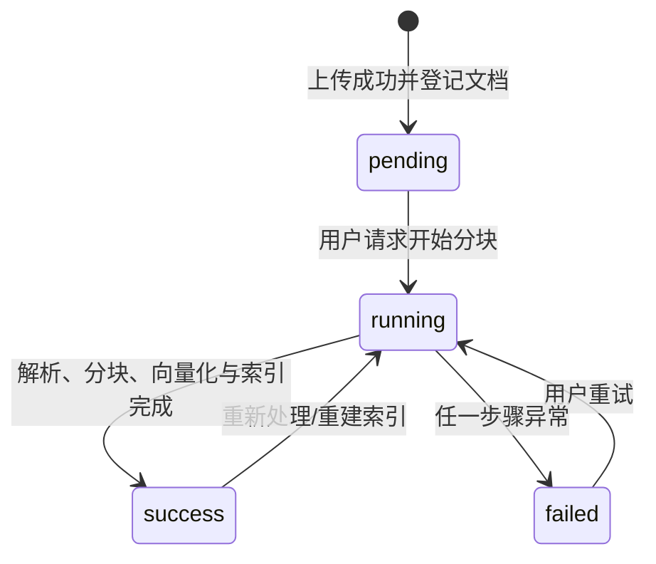
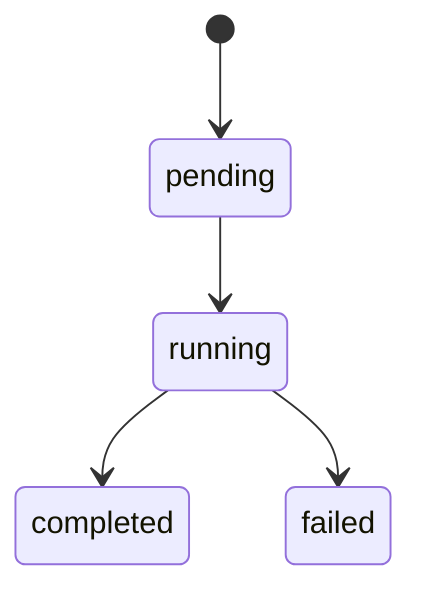
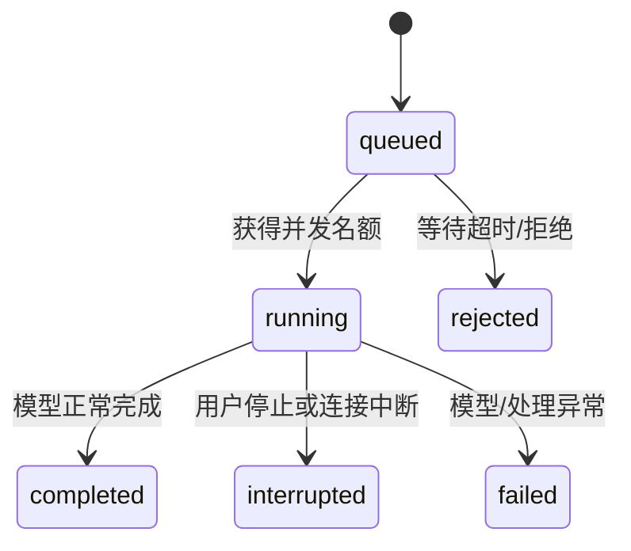
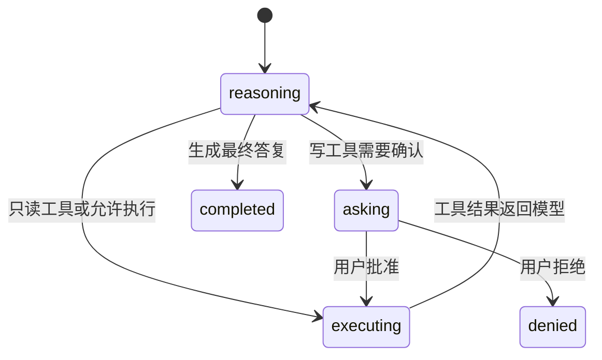

# 核心数据与状态

## 1. 数据地图

| 数据 | 从哪里产生 | 经过哪里 | 保存在哪里 | 被谁使用 |
|---|---|---|---|---|
| 文档原始字节 | 上传文件或远程抓取 | 文件存储服务、解析器 | S3/OSS 类对象存储 | 摄取内核、原文预览 |
| 文档记录 | 上传服务 | 文档状态更新 | PostgreSQL `t_knowledge_document` | 管理端、分块任务、检索元数据富化 |
| 结构化 Block | 文档解析器 | 分块服务 | 默认只在一次摄取内存中 | 不同类型的分块器 |
| Chunk | 分块服务 | Embedding、索引扇出 | `t_knowledge_chunk`，向量库/`t_knowledge_vector` | 检索、来源、推荐追问 |
| Embedding | Embedding 模型 | 向量写入服务 | pgvector 或 Milvus | 向量相似度检索 |
| 用户问题 | HTTP 查询参数 | 改写、意图、检索、Prompt | 作为 user 消息落库 | 后续会话、模型、评估 |
| `RetrievedChunk` | 各检索通道 | 去重、RRF、Rerank、富化、证据门槛 | 通常为请求内存对象 | 上下文与来源装配 |
| `RetrievalContext` | 检索引擎 | Prompt 组装 | 请求内存 | 聊天模型 |
| SSE 事件 | 流式回调 | Web 响应 | 客户端临时状态 | 页面增量展示 |
| 会话消息 | 用户输入和模型输出 | 记忆服务 | PostgreSQL `t_message` | 历史加载、摘要、会话页面 |
| Agent 状态 | ReAct 循环 | AgentScope 状态存储 | PostgreSQL `t_agent_state` 等 | 下轮推理、确认后恢复 |

## 2. 具体数据实例

### 2.1 文档与分块

```text
KnowledgeDocument
  id = doc-101
  kbId = kb-after-sale
  docName = 退换货政策.md
  fileUrl = s3://ragent-sources/after-sale/退换货政策.md
  mimeType = text/markdown
  status = success
  chunkCount = 3

KnowledgeChunk
  id = chunk-101-0
  docId = doc-101
  chunkIndex = 0
  content = 签收后 7 天内可申请无理由退货……
  embeddingText = 退换货政策 > 申请期限\n签收后 7 天内……
  enabled = 1
```

`content` 服务展示；`embeddingText` 可包含章节路径等结构信息，更适合检索和重建向量。两者不能随意混为同一字段。

### 2.2 检索命中

```text
RetrievedChunk
  id = chunk-101-0
  text = 签收后 7 天内可申请无理由退货……
  score = 0.82
  rerankScore = 0.91
  collectionName = after_sale
  docId = doc-101
  chunkIndex = 0
  docName = 退换货政策.md
```

`score` 的含义会随通道和后处理改变，可能是余弦、BM25、倒数名次或 RRF 分；`rerankScore` 只表示真正的精排分。原项目刻意分字段，避免误读。

### 2.3 一次问答上下文

```text
StreamChatContext
  question = "这个能退多久？"
  conversationId = conv-01
  taskId = task-09
  userId = user-7
  history = [user: "我昨天买了手机", assistant: "……"]
  rewriteResult.rewrittenQuestion = "手机签收后多久可以退货？"
  subIntents = [售后/退货]
```

检索后得到：

```text
RetrievalContext
  kbContext = "[退换货政策] 签收后 7 天内……"
  mcpContext = ""
  intentChunks = { after-sale-return: [chunk-101-0] }
  eligibleIntentIds = [after-sale-return]
```

### 2.4 SSE 与最终消息

```text
event: meta     data: {conversationId: conv-01, taskId: task-09}
event: message  data: {type: response, content: "根据"}
event: message  data: {type: response, content: "退换货政策……"}
event: finish   data: {messageId: msg-22, sources: [...]}
event: done     data: [DONE]
```

最终助手消息不仅保存正文，还可保存思考内容、来源、grounding 片段、所回复的用户消息 ID 和 `NORMAL/INTERRUPTED/REJECTED` 状态。

## 3. 状态模型

### 3.1 文档处理状态



- 创建者：文档上传服务创建 `pending`。
- 修改者：开始分块的事务把状态改为 `running`；分块执行服务写 `success/failed`。
- 存储：`t_knowledge_document.status`，另有 `t_knowledge_document_chunk_log` 保存每次执行耗时和错误。
- 约束：`running` 时不允许重复开始，也不允许删除。

### 3.2 通用摄取任务状态



注意它的成功词是 `completed`，不同于文档状态的 `success`。任务节点另有 `success/failed/skipped`。教学版本早期会统一一套词汇；只有真实需要多种对象生命周期时才拆开。

### 3.3 一次流式问答任务



原项目没有把上述所有状态集中成一张 RAG task 表；运行状态分布在公平限流器、`StreamTaskManager`、SSE 回调和最终消息状态中。`taskId` 用于取消一次运行，`conversationId` 用于持续会话。

### 3.4 Agent 工具确认



确认接口只接收批准/拒绝，不接收可被篡改的工具参数；真实参数从已持久化 Agent 状态读取。

## 4. 数据所有权与关键边界

- 对象存储拥有原文件；关系库拥有业务记录、展示文本和状态；向量库拥有语义检索索引。三者不能只成功一部分而不留可恢复状态。
- 用户与会话归属由 `userId + conversationId` 确定；单次运行由 `taskId` 确定。
- 检索引擎产生证据，Prompt 服务负责把证据组织给模型，LLM 服务负责生成；模型不应自行假装已经检索。
- 固定工作流决定步骤顺序；Agent 模式把步骤选择权交给模型，但工具执行、安全确认和状态存储仍由应用掌握。
- 同步边界适合短小确定的内存操作；模型流、多个检索通道、摄取任务和 Agent 工具常跨异步线程，需要显式处理取消、上下文透传与恰好一次收尾。
