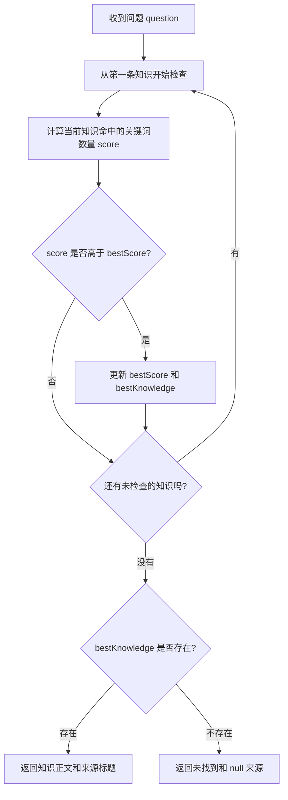

# 第 2 课：政策变多后，答案不能继续写死

> 状态：已完成。学生已理解测试、数据流、两层循环和临时状态变化，运行测试完成验收，并手动提交代码；远程 push 尚待完成。

## 1. 前言

第 1 课只有一条退货政策，一个 `if` 足以完成需求。现在客服又收到了保修和物流政策，调用者还需要知道答案来自哪一条知识，才能把依据展示给用户。

如果继续沿用上一课的方式，方法会逐渐变成：

```text
if 退货 → 返回退货答案
else if 保修 → 返回保修答案
else if 物流 → 返回物流答案
else → 未找到
```

这里真正增加的不只是三个分支，而是“知识”开始成为一组具有相同结构的数据：每条都有标题、正文和用于当前简单匹配的关键词。于是本课第一次有理由把知识数据从判断逻辑中分离出来。

本课新增的真实需求是：

> 助手接收多条内存知识，根据问题命中的关键词数量选择最相关的一条，并同时返回知识正文和来源标题；完全没有命中时继续诚实兜底。

## 2. 主要内容

这一课先解决上一课已经暴露出来的两个问题。

第一个问题是，知识越来越多以后，不能继续把问题和答案直接写在一连串 `if/else` 中。退货、保修和物流政策虽然内容不同，但它们都有标题、正文和关键词。我们会把这些共同的数据整理成 `KnowledgeEntry`，然后用一个 `List` 保存多条知识。这样，增加一条知识时只需要增加数据，不需要再复制一整段判断代码。

第二个问题是，调用者不仅需要答案，还需要知道答案来自哪里。上一课的 `answer` 只返回一个字符串，无法同时表达正文和来源。本课把返回值改为 `KnowledgeAnswer`，里面分别保存回答正文和知识标题。没有任何知识命中时，正文仍然是诚实的兜底提示，来源则为 `null`。

接着，我们让助手逐条查看知识列表。对于当前知识的每个关键词，只要问题中包含它，就增加 1 分。所有知识检查完成后，助手返回分数最高的那一条；如果没有任何知识得到分数，就返回未找到。

测试部分一次准备退货、保修和物流三条知识，再用四个问题验证旧能力、多知识查询、最高分选择和未知问题边界。这四个测试都经过同一条检索流程，因此测试与最小实现集中交付，由学生统一运行，不再为了每个测试分别暂停。

最后，我们沿着一个具体问题逐步查看变量怎样变化，确认正文与来源始终来自同一条知识，并由学生运行全部测试完成验收。本课只处理内存中的简单关键词匹配，不引入数据库、Repository、模型或向量检索。

## 3. 技术要点

### 3.1 当前坐标

```text
最终系统：文档 → 片段 → 检索 → 证据 → 模型回答
                         ↑
本课位置：多条内存知识 → 简单关键词计分 → 最佳知识与来源
```

本课仍不是语义检索。关键词匹配的局限会在用户换一种说法时自然暴露，届时才有理由引入向量。

### 3.2 当前数据

一条知识只包含当前需求已经用到的三个字段：

```text
KnowledgeEntry
  title    = 退货政策
  content  = 签收后 7 天内可申请无理由退货。
  keywords = [退货, 退款]
```

一次回答也不再只是字符串：

```text
KnowledgeAnswer
  content     = 签收后 7 天内可申请无理由退货。
  sourceTitle = 退货政策
```

完全未命中时，`content` 是统一兜底文字，`sourceTitle` 为 `null`，明确表示这次回答没有知识来源。

这两个对象只是数据，不创建 Repository、Provider 或检索接口。当前知识由调用者直接用 `List` 交给助手，生命周期只在内存中。

### 3.3 最小相关性规则

当前规则刻意简单：

```text
对每条知识：
  问题包含一个配置关键词 → 分数 +1

全部计算后：
  最高分大于 0 → 返回该知识正文与标题
  所有分数都是 0 → 返回未找到，来源为空
```

具体例子：

```text
问题：我想退货退款，也想知道什么时候发货？

退货政策命中：退货、退款 → 2 分
物流政策命中：发货       → 1 分
保修政策命中：无         → 0 分

结果：选择退货政策
```

这个规则不能理解同义词，也暂不处理并列问题，只满足当前“选择最相关的一条”的需求。

### 3.4 第一次出现的 Java 数据表达

本课第一次使用 Java 17 的 `record`。在当前场景里，可以先把它理解成“专门装数据的精简类”。例如：

```java
public record KnowledgeAnswer(
        String content,
        String sourceTitle
) {
}
```

这段代码声明了一种包含正文和来源标题的数据。Java 会自动提供构造方法，所以我们可以直接创建回答：

```java
new KnowledgeAnswer("暂时没有找到相关知识。", null)
```

Java 还会根据字段名生成读取方法。`record` 的读取方法没有 `get` 前缀：

```java
answer.content()
answer.sourceTitle()
```

这里使用 `record` 只是为了清楚地把几个相关数据放在一起。它没有负责关键词匹配，也没有形成新的业务层。

当前需求使字符串返回值无法表达来源，因此创建：

```text
KnowledgeEntry.java
KnowledgeAnswer.java
```

它们不是为了套某种设计模式，而是因为字符串已经无法同时清楚表达正文、来源和知识关键词。

### 3.5 数据与状态

本课完整流程如下：



#### 代码结构：两层循环

`KnowledgeAssistant` 中有两层循环：

```java
for (KnowledgeEntry knowledge : knowledgeEntries)
```

外层循环负责逐条查看知识。第一次检查退货政策，第二次检查保修政策，第三次检查物流政策。

```java
for (String keyword : knowledge.keywords())
```

内层循环只处理当前这条知识，逐个查看它配置的关键词是否出现在问题中。每命中一个关键词，当前知识的 `score` 就增加 1。

所以代码实际做的事情可以直接说成：

```text
拿一条知识
→ 检查它的所有关键词
→ 得到这条知识的分数
→ 和目前最高分比较
→ 再拿下一条知识
```

#### 用测试问题跟踪数据和状态

以测试中的问题为例：

```text
我想退货退款，也想知道什么时候发货？
```

进入 `answer` 时，还没有选中任何知识：

```text
bestScore = 0
bestKnowledge = null
```

检查退货政策时，问题命中“退货”和“退款”：

```text
score = 2

因为 2 > 0，所以更新为：
bestScore = 2
bestKnowledge = 退货政策
```

检查保修政策时，没有命中关键词：

```text
score = 0

因为 0 不大于 2，所以最佳结果保持不变。
```

检查物流政策时，问题命中“发货”：

```text
score = 1

因为 1 不大于 2，所以最佳结果仍然是退货政策。
```

遍历结束后，`bestKnowledge` 指向退货政策。助手从这一条知识中同时取出正文和标题，因此正文与来源不会串到两条不同知识上。

#### 哪些是数据，哪些是临时状态

`knowledgeEntries` 是助手持有的数据：

```text
退货政策
保修政策
物流政策
```

构造助手时，这些数据进入 `KnowledgeAssistant`。之后每次回答问题都会读取它们，但当前代码不会修改它们。

下面三个变量是一次回答过程中的临时状态：

```java
KnowledgeEntry bestKnowledge
int bestScore
int score
```

每次调用 `answer`，`bestKnowledge` 和 `bestScore` 都会从 `null` 和 `0` 重新开始；每检查一条知识，`score` 也会重新从 `0` 开始。因此前一个问题的计算过程不会污染后一个问题。

方法执行结束后，这些临时变量便不再保留。当前没有数据库，也没有把分数写回知识列表，所以不存在跨请求或跨进程的状态变化。

## 4. 测试与验收

### 4.1 测试矩阵

本轮一次加入四条测试：

| 场景 | 输入重点 | 预期 |
| --- | --- | --- |
| 旧能力回归 | `退货` | 返回退货正文和“退货政策”来源 |
| 第二条知识 | `保修`、`质保` | 返回保修正文和“保修政策”来源 |
| 相关性选择 | 退货 2 个关键词、物流 1 个关键词 | 选择退货政策 |
| 完全未知 | `发票` | 返回未找到，来源为 `null` |

四条测试分别保护回归、多数据、排序和边界，但都穿过同一条遍历与选择路径，所以合并为一个红绿循环。

### 4.2 旧实现会出现的问题

上一课的助手只有无参构造方法，`answer` 返回 `String`；本课测试需要知识列表、`KnowledgeEntry` 和 `KnowledgeAnswer`。因此从旧契约切换到新契约时，首先会出现编译失败，而不是断言失败。

这些编译问题说明旧的数据形状和方法契约已经不足以表达新需求。根据学生对课堂节奏的反馈，本轮不要求为它单独停留一次，而是直接给出受测试约束的全部最小代码，再统一运行验收。

### 4.3 完成标准

- 四条测试全部通过，并由学生亲自运行。
- 学生能沿具体问题算出每条知识的分数。
- 学生能解释知识标题、正文、关键词与回答来源分别是什么。
- 学生能说明为什么此时需要数据对象，但仍不需要数据库或 Repository。
- 旧的退货和未知问题能力没有丢失。

## 5. 总结

本课完成后，系统会从“写死一个问题”演化为“在一组内存知识中选择最佳匹配”，回答也会携带来源。知识第一次成为独立数据，而不是散落在条件分支中的字符串。

同时它会留下两个真实限制：知识仍要手工写进 Java，关键词也不理解语义。后续只有当课程正式进入相应需求时，才分别处理文档摄取和语义检索；本课不提前实现。
