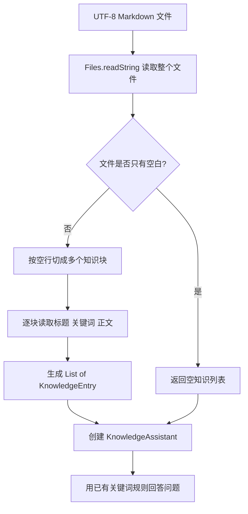

# 第 3 课：让文本文件自动变成可查询的知识

> 状态：已完成。学生已理解文件、字符串、知识块和知识列表之间的数据变化，并亲自运行 6 个测试完成验收；等待手动 commit 和 push。

## 1. 前言

第 2 课已经能在多条知识中选择最相关的一条，但这些知识仍然由开发者写在 Java 代码里。每增加或修改一条政策，都要修改代码、重新构建程序，这不是运营人员能够独立完成的工作。

现在出现一个新需求：运营人员已经有 UTF-8 编码的文本或 Markdown 文件。程序需要读取文件，用空行识别不同的知识块，再把每块内容转换成上一课已经认识的 `KnowledgeEntry`。文件加载完成后，已有的 `KnowledgeAssistant` 应该可以直接查询这些知识。

本课只解决本地文件进入内存的问题。文件不会上传到服务器，也不会保存到数据库；复杂 Markdown、PDF、表格和语义检索都不属于当前需求。

## 2. 主要内容

这一课首先约定一个简单、能被人直接阅读和编辑的 Markdown 格式。每条知识由标题、关键词和正文组成，不同知识之间用空行分开：

```markdown
# 退货政策
关键词：退货、退款
签收后 7 天内可申请无理由退货。

# 保修政策
关键词：保修、质保
电子产品自购买之日起享受 1 年保修。
```

程序先按照 UTF-8 编码把整个文件读成一个字符串。这里明确指定 UTF-8，是为了让中文内容在不同电脑上都按同一种规则转换，避免依赖操作系统默认编码。

读到字符串后，程序用空行把它切成多个知识块。第一个知识块包含退货政策，第二个知识块包含保修政策。程序不会在这里回答问题，它只负责把文件内容整理成 `List<KnowledgeEntry>`。

接着，程序逐个解析知识块：第一行去掉 Markdown 的 `#` 后成为标题；第二行去掉“关键词：”后按顿号或逗号拆成关键词列表；第三行开始的内容合并成正文。每个知识块最终都会变成一条上一课已经使用过的 `KnowledgeEntry`。

最后，测试把加载出来的知识列表交给 `KnowledgeAssistant`，再提出“电子产品质保多久？”。如果返回保修正文和“保修政策”来源，就说明“文件读取 → 分块 → 数据转换 → 关键词检索”这一整条链路已经接通。

空文件是本课的重要边界。空文件会产生空知识列表，而不是一条内容为空的知识；助手收到空列表后，沿用上一课的规则返回“暂时没有找到相关知识”。

## 3. 技术要点

### 3.1 当前坐标

```text
最终系统：文档 → 结构解析 → 分块 → 向量化 → 索引 → 检索 → 回答
            ↑
本课位置：UTF-8 文件 → 空行分块 → KnowledgeEntry → 现有关键词检索
```

第 2 课的知识从 Java 代码直接产生。本课在它前面增加一个文件入口，后面的检索算法保持不变。

### 3.2 文件中的数据怎样变化

测试文件中的原始数据是：

```text
# 保修政策
关键词：保修、质保
电子产品自购买之日起享受 1 年保修。
```

解析后变成：

```text
KnowledgeEntry
  title    = 保修政策
  keywords = [保修, 质保]
  content  = 电子产品自购买之日起享受 1 年保修。
```

这里没有创造新的业务内容，只是把文件中的三部分文字换成 Java 可以直接使用的数据结构。

### 3.3 完整流程图



用测试中的保修问题顺着图走：

1. `Files.writeString` 在临时目录创建一个 UTF-8 Markdown 文件，模拟运营人员提供的知识。
2. `KnowledgeFileLoader.load` 用 `Files.readString` 读取文件，得到一个包含两段政策的字符串。
3. 程序按空行切分，得到退货和保修两个 `block`。
4. 每个 `block` 被解析成 `KnowledgeEntry`，并按照文件中的顺序放进列表。
5. `KnowledgeAssistant` 接收这份列表，问题“电子产品质保多久？”命中保修知识中的“质保”。
6. 助手返回保修正文和“保修政策”来源。

### 3.4 代码结构和临时状态

文件加载过程可以直接说成：

```text
读取文件
→ 判断是不是空文件
→ 按空行拆成知识块
→ 逐个解析知识块
→ 把 KnowledgeEntry 放进列表
→ 返回列表
```

`document` 保存本次读取到的完整文件文本，`blocks` 保存切分后的知识块数组，`knowledgeEntries` 保存逐步构造的结果列表。这些都是一次 `load` 调用中的临时状态；文件本身不会被修改，加载结果也没有写入数据库。

解析一个知识块时，`lines` 是这个块的各行文字。`title`、`keywords` 和 `content` 分别从这些行产生，随后一起进入一个新的 `KnowledgeEntry`。

### 3.5 第一次出现的 Java 语法和 API

测试使用 `@TempDir`：

```java
@TempDir
Path tempDirectory;
```

JUnit 会在测试开始前创建一个独立临时目录，并在测试结束后清理。这样可以真实测试文件读写，又不会把临时政策文件留在项目中。

测试中的三引号是 Java 文本块：

```java
"""
# 退货政策
关键词：退货、退款
签收后 7 天内可申请无理由退货。
"""
```

它适合表示多行文字，比大量 `\n` 更接近真实文件内容。

`Path` 表示文件位置，`Files.writeString` 把文字写入文件，`Files.readString` 把文件读回字符串。两边都明确传入 `StandardCharsets.UTF_8`，确保使用相同编码。

`throws IOException` 表示文件操作可能因为路径、权限或磁盘问题失败，当前测试把这类错误直接交给 JUnit 报告，不在业务代码中假装读取成功。

分块表达式：

```java
"\\R\\s*\\R"
```

其中 `\R` 表示换行，`\s*` 表示中间可以有任意数量的空白。组合起来表示“中间隔着空行的位置”。Java 字符串中的反斜杠本身需要再写一个反斜杠，所以源码里看到的是双反斜杠。

### 3.6 当前文件格式的边界

当前每个知识块必须按顺序包含：

```text
标题
关键词
正文
```

如果结构不完整，加载器会直接报告“知识块必须依次包含标题、关键词和正文”。这是为了避免把格式错误的文件悄悄变成错误知识。

当前实现不理解完整 Markdown 语法，也不处理正文内部的空行。这个限制是有意保留的；等真实文档格式变复杂时，再引入更成熟的解析方法。

## 4. 测试与验收

### 4.1 正常文件完整链路

测试在临时目录写入两条中文政策，加载后先检查：

- 知识列表中有两条数据；
- 第一条标题是“退货政策”；
- 第二条关键词是 `[保修, 质保]`。

随后用加载结果回答“电子产品质保多久？”，预期得到保修正文和“保修政策”来源。这个测试同时证明 UTF-8 读取、空行分块、字段转换和现有检索链能够连通。

### 4.2 空文件边界

测试写入一个只包含空格和换行的文件。预期加载结果为空列表，助手返回未找到且来源为 `null`。

它证明空文件不会制造无意义知识，也不会绕过已有的诚实兜底。

### 4.3 完成标准

- 原有 4 条检索测试继续通过。
- 新增 2 条文件加载测试通过。
- 学生能从测试文件开始，解释文字如何变成 `KnowledgeEntry`，再进入 `KnowledgeAssistant`。
- 学生能区分磁盘上的文件、读取后的字符串、知识块数组和最终知识列表。
- 学生理解 `@TempDir`、Java 文本块以及显式 UTF-8 编码在当前测试中的作用。

## 5. 总结

本课完成后，增加知识不再要求修改 Java 代码。只要按照当前简单格式编辑文本或 Markdown 文件，程序就能把文件内容转换为可查询知识。

系统第一次形成了最小的“摄取 → 检索”链路：知识从磁盘文件进入内存，经过分块和结构转换，再被已有算法查询。

当前限制也很明确：文件格式仍然简单，关键词仍由人工填写，数据只存在于内存。后续需求会分别推动更真实的文档解析、语义检索和持久化；本课不提前解决这些问题。
