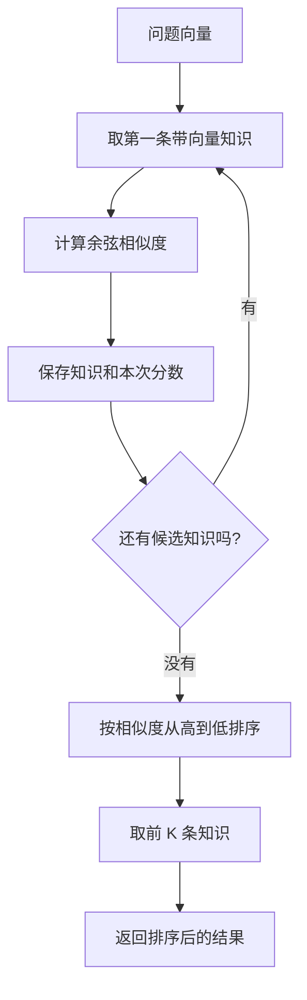

# 第 4 课：用户换一种说法也要找得到

> 状态：已完成。学生已理解固定向量、余弦相似度、排序和 Top-K，代码已提交并推送，commit 为 `9e8e63d`。

## 1. 前言

第三课已经能从文件加载知识，但查询仍然依赖人工填写的关键词。知识里写的是“退货、退款”，用户却可能问“东西不想要了，几天能退”。这两段文字意思接近，却没有相同的关键词，上一课的检索会直接返回未找到。

为了处理“字面不同、意思相近”，系统需要比较语义，而不是只比较文字。常见做法是先用 Embedding 模型把文字转换成一串数字，也就是向量；意思越接近的文字，向量方向通常越接近。

本课不连接真实模型，因为那会同时引入 HTTP、密钥、外部服务和不稳定网络，掩盖向量检索本身。我们先使用固定的二维向量，亲手看清相似度怎样计算、结果怎样排序，以及 Top-K 怎样限制返回数量。

## 2. 主要内容

本课先用二维向量理解“方向接近”是什么意思。问题向量设为 `[1.0, 0.0]`，它指向右边；`[2.0, 0.0]` 虽然更长，但方向相同，所以余弦相似度是 `1`。`[0.0, 3.0]` 与它垂直，相似度是 `0`；`[-1.0, 0.0]` 方向相反，相似度是 `-1`。

接着，我们给退货、保修和物流三条现有知识各准备一个固定向量。测试中的问题“东西不想要了，几天能退”不包含“退货”或“退款”，但它的测试向量与退货政策向量最接近。因此向量检索仍然应该把退货政策排在第一位。

程序会遍历所有候选知识，为问题向量和每条知识向量计算余弦相似度，并把知识和本次分数临时放在一起。全部计算完成后，再按相似度从高到低排序，最后只取前 `K` 条。`Top-K` 中的 `K` 就是调用者希望拿到的最大结果数量。

本课新增的 `EmbeddedKnowledge` 只是把已有 `KnowledgeEntry` 和它的向量放在一起。知识标题、正文和关键词没有复制到新结构中，文件加载能力也没有删除。

现有关键词问答仍然保留，因为当前还没有真实模型把任意问题和文件内容转换成向量。第五课接入具体 Embedding 服务后，向量检索才会进入真实文本问答主链。本课不创建 Provider、接口或假装已经具备自动语义理解。

## 3. 技术要点

### 3.1 当前坐标

```text
第三课：文件 → KnowledgeEntry → 关键词检索

第四课：固定问题向量 + 固定知识向量
                    ↓
             余弦相似度排序
                    ↓
               Top-K 知识

第五课才会补上：文字 → 真实 Embedding 向量
```

### 3.2 向量的当前数据形状

测试使用二维数组：

```java
double[] questionVector = {1.0, 0.0};
double[] returnVector = {0.9, 0.1};
```

两个位置可以想象成平面坐标的横轴和纵轴。真实 Embedding 通常有更多维度，但计算方式相同；二维只是为了让本课的数据能够被人直接检查。

一条带向量的知识是：

```text
EmbeddedKnowledge
  knowledge = 退货政策原有 KnowledgeEntry
  vector    = [0.9, 0.1]
```

### 3.3 余弦相似度

计算公式是：

```text
相似度 = 点积 ÷（左向量长度 × 右向量长度）
```

对于问题 `[1, 0]` 和退货政策 `[0.9, 0.1]`：

```text
点积 = 1 × 0.9 + 0 × 0.1 = 0.9

问题长度 = √(1² + 0²) = 1
退货向量长度 = √(0.9² + 0.1²) ≈ 0.906

相似度 ≈ 0.9 ÷ (1 × 0.906) ≈ 0.994
```

分数越接近 `1`，方向越接近。全零向量没有方向，而且会让公式分母变成 `0`，所以代码直接拒绝它。

### 3.4 完整流程图



### 3.5 用排序测试跟踪数据和状态

测试中的问题向量是：

```text
[1.0, 0.0]
```

三条候选知识依次得到大致分数：

```text
退货政策 [0.9, 0.1] → 0.994
保修政策 [0.0, 1.0] → 0
物流政策 [0.4, 0.6] → 0.555
```

计算期间，`scoredKnowledge` 逐步变成：

```text
检查退货后：[退货 0.994]
检查保修后：[退货 0.994, 保修 0]
检查物流后：[退货 0.994, 保修 0, 物流 0.555]
```

排序以后：

```text
[退货 0.994, 物流 0.555, 保修 0]
```

测试传入 `topK = 2`，所以最终只复制前两条知识：

```text
[退货政策, 物流政策]
```

问题向量、每次的 `similarity`、带分数列表和最终结果列表都是一次 `search` 调用中的临时状态。知识对象本身和向量没有被修改。

### 3.6 代码结构

`search` 方法直接做四件事：

```text
逐条计算相似度
→ 保存知识和分数
→ 按分数降序排列
→ 复制前 K 条知识
```

`cosineSimilarity` 只负责数学计算：

```text
逐维累加点积和两个长度平方
→ 拒绝全零向量
→ 开平方得到长度
→ 代入公式返回相似度
```

### 3.7 第一次出现的 Java 语法

`double[]` 表示一组双精度小数：

```java
double[] vector = {0.9, 0.1};
```

通过 `vector[index]` 读取某一维，`vector.length` 表示维度数量。

排序代码使用一个很小的 Lambda：

```java
scoredKnowledge.sort((left, right) ->
        Double.compare(right.similarity(), left.similarity())
);
```

`left` 和 `right` 是排序过程中拿来比较的两个元素。把 `right` 放在前面比较，表示分数大的元素排在前面。这里使用 Lambda 只是把“两个元素怎样比较”作为一小段行为交给 `sort`，没有创建新的架构层。

浮点数计算可能存在极小误差，所以测试写成：

```java
assertEquals(1.0, actual, 0.000001);
```

第三个参数表示允许的误差范围。

`assertThrows` 接收一段暂时不立即执行的代码：

```java
() -> vectorSearch.cosineSimilarity(...)
```

JUnit 执行它并确认抛出了指定异常。这也是 Lambda，但这里只需要理解成“把待执行的代码交给测试框架”。

## 4. 测试与验收

### 4.1 方向测试

固定二维向量分别验证同向、垂直和反向，相似度应为 `1`、`0`、`-1`。它保护余弦公式，而不是某一条业务政策。

### 4.2 语义排序和 Top-K

固定向量模拟“东西不想要了，几天能退”和三条知识的 Embedding。预期退货政策第一、物流政策第二，并且只返回两条。

这个测试证明：检索不再依赖问题中必须出现“退货”二字；但向量目前仍是人工夹具，尚不能处理测试之外的任意文本。

### 4.3 零向量边界

全零向量没有方向，余弦公式无法计算。测试要求抛出带明确消息的 `IllegalArgumentException`，避免产生 `NaN` 后继续排序。

### 4.4 完成标准

- 原有 6 个测试继续通过，新增 3 个向量测试通过。
- 学生能用测试中的二维数据解释点积、长度和相似度。
- 学生能沿排序测试说明分数列表如何变化，Top-K 最后截取什么。
- 学生能解释固定向量与真实 Embedding 模型的边界。
- 学生理解 `double[]`、浮点误差以及两个当前 Lambda 的具体作用。

## 5. 总结

本课完成后，项目拥有了不依赖外部服务、可重复验证的向量排序核心。它证明了只要问题和知识已经被转换为向量，系统就能按方向接近程度找到字面不同但语义相近的知识。

当前缺口也很明确：这些向量由测试手工提供，真实文件和用户问题还不会自动得到向量。这个问题将在下一课真正推动一个具体 Embedding 服务出现；本课不提前创建模型接口或供应商体系。
