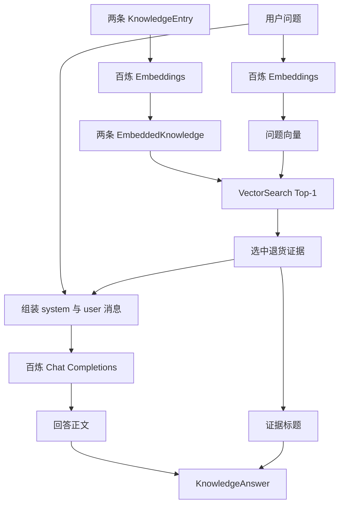

# 第 5 课：把语义检索接到真实模型

> 状态：已完成。百炼永久环境、普通测试和真实网络调用均已成功，代码已提交并推送，commit 为 `306f839`。

## 1. 为什么现在才接模型

上一课已经证明，只要问题和知识都有向量，`VectorSearch` 就能找出最相关的知识。但是二维向量由测试人员手写，程序还不能为任意中文知识和问题生成向量。检索完成后，程序也只会原样返回知识正文，不会根据问题组织自然回答。

这两个实际缺口现在才需要外部模型：Embedding 模型负责把文字变成向量，Chat 模型负责根据检索证据生成回答。

课程最初使用了 OpenAI 的具体服务，但学生希望在国内网络环境直接运行。原项目的默认配置也使用阿里云百炼：Embedding 模型是 `text-embedding-v4`，聊天候选包含 `qwen-plus-latest`。因此本课改用同一条路线。

百炼提供 OpenAI 兼容 HTTP 接口。“兼容”表示请求地址、认证头和 JSON 结构沿用常见的 OpenAI 格式，但实际域名、API Key 和模型名称属于百炼。本课只有百炼一个供应商，因此直接写 `BailianClient`，不创建 Provider、Factory 或多模型路由。

## 2. 本课完整流程



`BailianRagAssistant.answer` 负责调用顺序：

```text
逐条为知识生成向量
→ 为问题生成向量
→ 调用上一课 VectorSearch 取 Top-1
→ 把问题和这一条证据交给 Chat
→ 返回生成正文和证据标题
```

`BailianClient` 不决定选哪条知识。它只负责把 Java 数据翻译成百炼要求的 HTTP/JSON，再把响应翻译回 Java 数据。

## 3. 先理解 HTTP 请求由什么组成

一次模型请求不只是一个 JSON。它至少包含四部分：

```text
请求方法：POST
请求地址：https://.../embeddings
请求头：Authorization、Content-Type
请求体：JSON 文字
```

服务端返回时也有对应部分：

```text
HTTP 状态码：200、400、401、429、500……
响应头：例如 Content-Type
响应体：JSON 文字
```

状态码先说明整次请求是否成功。只有 2xx 时，代码才继续按成功 JSON 解析；否则当前代码抛出异常并保留状态码。

`Authorization: Bearer <API Key>` 表示把密钥放在请求头里。`Content-Type: application/json` 表示请求体采用 JSON 格式。Jackson 只负责创建和读取 JSON，不负责规定百炼必须接受哪些字段；字段格式来自百炼的接口协议。

## 4. Embedding 请求：先看 JSON，再看 Jackson

### 4.1 百炼要求的请求

程序向下面的地址发送 POST：

```text
https://dashscope.aliyuncs.com/compatible-mode/v1/embeddings
```

请求体是：

```json
{
  "model": "text-embedding-v4",
  "input": "退货政策\n签收后 7 天内可申请无理由退货。"
}
```

字段含义很直接：

| JSON 位置 | 当前值 | 作用 |
|---|---|---|
| `model` | `text-embedding-v4` | 告诉百炼使用哪个向量模型 |
| `input` | 知识或问题文字 | 告诉模型要把什么转换成向量 |

### 4.2 对应的 Jackson 代码

```java
ObjectNode requestBody = objectMapper.createObjectNode();
requestBody.put("model", EMBEDDING_MODEL);
requestBody.put("input", text);
```

逐句看：

1. `createObjectNode()` 创建一对 JSON 大括号 `{}`。
2. 第一次 `put` 往大括号里放入字符串字段 `model`。
3. 第二次 `put` 放入字符串字段 `input`。

执行完后，内存中的 `requestBody` 就等价于上面的 JSON，但它还只是 Java 对象。下面这一句才把它变成真正能作为 HTTP 正文发送的字符串：

```java
String jsonText = objectMapper.writeValueAsString(requestBody);
```

### 4.3 百炼返回的响应

真实向量会有很多维。为了看清形状，这里只用三个数字示意：

```json
{
  "data": [
    {
      "object": "embedding",
      "index": 0,
      "embedding": [0.12, -0.37, 0.81]
    }
  ],
  "model": "text-embedding-v4"
}
```

我们需要的数据位于：

```text
根对象
└── data                 数组
    └── 第 0 个元素      对象
        └── embedding    数字数组
```

因此代码按同样顺序读取：

```java
JsonNode embedding = responseBody
        .path("data")
        .path(0)
        .path("embedding");
```

`path("data")` 不是发网络请求，而是在已经收到的 JSON 树中走到下一层。`path(0)` 取数组第一项，最后一个 `path` 取得向量。

`JsonNode` 仍然是 Jackson 的 JSON 数据，上一课的 `VectorSearch` 需要 `double[]`。所以代码创建同样长度的数组，再逐个复制：

```java
double[] vector = new double[embedding.size()];
for (int index = 0; index < embedding.size(); index++) {
    vector[index] = embedding.get(index).asDouble();
}
```

这里的 `get(index)` 取 JSON 数组中的一个元素，`asDouble()` 把这个 JSON 数字读成 Java 的 `double`。

## 5. Chat 请求：为什么出现 messages 数组

### 5.1 百炼要求的请求

Chat Completions 的地址是：

```text
https://dashscope.aliyuncs.com/compatible-mode/v1/chat/completions
```

本课发送的 JSON 是：

```json
{
  "model": "qwen-plus-latest",
  "messages": [
    {
      "role": "system",
      "content": "你是企业知识助手。只能根据提供的证据回答；证据不足时必须明确说不知道。"
    },
    {
      "role": "user",
      "content": "问题：东西不想要了，几天能退？\n\n证据标题：退货政策\n证据正文：签收后 7 天内可申请无理由退货。"
    }
  ],
  "max_tokens": 300
}
```

`messages` 是数组，因为对话可以有多条消息。当前只放两条：

- `system` 描述模型始终要遵守的规则。
- `user` 携带这一次的用户问题和检索证据。

`max_tokens` 限制本次最多生成多少 Token，避免一个简单答案无限延长。

### 5.2 对应的 Jackson 代码

```java
ObjectNode requestBody = objectMapper.createObjectNode();
requestBody.put("model", CHAT_MODEL);

ArrayNode messages = requestBody.putArray("messages");
messages.addObject()
        .put("role", "system")
        .put("content", "回答规则");
messages.addObject()
        .put("role", "user")
        .put("content", "问题和证据");

requestBody.put("max_tokens", 300);
```

这里出现两种节点：

- `ObjectNode` 对应 JSON 的 `{}`，里面按名字放字段。
- `ArrayNode` 对应 JSON 的 `[]`，里面按顺序放元素。

`putArray("messages")` 同时完成两件事：在根对象中创建 `messages: []`，并把这个数组返回。`addObject()` 再向数组追加一个 `{}`，随后连续 `put` 它的 `role` 和 `content`。

链式写法只是把：

```java
ObjectNode message = messages.addObject();
message.put("role", "system");
message.put("content", "回答规则");
```

缩成连续调用，两者构造出的 JSON 完全一样。

## 6. Chat 响应怎样取出回答

百炼兼容 Chat Completions 的响应大致是：

```json
{
  "choices": [
    {
      "index": 0,
      "message": {
        "role": "assistant",
        "content": "您可以在签收后 7 天内申请无理由退货。"
      }
    }
  ]
}
```

回答路径是：

```text
choices → 第 0 条候选 → message → content
```

对应代码是：

```java
JsonNode content = responseBody
        .path("choices")
        .path(0)
        .path("message")
        .path("content");
```

最后用 `content.asText()` 得到普通 Java 字符串。代码先检查它确实是文字且不为空，避免服务端返回异常形状时把空答案当成功。

## 7. `postJson` 把两种业务请求共用的动作放在一起

Embedding 和 Chat 的 JSON 不同，但发送步骤完全相同：

```text
JSON 树转字符串
→ 创建 POST 请求
→ 加认证头和 JSON 类型
→ 发送并等待响应
→ 检查状态码
→ 响应字符串转 JSON 树
```

因此 `postJson` 接收不同的地址尾部和请求 JSON：

```java
postJson("embeddings", embeddingBody);
postJson("chat/completions", chatBody);
```

`baseUri.resolve(path)` 把公共地址与尾部路径拼起来。`HttpClient.send` 执行同步网络调用：当前线程会等到响应回来才继续。异步和流式调用将在真实需求出现时再引入。

`objectMapper.readTree(response.body())` 与 `writeValueAsString` 方向相反：前者把 JSON 字符串读成树，后者把树写成 JSON 字符串。

## 8. 用测试实例跟踪业务状态

测试输入：

```text
退货政策 → Embedding → [0.9, 0.1]
保修政策 → Embedding → [0.0, 1.0]
用户问题 → Embedding → [1.0, 0.0]
```

`BailianRagAssistant.answer` 中的 `candidates` 依次变化：

```text
开始：[]
处理退货后：[退货政策及其向量]
处理保修后：[退货政策及其向量, 保修政策及其向量]
```

Top-1 选中退货政策。Chat 请求的 `user` 消息包含问题和退货正文，不包含保修正文。最终结果是：

```text
KnowledgeAnswer
  content     = 百炼 Chat 生成的回答
  sourceTitle = VectorSearch 选中的退货政策
```

来源不是让聊天模型生成的，而是程序保留的检索结果。

## 9. 哪些测试代码现在可以跳过

`BailianRagAssistantTest` 中前两个测试的输入、调用和断言值得看。类内的 `StubBailianServer` 可以暂时不看。

你现在只需要知道它做两件事：

1. 代替真实百炼接收请求，让普通测试不依赖网络和余额。
2. 返回固定 JSON，使断言每次都得到相同结果。

它属于测试基础设施，不参与真实业务。以后讲到 HTTP 测试替身时再拆开内部实现。

## 10. 在 WSL 中配置真实百炼环境

### 10.1 创建 Key

1. 登录阿里云控制台，进入“模型服务灵积/百炼”。
2. 在北京地域开通模型服务并进入 API Key 管理。
3. 在默认业务空间创建 API Key。
4. 不要把 Key 发到聊天、写进代码或提交到 Git。

本课使用北京地域公共兼容地址。Key 与地域需要一致；如果你选择其他地域，地址也必须跟着换。

### 10.2 永久保存到 WSL 私人文件

不要把 Key 放进项目的 `.env`、Java、`pom.xml` 或 `.vscode/settings.json`，这些文件容易被 Git 提交。我们把它保存在项目外：

```text
/home/shitanli/.config/ragent-st/bailian.env
```

先在 VS Code 的 WSL 终端执行：

```bash
mkdir -p "$HOME/.config/ragent-st"
chmod 700 "$HOME/.config/ragent-st"
touch "$HOME/.config/ragent-st/bailian.env"
chmod 600 "$HOME/.config/ragent-st/bailian.env"
```

`700` 表示只有当前用户能进入这个目录；`600` 表示只有当前用户能读写密钥文件。

接下来安全输入 Key。输入期间终端不会显示字符，Key 也不会进入 Shell 历史：

```bash
read -s -p "请输入百炼 API Key: " BAILIAN_KEY
echo
printf "export DASHSCOPE_API_KEY='%s'\n" "$BAILIAN_KEY" > "$HOME/.config/ragent-st/bailian.env"
unset BAILIAN_KEY
```

这条 `printf` 会覆盖旧 Key；以后更换 Key 时重新执行这一小组命令即可。

只检查权限和文件存在，不查看内容：

```bash
stat -c '%a %n' "$HOME/.config/ragent-st/bailian.env"
```

预期输出以 `600` 开头。不要使用 `cat` 查看文件，也不要把文件内容发到聊天中。

### 10.3 让以后打开的 Bash 终端自动加载

执行：

```bash
code "$HOME/.bashrc"
```

在文件末尾添加：

```bash
if [ -f "$HOME/.config/ragent-st/bailian.env" ]; then
    . "$HOME/.config/ragent-st/bailian.env"
fi
```

保存后，关闭当前 VS Code 终端，再通过“终端 → 新建终端”创建一个新终端。检查变量存在但不打印密钥：

```bash
test -n "$DASHSCOPE_API_KEY" && echo "新终端已自动加载 DASHSCOPE_API_KEY"
```

以后新开的 Bash 终端都会自动加载，不需要再次 `export`。

### 10.4 让 VS Code 绿色三角也能读取

终端和绿色三角不是同一个进程。终端由 Bash 启动，绿色三角由 VS Code WSL Server 中的 Java 扩展启动。VS Code 官方说明，WSL Server 启动时不会执行普通 Shell 启动脚本，因此还要创建它的环境设置脚本：

```bash
mkdir -p "$HOME/.vscode-server"
code "$HOME/.vscode-server/server-env-setup"
```

文件内容写成：

```sh
#!/bin/sh
if [ -f "$HOME/.config/ragent-st/bailian.env" ]; then
    . "$HOME/.config/ragent-st/bailian.env"
fi
```

保存后执行：

```bash
chmod 700 "$HOME/.vscode-server/server-env-setup"
```

这个脚本没有保存第二份 Key，只是加载前面的同一个私人文件。

### 10.5 重启 VS Code WSL Server

`server-env-setup` 只在 WSL Server 启动时处理，单纯新建终端不够。先保存所有文件，然后：

1. 按 `Ctrl+Shift+P` 打开命令面板。
2. 搜索并执行 `WSL: Kill VS Code Server`。如果当前版本没有这个命令，就关闭所有 WSL 类型的 VS Code 窗口；必要时在 Windows PowerShell 执行 `wsl --shutdown`，但它会停止所有 WSL 进程。
3. 从 WSL 终端进入项目目录并执行 `code .`，重新打开项目。

项目重新打开后，在 `BailianRagLiveIT.java` 中只点击 `shouldReadPermanentApiKeyFromEnvironment` 方法左侧的绿色三角。这个方法不访问网络、不产生费用、不打印 Key。测试通过就说明 Java 测试进程已经获得永久变量。

## 11. 先跑普通测试，再跑真实网络测试

### 11.1 普通测试

```bash
cd /home/shitanli/ln_rebuild/ragent/ragent-st
mvn clean test
```

预期：

```text
Tests run: 11, Failures: 0, Errors: 0, Skipped: 0
BUILD SUCCESS
```

它不会运行 `BailianRagLiveIT`，不会访问公网。

### 11.2 真实网络人工验收

确认永久环境检查已经通过后执行：

```bash
mvn -Dtest=BailianRagLiveIT test
```

这会真实发出三次 Embedding 请求和一次 Chat Completions 请求，可能消耗免费额度或产生费用。成功时会看到类似：

```text
百炼回答：您可以在签收后 7 天内申请无理由退货。
证据来源：退货政策
BUILD SUCCESS
```

回答的具体措辞可以变化，但来源必须是退货政策。由于现在已经给 VS Code WSL Server 配置永久环境，真实测试也可以点击绿色三角；第一次仍推荐使用上面的 Maven 命令，因为终端会完整展示请求失败时的异常信息。

## 12. 常见真实网络错误

- `百炼 API Key 不能为空`：当前终端没有正确设置环境变量。
- HTTP `401`：Key 错误、失效，或 Key 与调用地域不匹配。
- HTTP `404`：请求地址拼错，或所选地域使用不同 Base URL。
- HTTP `429`：额度、余额或调用频率受到限制。
- 模型不存在或无权限：业务空间没有对应模型权限，或模型名与地域不匹配。

反馈错误时，请发送 Maven 从异常类型到状态码的完整内容，但一定遮住 Key。

## 13. 当前边界

- 每次提问都会重新计算知识向量，仍有重复网络请求。
- 没有相似度阈值，只要知识列表非空就会选第一名。
- 网络错误目前只抛异常，还没有面向普通用户的错误响应。
- 没有浏览器入口、会话历史、流式输出和持久化。
- 当前只有百炼，不建立供应商抽象。

## 14. 官方资料

- 百炼 API Key 与北京地域 Base URL：<https://help.aliyun.com/zh/model-studio/get-api-key>
- 百炼 Embedding OpenAI 兼容调用：<https://help.aliyun.com/zh/model-studio/embedding>
- `text-embedding-v4` 模型：<https://help.aliyun.com/zh/model-studio/text-embedding-v4>
- 百炼文本生成与 Chat Completions：<https://help.aliyun.com/zh/model-studio/qwen-api-reference>
