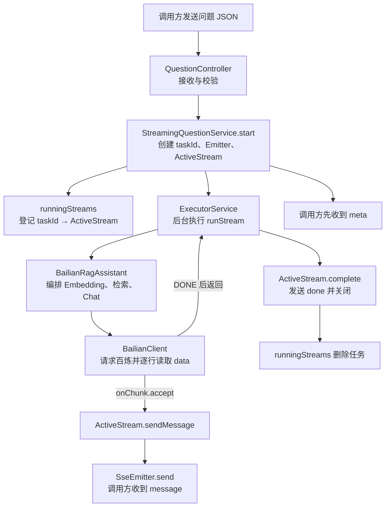
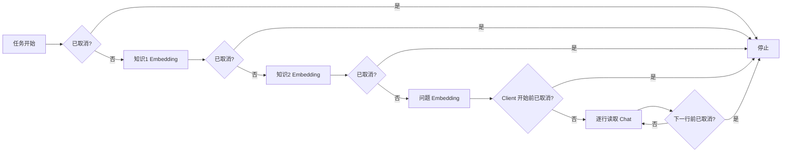
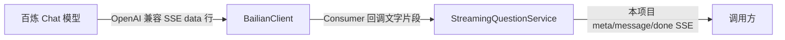
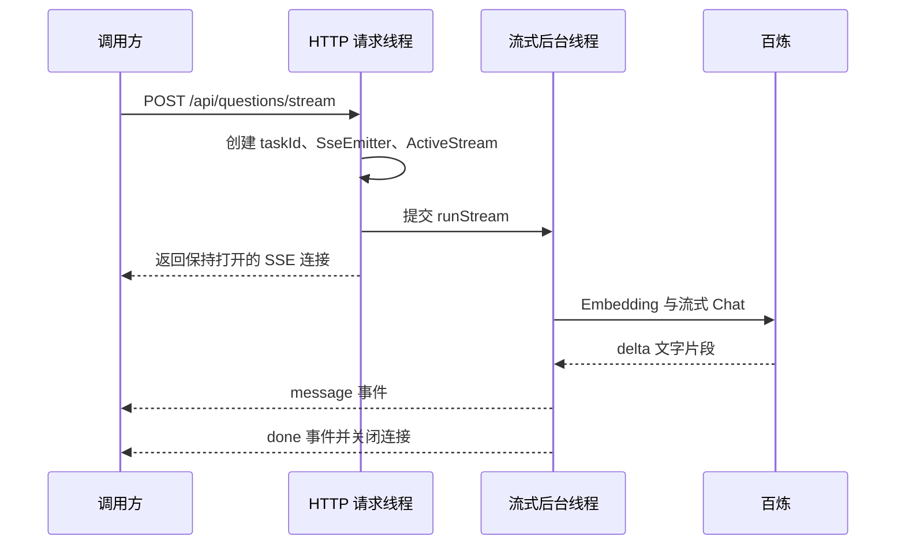
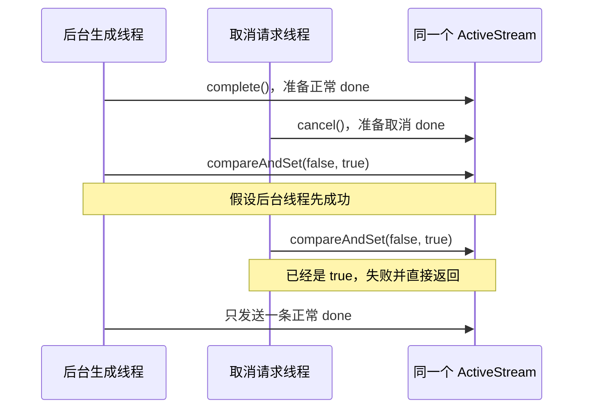

# 第 7 课：答案很长时，先返回已经生成的部分

## 1. 前言

> 本课业务、数据流和并发概念已由学生理解；完整真实流与取消流均已通过绿色按钮验收，并已提交、推送为 commit `f5ae5a3`。

第 6 课让项目第一次成为真正的 HTTP 服务，但它仍然采用“一次性响应”：百炼没有生成完整答案之前，调用方什么都收不到。答案较长或网络稍慢时，页面会一直空白，用户很容易以为服务卡住。

模型实际上不是在最后一刻突然得到整段答案。它会陆续产生文字片段，例如先产生“根据”，再产生“退货政策”，最后补完句子。如果服务器能在每一段产生后立刻转发，用户就能边生成边阅读。

流式回答还带来一个新需求：生成开始后，用户可能点击“停止”。服务器必须告诉用户这次生成的 `taskId`，保存仍在运行的任务状态，并保证正常完成、取消和异常三条路径只能有一条负责最后收尾。

本课只实现当前需要的一条真实链路：百炼 OpenAI 兼容流 → 本地 RAG → Spring SSE → 调用方。不会创建多模型 Provider、通用事件总线或跨服务器任务系统。

## 2. 主要内容

### 2.1 本课完成标准

- `POST /api/questions/stream` 建立 SSE 连接。
- 第一条事件是 `meta`，其中包含本次生成的 `taskId`。
- 百炼每返回一段新增文字，调用方就收到一条 `message`。
- 正常结束时只收到一条 `done`，其中包含证据来源。
- `DELETE /api/questions/stream/{taskId}` 能取消仍在运行的任务。
- 取消同样只用一条 `done` 收尾，并将 `cancelled` 标为 `true`。
- 原有一次性 JSON 接口继续可用，历史 11 个测试继续通过。

### 2.2 代码阅读顺序

这节课第一次出现 SSE、后台线程和并发状态，请按下面的顺序读，不要先钻进原子类的实现。

1. 暂时不看源码，先读本教案 3.1～3.3：建立对象交接主链、校准整体理解，并知道取消检查为何分散在各层。
2. 看 `StreamMeta.java`、`StreamMessage.java`、`StreamDone.java`。先认识调用方实际收到的三种数据。
3. 看 `QuestionController.java` 新增的 `stream` 和 `cancel`。回答：创建流与取消流分别使用什么 HTTP 地址？
4. 看 `StreamingQuestionService.java`，先只读 `start`、`cancel`、`runStream` 三个外层函数。回答：任务何时登记，谁在后台执行，何时从任务表删除？
5. 再看同一文件的内部类 `ActiveStream`，依次读 `sendMeta`、`sendMessage`、`complete`、`cancel`、`fail` 和 `finish`。重点观察 `cancelled` 与 `finished` 两个状态。
6. 看 `RagentApplication.streamExecutor`。回答：为什么模型流不能继续占着最初的 HTTP 请求线程？为什么线程池目前固定为四个线程？
7. 看 `BailianRagAssistant.streamAnswer`。沿两条知识、一个问题和 Top-1 证据走一遍，观察每个阶段怎样检查取消状态。
8. 看 `BailianClient.streamAnswer` 和 `readChatStream`。把请求中的 `stream: true`、百炼的 `data:` 行、`delta.content` 和 `[DONE]` 一一对应起来。
9. 最后看 `StreamingQuestionApiLiveIT.java`。先读两个测试方法，再读 `openStream`、`cancel` 和三个 SSE 读取辅助函数。

所有新增函数都配有中文函数级注释。先读注释确定函数的输入、输出、主流程和边界，再进入函数体。

### 2.3 当前系统坐标

```text
调用方
  │
  │ HTTP + SSE
  ▼
QuestionController
  │
  ▼
StreamingQuestionService  ← 本课新增的任务、线程与收尾管理
  │
  ▼
BailianRagAssistant
  │
  ├── Embedding → VectorSearch
  │
  └── BailianClient 流式 Chat
          │
          └── 百炼 OpenAI 兼容 SSE
```

`StreamingQuestionService` 不是为了套一层 Service 而创建的。第 6 课的 Controller 只需要同步调用一次函数；现在它如果同时管理线程池、运行任务、取消状态、SSE 事件和恰好一次收尾，会迅速变得难读。当前需求已经产生一组明确且紧密相关的职责，因此现在才增加这个具体类，而且没有为它创建接口。

## 3. 技术要点

### 3.1 先建立完整执行链：每个重要对象把什么交给谁

先不要急着看 `AtomicBoolean` 或方法引用。一次正常流式问答可以分成七层，每一层只解决自己的问题，再把结果交给下一层或上一层。

#### 第一层：`QuestionController` 接住 HTTP 请求

调用方发送：

```http
POST /api/questions/stream
Content-Type: application/json

{"question":"请详细说明退货期限和条件。"}
```

Spring 先把 JSON 转成 `QuestionRequest` 并校验。`QuestionController.stream` 不执行向量化，也不读取模型流，只把两个数据交给 `StreamingQuestionService.start`：

```text
question = "请详细说明退货期限和条件。"
knowledgeEntries = 当前两条知识
```

#### 第二层：`StreamingQuestionService` 建立一次运行任务

`start` 为这一次流式请求创建：

```text
taskId      = 一个新的 UUID
emitter     = 与当前 HTTP 响应连接绑定的 SseEmitter
activeStream = taskId + emitter + cancelled + finished
```

随后依次完成：

```text
把 taskId → ActiveStream 放入 runningStreams
→ 发送第一条 meta(taskId)
→ 把 runStream 提交给 streamExecutor
→ 将 SseEmitter 返回给 Spring
```

只有 `/api/questions/stream` 创建 `ActiveStream`。第 6 课原来的普通 `/api/questions` 仍然一次性返回 JSON，不创建流式任务。

#### 第三层：`ExecutorService` 让后台线程接手耗时工作

线程池中的某个后台线程执行 `runStream`。最初接收 HTTP 请求的线程因此不用等模型生成完整答案；Spring 可以先把保持打开的 SSE 响应交给调用方。

`StreamingQuestionService` 仍然拥有 `ActiveStream`，所以它知道应该把片段发往哪条 HTTP 连接，也知道这次任务是否已取消。

#### 第四层：`BailianRagAssistant` 编排完整 RAG

Service 调用：

```java
assistant.streamAnswer(
    question,
    knowledgeEntries,
    activeStream::sendMessage,
    activeStream::isCancelled
);
```

Assistant 负责按业务顺序安排工作：

```text
让 Client 向量化“退货政策”
→ 让 Client 向量化“保修政策”
→ 让 Client 向量化用户问题
→ 让 VectorSearch 在本地选择 Top-1 证据
→ 把问题、证据和两个函数交给 Client 做流式 Chat
```

Assistant 知道 RAG 的先后顺序，但不知道 HTTP、SSE 和 Spring。

#### 第五层：`BailianClient` 处理百炼协议

Client 把问题和证据组装成带 `"stream": true` 的百炼请求，发送到 Chat Completions 接口。收到响应后，它不会一次性读完整正文，而是逐行读取：

```text
data: {..."delta":{"content":"根据"}...}
data: {..."delta":{"content":"退货政策"}...}
data: [DONE]
```

每读到一个 `delta.content`，Client 执行：

```java
onChunk.accept(content);
```

#### 第六层：回调把回答片段送回 `ActiveStream`

前面传入的 `onChunk` 实际是 `activeStream::sendMessage`。因此 `onChunk.accept("根据")` 最终等价于：

```java
activeStream.sendMessage("根据");
```

`ActiveStream` 再让自己的 `SseEmitter` 向调用方发送：

```text
event:message
data:{"content":"根据"}
```

这里需要修正一个容易产生的理解：不是把 `emitter.send` 本身交给后续所有对象，也不是把 `SseEmitter` 暴露给 Assistant 和 Client。真正向下传的是一个“收到字符串后应该做什么”的函数。只有 `ActiveStream` 接触 Spring 的 `SseEmitter`。

#### 第七层：Service 负责最后收尾

模型正常返回 `[DONE]` 后，调用逐层返回到 `runStream`。Service 让 `ActiveStream.complete` 发送：

```text
event:done
data:{"sourceTitle":"退货政策","cancelled":false,"error":null}
```

随后关闭 SSE，并从 `runningStreams` 删除任务。用户取消或网络异常也会尝试收尾，但 `finished` 保证最终只有一条路径真正发送 `done`。

完整交接关系如下：



可以用这张职责表检查自己有没有把层次混在一起：

| 重要对象 | 它拥有或看到什么 | 它完成什么 | 它不负责什么 |
|---|---|---|---|
| `QuestionController` | HTTP 请求、`QuestionRequest` | 接入流式和取消 URL | 不做模型协议与并发收尾 |
| `StreamingQuestionService` | 任务表、线程池、`ActiveStream` | 创建、登记、执行、取消、收尾 | 不解析百炼 JSON |
| `ActiveStream` | 单次 `taskId`、`SseEmitter`、两个状态 | 向这一条连接发事件并保证只收尾一次 | 不做向量检索 |
| `BailianRagAssistant` | 问题、知识、回调、取消查询函数 | 编排 Embedding → 检索 → Chat | 不认识 HTTP/SSE |
| `VectorSearch` | 问题向量、知识向量 | 选择 Top-1 证据 | 不访问网络 |
| `BailianClient` | 百炼 URL、Key、请求 JSON、响应行 | 与百炼通信并取出 `delta.content` | 不持有浏览器连接 |
| `SseEmitter` | 当前调用方的 HTTP 响应连接 | 把 meta/message/done 写给调用方 | 不理解 RAG |

### 3.2 你的整体理解：正确部分与两处校准

你的理解主干是正确的：Service 管理流式任务和线程池，Assistant 完成 RAG 编排，Client 处理百炼请求与逐行响应，再通过回调把片段送回来。

需要校准两处措辞：

1. 不是“每个问答”都绑定流对象，而是每个进入流式端点的问答创建一个 `ActiveStream`。原来的一次性问答没有它。
2. `runningStreams` 是以 `taskId` 为键的并发 Map，不是有固定顺序的 List。取消时关心的是根据编号快速找到对应任务，而不是任务排在第几个。

更加准确的一句话版本是：

> Controller 把一次流式 HTTP 请求交给 Service；Service 为它创建并登记一个 `ActiveStream`，再把耗时 RAG 放进线程池；Assistant 安排向量化、检索和流式问答；Client 逐行读取百炼 SSE，并通过函数回调让原来的 `ActiveStream` 把片段发给对应调用方。

### 3.3 为什么到处都检查 `cancelled`

这些判断不是同一句代码无意义地重复。每一层都处在不同的“继续工作关口”，只能阻止自己即将进行的工作。

| 检查位置 | 它防止什么 |
|---|---|
| `BailianRagAssistant.streamAnswer` 刚开始 | 已取消的排队任务仍开始第一次 Embedding |
| 每条知识 Embedding 前 | 取消后还继续为剩余知识调用模型 |
| 知识向量完成后 | 取消后仍继续生成问题向量 |
| `BailianClient.streamAnswer` 开始时 | 取消后仍发出 Chat 请求 |
| `readChatStream` 每次循环前 | 取消后仍继续读取百炼的新片段 |
| `ActiveStream.sendMessage` | 与取消几乎同时到达的迟到片段仍写给调用方 |
| `runStream` 返回后 | 已经由取消路径收尾，又按正常完成再收尾一次 |

一次取消可能发生在任何时刻，所以不存在一个检查位置能够替所有层阻止后续工作。例如只在 Controller 检查没有用，因为 Controller 早已返回；只在 Client 循环检查也不够，因为取消可能发生在三次 Embedding 期间。

可以把它理解成沿执行链设置多个刹车点：



当前不能强行打断正在等待结果的那一次普通 Embedding HTTP 调用；它返回后，下一个检查点才会停止。这是本课明确保留的边界。

### 3.4 什么是 SSE

SSE 全称是 Server-Sent Events，可以先理解为“服务器保持 HTTP 响应不关闭，并陆续往里面追加带名字的消息”。它是服务器单向推送：本次连接主要负责服务器向调用方发送数据；取消操作另外发送一个普通 HTTP DELETE 请求。

普通 JSON 响应是：

```text
建立连接
→ 等完整答案
→ 一次写出整个 JSON
→ 关闭连接
```

本课的 SSE 响应是：

```text
建立连接
→ 写 meta
→ 写 message
→ 再写 message
→ ……
→ 写 done
→ 关闭连接
```

一条原始 SSE 事件由 `event:`、`data:` 和最后的空行组成。例如：

```text
event:message
data:{"content":"签收后"}

```

空行表示这一条事件已经结束。调用方不应该把每条 `message` 当成完整答案，而应按到达顺序拼接其中的 `content`。

### 3.5 本项目发给调用方的完整事件实例

调用方提交：

```http
POST /api/questions/stream
Content-Type: application/json
Accept: text/event-stream

{"question":"请详细说明退货期限和条件。"}
```

服务首先返回：

```text
event:meta
data:{"taskId":"5c8c7c6c-2b06-4cee-ae84-72a85c9a06fd"}

```

`taskId` 每次都由 `UUID.randomUUID()` 生成，实际值不会与示例相同。随后可能收到：

```text
event:message
data:{"content":"根据"}

event:message
data:{"content":"退货政策，"}

event:message
data:{"content":"签收后 7 天内可申请无理由退货。"}

```

正常结束时最后一条是：

```text
event:done
data:{"sourceTitle":"退货政策","cancelled":false,"error":null}

```

重要中间数据是：

```text
message 1.content = "根据"
message 2.content = "退货政策，"
message 3.content = "签收后 7 天内可申请无理由退货。"

按顺序拼接
→ "根据退货政策，签收后 7 天内可申请无理由退货。"
```

百炼决定每个片段有多长，所以测试不能假定一定有三条，也不能断言每条的具体文字。它只检查至少有一条 `message`、拼接结果不为空、最后来源是退货政策。

### 3.6 从百炼视角看到的流式请求

Embedding 和本地 Top-1 检索仍与第 5、6 课相同。选出退货政策后，Chat 模型收到：

```json
{
  "model": "qwen-plus-latest",
  "stream": true,
  "messages": [
    {
      "role": "system",
      "content": "你是企业知识助手。只能根据提供的证据回答；证据不足时必须明确说不知道。"
    },
    {
      "role": "user",
      "content": "问题：请详细说明退货期限和条件。\n\n证据标题：退货政策\n证据正文：签收后 7 天内可申请无理由退货。"
    }
  ],
  "max_tokens": 300
}
```

与上一课最关键的差异只有：

```json
"stream": true
```

上一课百炼返回一个完整 JSON；本课百炼返回许多 SSE 行。典型中间数据是：

```text
data: {"choices":[{"delta":{"content":"根据"}}]}
data: {"choices":[{"delta":{"content":"退货政策"}}]}
data: {"choices":[{"delta":{"content":"，签收后 7 天内……"}}]}
data: [DONE]
```

`BailianClient.readChatStream` 逐行处理：

```text
读取一行
→ 不是 data: 就跳过
→ data: [DONE] 就正常结束
→ 其他 data: 后面按 JSON 解析
→ 读取 choices[0].delta.content
→ 调用 onChunk.accept(新增文字)
```

`delta` 的意思是“相对于上一次新增的部分”，不是目前为止的完整答案。这就是代码中把每段交给上层、由测试使用 `StringBuilder` 拼接的原因。

### 3.7 两条同时存在的 SSE

本课容易混淆的是：系统里现在有两段独立的流。



百炼 SSE 是外部厂商协议，事件正文位于 `choices[0].delta.content`。本项目 SSE 是我们自己定义的对外协议，包含 `meta`、`message` 和 `done`。`BailianClient` 位于二者中间，负责把外部协议翻译成 Java 字符串片段；`StreamingQuestionService` 再把片段翻译成本项目事件。

因此调用方看不到百炼原始 JSON、API Key 或模型内部字段，只看见稳定的本项目事件。

### 3.8 为什么需要后台线程

如果 Controller 在 `stream` 函数里直接执行全部 Embedding 和 Chat，直到模型结束才返回 `SseEmitter`，调用方仍然会一直等，流式响应就失去意义。

当前执行被拆成两条线：



`ExecutorService` 可以先理解为“一组专门等候后台工作的线程”。本课固定四个线程，表示最多四个流式模型任务同时真正执行；更多任务暂时排队。这个数字只是当前教学项目的简单边界，不是生产环境的通用答案，也没有提前做动态配置。

Spring 在应用关闭时调用 `shutdown`，避免线程池阻止 Java 进程退出。

### 3.9 为什么传入两个函数引用，而不是普通数据

`BailianClient` 每读到一段文字，就需要通知上层，但它不应该认识 Spring 的 `SseEmitter`。因此参数使用：

```java
Consumer<String> onChunk
```

可以把它直白地理解成：“请给我一个能接收字符串的函数”。客户端读到内容后执行：

```java
onChunk.accept(content.asText());
```

服务调用助手时传入：

```java
activeStream::sendMessage
```

这叫方法引用，等价于：

```java
chunk -> activeStream.sendMessage(chunk)
```

同理，`BooleanSupplier cancelled` 可以理解成“一个每次调用都返回 true/false 的函数”。传入 `activeStream::isCancelled` 后，底层循环不需要持有整个任务对象，也能随时询问是否应该停止。

这里传递的是“以后可以执行的行为”，不是现在就计算出的结果。两个参数的完整去向是：

```text
activeStream::sendMessage
→ 作为 Consumer<String> 进入 Assistant
→ Assistant 原样交给 Client
→ Client 每读到一个 delta 就执行 onChunk.accept(delta)
→ 实际回到原来那个 ActiveStream.sendMessage(delta)

activeStream::isCancelled
→ 作为 BooleanSupplier 进入 Assistant 和 Client
→ 每到一个检查点执行 cancelled.getAsBoolean()
→ 实际读取原来那个 ActiveStream 此刻最新的 cancelled 状态
```

第二个函数尤其不能简单替换成一个普通 `boolean`：

```java
boolean cancelledNow = activeStream.isCancelled();
```

这只会拍下调用当时的一张“状态照片”。如果当时是 `false`，五秒后用户取消，底层仍只拿着旧的 `false`。传入 `activeStream::isCancelled` 相当于把“查询最新状态的方法”交下去，每次调用都会重新读取。

第一个函数引用则让依赖方向保持清楚：Client 只知道“产生片段后调用这个函数”，不需要依赖 Spring，也不需要拿到 `SseEmitter`。回答片段从下层返回上层，这种“下层在某件事发生时调用上层提供的函数”就是回调。

这两个标准 Java 函数类型是当前流式回调的最小连接方式，不建立自定义模型 Provider 或庞大的回调体系。

### 3.10 运行任务的数据和状态

`StreamingQuestionService` 使用：

```text
ConcurrentHashMap<String, ActiveStream>
```

当前具体实例可能是：

```text
runningStreams = {
  "5c8c7c6c-2b06-4cee-ae84-72a85c9a06fd"
    → ActiveStream[
        cancelled = false,
        finished = false,
        emitter = 当前浏览器连接
      ]
}
```

它不是数据库。任务只在当前 Java 进程运行期间存在，完成后立即删除，应用重启也不会恢复。这正符合当前“取消正在生成的回答”需求；持久化任务要等以后真正需要查询历史状态时再出现。

正常状态流：

```text
创建 taskId
→ 放入 runningStreams
→ cancelled=false, finished=false
→ 多次发送 message
→ finish 尝试把 finished 从 false 改成 true
→ 发送 done(cancelled=false)
→ 关闭 SSE
→ 从 runningStreams 删除
```

取消状态流：

```text
收到 DELETE + taskId
→ 从 runningStreams 取出并删除任务
→ cancelled=true
→ finish 尝试把 finished 从 false 改成 true
→ 发送 done(cancelled=true)
→ 关闭 SSE
→ 后台循环发现 cancelled=true 并停止
```

### 3.11 `ActiveStream` 是什么，为什么放在 Service 内部

`ActiveStream` 不是网络中的“流”本身。它是本项目为一次流式问答保存的运行现场：

```text
ActiveStream
├── taskId       这次任务的编号
├── emitter      通往这一个调用方的 SSE 连接
├── cancelled    后台工作是否应该停止
└── finished     最终 done 是否已经发送
```

每次调用流式端点都会 `new ActiveStream(...)`，所以两个用户同时提问时会得到两个不同对象：

```text
task-A → ActiveStream-A → 调用方 A 的 emitter
task-B → ActiveStream-B → 调用方 B 的 emitter
```

它们不会共享 `cancelled` 或 `finished`。用 task-A 取消时，根据 Map 找到的是 `ActiveStream-A`，不会改变 B 的状态。

源码声明是：

```java
private static final class ActiveStream
```

严格地说，它是“静态嵌套类”，平时也常被宽泛地称为内部类。几个修饰词分别表达：

- `private`：只有 `StreamingQuestionService` 内部能够使用，其他类不应该依赖这个实现细节。
- `static`：每个 `ActiveStream` 不会偷偷保存一个外部 `StreamingQuestionService.this` 引用；创建它只需要显式传入的 `taskId` 和 `emitter`。
- `final`：当前没有继承和替换它的需求，不允许为了未来扩展创建子类。

把它放在 Service 内部，是因为它只服务于这个类的任务管理和 SSE 收尾，不是外部 API 数据，也不是通用业务对象。这样阅读 `StreamingQuestionService` 时，任务表与表中保存的值放在同一个文件里，关系很直接。

如果以后多个服务都要使用它、需要保存到数据库，或者它独立承担越来越多职责，再把它提取成单独文件。现在提前拆出去只会让一次流式任务的局部状态分散。

### 3.12 `ConcurrentHashMap` 为什么不是普通 `HashMap`

第 7 课开始，同一张任务表会被不同线程同时访问：

- HTTP 请求线程调用 `start` 添加任务。
- 另一个 HTTP 请求线程调用 `cancel` 删除任务。
- 后台线程生成结束后也会删除任务。

普通 `HashMap` 没有承诺这些并发操作是安全的。`ConcurrentHashMap` 是 Java 标准库提供的并发 Map，允许当前这些线程安全地根据 `taskId` 添加、读取和删除任务。

这里不是为了炫技引入并发容器，而是数据第一次真的开始被多个线程同时修改。

### 3.13 为什么 `cancelled` 和 `finished` 是两个 `AtomicBoolean`

这里的并发不是“多个普通问题请求都来修改同一个流”。每个流都有自己的 `ActiveStream`。真正会同时访问同一个 `ActiveStream` 的参与者是：

```text
后台生成线程
  ├── 发送 message
  └── 正常完成或报告模型异常

取消请求线程
  └── 用户用同一个 taskId 发 DELETE

Spring 容器线程
  ├── SSE 超时回调
  ├── 连接错误回调
  └── 连接完成回调
```

这些动作可能发生得非常接近。例如模型刚收到 `[DONE]` 的同时，用户也点击了停止：



如果取消线程先成功，结果就相反：只发送一条取消 `done`。重点不是保证谁一定获胜，而是保证只能有一个获胜者。

`cancelled` 回答：

```text
后台生成是否应该停止？
```

`finished` 回答：

```text
有没有人已经发送最终 done 并关闭连接？
```

它们不能合并，因为“应该停止生成”和“已经完成最终响应”是两个不同事实。

正常完成、用户取消和网络异常可能在很接近的时间发生。如果三条路径都先检查普通 boolean 再修改，可能同时认为自己应该收尾，导致两条 `done` 或重复关闭。`finish` 使用：

```java
finished.compareAndSet(false, true)
```

意思是：“只有当它仍为 false 时，才原子地改成 true，并告诉我这次是否成功。”只有成功的那个线程发送 `done`，其他线程直接返回。这叫恰好一次收尾。

`AtomicBoolean` 还保证一个线程写入的新值能被其他线程看见。普通 boolean 如果没有额外同步，后台线程不一定及时观察到取消请求线程刚写入的值，这属于并发中的“可见性”问题。

两个状态的用法并不完全相同：

- `cancelled` 主要使用 `set/get`，让不同线程及时传播“应该停止”的事实；理论上也可以使用正确声明的 `volatile boolean`，这里选择 `AtomicBoolean` 让两个并发状态的表达保持一致。
- `finished` 必须使用 `compareAndSet`，因为它不只是传播状态，还要把“检查尚未结束”和“标记已经结束”合成一个不可分割动作。这属于“原子性”问题。

### 3.14 取消的真实边界

取消端点会立即向调用方发送 `cancelled=true` 的 `done` 并关闭本项目 SSE。后台流程会在下一个取消检查点停止：

- 尚未开始时立即停止。
- 两次 Embedding 之间停止。
- Chat 正在持续返回时，在读取下一行前停止并关闭百炼响应流。

如果某一次普通 Embedding HTTP 请求此刻正在等待响应，当前实现不会强行中断这个正在进行的网络调用；它会等待该次调用返回，然后在下一检查点退出。这是当前最小实现的清楚边界。等真实超时或资源浪费成为问题，再增加底层可取消 HTTP 句柄。

### 3.15 Spring 新出现的写法

- `SseEmitter`：Spring MVC 提供的长连接响应对象，可以多次 `send`，最后 `complete`。
- `produces = MediaType.TEXT_EVENT_STREAM_VALUE`：告诉调用方响应类型是 `text/event-stream`，不是一次性 JSON。
- `@DeleteMapping`：把 HTTP DELETE 请求映射到 `cancel`。
- `@PathVariable("taskId")`：从 URL `/stream/{taskId}` 中取出实际任务编号。这里显式写出 `"taskId"`，不依赖编译后的 class 是否保留 Java 参数名。
- `@Service`：告诉 Spring 创建并管理 `StreamingQuestionService`。它与 `@RestController` 都会被启动类扫描，但含义不同：Controller 面向 HTTP，Service 承担流式业务过程。
- `@Bean(destroyMethod = "shutdown")`：Spring 创建线程池，并在应用关闭时调用其 `shutdown`。

## 4. 测试与验收

### 4.1 环境变化

本课没有新增 Maven 依赖、VS Code 插件或语言运行环境。继续使用已经安装的 Java Extension Pack、JDK 17、Maven、Spring Boot 与永久百炼环境变量。

如果新增文件暂时标红，先等待 Java 项目重新编译；必要时运行命令面板中的 `Maven: Reload Projects`。绿色测试按钮仍不出现时，再执行 `Java: Clean Java Language Server Workspace`。

### 4.2 测试代码中的关键中间数据

第一个测试 `shouldReceiveRealAnswerAsOrderedSseEvents` 使用真实问题：

```text
请详细说明退货期限和条件。
```

测试不会只检查最终字符串。它保存从连接中实际读到的有序事件：

```text
events[0] = meta(taskId)
events[1..n] = message(content 片段)
events[last] = done(sourceTitle="退货政策", cancelled=false)
```

然后遍历所有 `message`，用 `StringBuilder` 拼接答案，并在测试输出中逐段打印。

第二个测试 `shouldCancelRunningStreamByTaskId` 的关键数据是：

```text
第一条 meta.data.taskId
→ DELETE /api/questions/stream/{taskId}
→ HTTP 204
→ 最终 done.cancelled = true
```

取消发生在收到 meta 后立刻进行，因此不要求必须先收到 message。模型是否已经开始第一项工作取决于两个线程的实际调度。

### 4.3 用绿色按钮运行

打开：

```text
src/test/java/com/shitan/ai/StreamingQuestionApiLiveIT.java
```

先找到：

```java
shouldReceiveRealAnswerAsOrderedSseEvents()
```

点击方法旁边的绿色三角，选择 `Run Test`。它会调用三次真实 Embedding 和一次真实流式 Chat。成功后方法旁边出现绿色对勾，测试输出中会陆续看到：

```text
收到回答片段：……
收到回答片段：……
拼接后的完整回答：……
本次流式任务 ID：……
```

接着单独运行：

```java
shouldCancelRunningStreamByTaskId()
```

成功后应看到绿色对勾和：

```text
已经取消流式任务：……
```

最后可以点击类名 `StreamingQuestionApiLiveIT` 旁边的绿色按钮，让两个流程一起运行。因为测试类以 `IT` 结尾，普通历史回归不会自动访问真实百炼。

如果测试失败，请提供：

- 失败的是哪一个测试方法；
- 第一段 `Caused by`；
- HTTP 状态码；
- 最后一条实际收到的 `event` 和 `data`；
- 是否出现 `百炼 API Key 不能为空`。

不要提供 API Key 本身。

### 4.4 Maven 只作为备用

姐姐已经运行过批量回归，结果是历史 11 个测试全部通过。若绿色按钮出现缓存问题，可用下面命令判断 Maven 工程本身是否正常：

```bash
mvn clean test
```

需要从终端单独运行真实流式测试时才使用：

```bash
mvn -Dtest=StreamingQuestionApiLiveIT test
```

日常仍以你习惯的绿色按钮为主。

### 4.5 已遇到的取消端点报错

第一次运行 `shouldCancelRunningStreamByTaskId` 时，流式连接和 `meta` 都已经成功，但取消请求返回了 HTTP 500。关键错误是：

```text
Name for argument of type [java.lang.String] not specified,
and parameter name information not available via reflection
```

当时 Controller 写成：

```java
@DeleteMapping("/stream/{taskId}")
public ResponseEntity<Void> cancel(@PathVariable String taskId)
```

源码中的 Java 参数也叫 `taskId`，但当前 Maven 编译没有启用 `-parameters`，编译后的 class 不保证保留这个名字。Spring 运行时看见一个 `String` 参数，却无法可靠知道它应当对应 URL 中的哪一个 `{...}`，因此还没有执行 `streamingQuestionService.cancel` 就返回了 500。

修复为：

```java
public ResponseEntity<Void> cancel(@PathVariable("taskId") String taskId)
```

`@PathVariable("taskId")` 明确建立：

```text
URL 中的 {taskId}
→ Java 参数 taskId
```

修复后，取消请求返回 HTTP 204，测试收到 `cancelled=true` 的 `done`，单方法真实测试通过。这里选择显式写注解名称，而不是为了一个参数修改整个编译器配置，因为它更直接地表达了当前 HTTP 协议。

## 5. 总结

第 6 课建立了 HTTP 服务边界，第 7 课让这个边界从“一次性返回完整 JSON”演化为“保持连接并逐段发送事件”。真正推动新结构出现的是三个新事实：模型能够逐段输出、HTTP 请求不能长时间空白、用户需要取消仍在运行的生成。

因此本课才出现：

- SSE，负责逐段交付；
- 后台线程池，避免 Controller 等完整生成后才返回；
- `taskId` 与运行任务表，允许另一个请求定位正在生成的任务；
- `ConcurrentHashMap` 和 `AtomicBoolean`，保护第一次出现的真实并发状态；
- `meta → message... → done`，形成调用方可以稳定理解的最小事件协议。

当前项目仍不保存任务、不跨服务器取消、不实现多模型抽象，也不强行中断正在等待的单次 Embedding HTTP 请求。等这些限制真正影响后续需求，再继续演化。

学生已经按第 4.3 节用绿色按钮完成两个真实测试：完整流能够收到并拼接回答片段，最后以 `sourceTitle=退货政策` 正常完成；取消流在修复显式路径变量名后返回 HTTP 204，并以 `cancelled=true` 的 `done` 收尾。本课已手动 commit 并 push，提交为 `f5ae5a3`。
