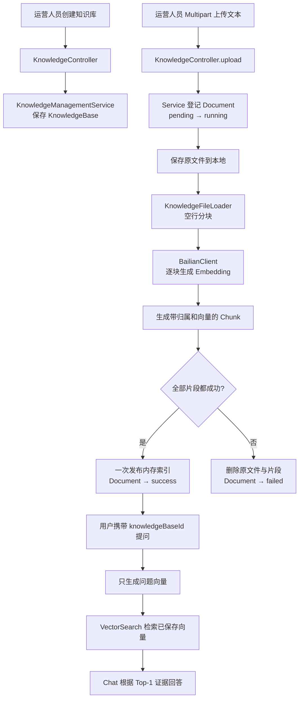

# 第 8 课：让运营人员上传自己的知识

## 1. 前言

> 本课两个真实流程已经由学生用 VS Code 绿色按钮验收，并提交、推送为 commit `1aec9c3`。

### 1.1 先用两条业务通路理解本课

本课可以先压缩成两条从 HTTP API 开始、一直走到动作结束的通路：

```text
通路一：保存知识
上传 HTTP API
→ 保存文档原文件
→ 按空行分块
→ 每块调用 Embedding 变成向量
→ 将“片段文字 + 向量 + 归属”保存在内存 Map

通路二：回答问题
问答 HTTP API
→ 根据 knowledgeBaseId 从内存 Map 取出带向量的片段
→ 把问题也变成向量
→ 本地选出最相近的片段
→ 把问题和证据交给聊天模型
→ 返回回答和来源
```

这里的“通路”不是一个 Java 类型，而是帮助阅读的业务路线：从外部入口开始，沿重要对象一直看到数据最终保存在哪里，或者结果最终交给了谁。

前几课虽然已经能通过 HTTP 提问，但可查询的“退货政策”和“保修政策”仍写在 `QuestionController` 的 Java 代码里。运营人员如果要增加一条公司制度，必须请开发者改代码、重新编译并重启服务。这不是真正可运营的知识系统。

本课增加一条新的完整业务链：运营人员先创建知识库，再通过 HTTP 上传 UTF-8 文本。服务器保存原文件，按第 3 课的格式切成知识片段，在上传阶段调用百炼生成片段向量，并把文档最终状态返回给运营人员。之后提问时指定这个知识库，系统直接检索已经保存的片段向量，再让聊天模型根据命中的证据回答。

这一课只解决“小文件同步上传”这个当前需求：知识库、文档元数据、片段和向量暂存在内存，原文件保存在本地磁盘。不会提前引入数据库、对象存储、消息队列、通用 Repository 或复杂 Pipeline。内存数据重启后会消失，这个真实问题将推动第 9 课；同步上传耗时长的问题将推动第 10 课。

## 2. 主要内容

### 2.1 本课需求和完成标准

一次成功流程必须做到：

1. `POST /api/knowledge-bases` 创建知识库并返回 `knowledgeBaseId`。
2. `POST /api/knowledge-bases/{knowledgeBaseId}/documents` 接收一个 `.txt` 或 `.md` 文件。
3. 原始文件保存到服务器本地目录，而不是只留在 HTTP 请求内存中。
4. 文件按空行切成知识块，每块保留标题、正文、关键词、文档归属和知识库归属。
5. 每个片段在上传阶段调用一次百炼 Embedding，向量成功后才发布到内存索引。
6. 文档明确经过 `pending → running → success`；任一步失败则进入 `failed`。
7. 成功文档可以查看片段，失败文档可以查看原因，而且不会留下半份索引或残留原文件。
8. 问答请求携带 `knowledgeBaseId` 后，能根据刚上传的新知识回答。

### 2.2 代码阅读顺序

这一课新增的数据对象比较多。不要按文件名随意跳读，请按业务发生顺序阅读：

> 课程演化提示：下面的 `KnowledgeUploadApiLiveIT.java` 是第 8 课当时的名字。第 10 课把同步上传演化为异步任务后，它已改名为 `AsyncKnowledgeUploadApiLiveIT.java`。阅读第 8 课时把两者视为同一条测试通路在不同时期的版本即可。

1. 先看 `KnowledgeUploadApiLiveIT.java` 的两个测试方法，不看下面的 HTTP 辅助函数。先认识运营人员做了哪几件事、每一步期待看到什么。
2. 看 `KnowledgeBase.java`、`KnowledgeDocument.java`、`DocumentStatus.java`、`KnowledgeChunk.java`。回答：知识库、文档、片段分别保存什么？谁拥有状态？谁拥有向量？
3. 看 `KnowledgeController.java`，依次读 `createKnowledgeBase`、`upload`、`getDocument`、`getChunks`。回答：每个 URL 接住什么 HTTP 数据，又把工作交给谁？
4. 看 `KnowledgeManagementService.java` 的 `createKnowledgeBase` 和 `upload`。先只看外层主流程，沿 `pending → running → success/failed` 走一遍。
5. 再看同一文件的 `saveOriginalFile`、`createIndex` 和 `cleanupFailedUpload`。回答：原文件何时落盘？片段何时真正对查询可见？失败时清掉什么？
6. 看 `QuestionRequest.java` 和 `QuestionController.ask`。回答：旧问题不传知识库编号时怎样保持兼容？新问题怎样选中刚上传的知识库？
7. 看 `BailianRagAssistant.answerFromIndex`。对比旧的 `answer`，回答：为什么现在少了“逐条向量化全部知识”这一步？
8. 如果还想验证流式路径，再看 `QuestionController.stream`、`StreamingQuestionService.startFromIndex` 和 `BailianRagAssistant.streamAnswerFromIndex`。它们复用第 7 课的 SSE 管理，只替换知识来源。
9. 最后回到 `KnowledgeUploadApiLiveIT.java`，阅读 `postJson`、`uploadText`、`getJson` 和 `apiUri`，理解测试如何发出真实 JSON、Multipart 和 GET 请求。

所有本课新增或修改的函数都有中文函数级注释。先读注释确定输入、输出、主流程和边界，再看函数体。

### 2.3 当前项目发生了什么变化

第 7 课以前，知识方向是：

```text
开发者修改 QuestionController 中的 Java 集合
→ 重新编译应用
→ 每次提问重新为所有知识生成向量
→ 检索和回答
```

第 8 课以后，运营知识方向是：

```text
运营人员创建知识库
→ 上传文本文件
→ 服务器保存原文
→ 分块
→ 上传时生成并保存片段向量
→ 提问只生成问题向量
→ 检索已保存的片段向量
→ 根据证据回答
```

旧的两条内置政策没有被偷偷迁移或删除。不传 `knowledgeBaseId` 时，前几课的测试和接口继续使用内置政策；传入编号时，才查询运营人员上传的知识库。这是为了让本课变化清楚，也让历史行为继续可运行。

## 3. 技术要点

### 3.1 先建立完整执行链：哪个对象接到什么，又交给谁

本课完整 Happy Path 可以分成八层。

#### 第一层：调用方创建知识库

调用方发送：

```http
POST /api/knowledge-bases
Content-Type: application/json

{"name":"公司内部制度"}
```

Spring 把 JSON 转成 `KnowledgeBaseCreateRequest`。`KnowledgeController.createKnowledgeBase` 将名称交给 `KnowledgeManagementService`，Service 生成 UUID，并把对象放入知识库 Map。响应示例：

```json
{
  "id": "kb-实际是一个UUID",
  "name": "公司内部制度"
}
```

#### 第二层：调用方用 Multipart 上传文件

调用方把上一步得到的编号放入 URL，并把文件放入名为 `file` 的 Multipart 部件：

```http
POST /api/knowledge-bases/{knowledgeBaseId}/documents
Content-Type: multipart/form-data; boundary=lesson8-boundary

--lesson8-boundary
Content-Disposition: form-data; name="file"; filename="company-rules.txt"
Content-Type: text/plain; charset=UTF-8

# 年假规则
关键词：年假、休假
员工连续工作满一年后，每年享有 5 天带薪年假。

# 访客规则
关键词：访客、预约
外部访客进入办公室前，需要由接待员工提前一天完成预约。
--lesson8-boundary--
```

Spring 的 Multipart 解析器识别边界，把文件名、类型和字节包装成 `MultipartFile`，再调用 `KnowledgeController.upload`。Controller 自己不读文件，只把知识库编号和 `MultipartFile` 交给 Service。

#### 第三层：Service 登记文档并推进状态

`KnowledgeManagementService.upload` 先确认知识库存在，再生成文档 UUID 和安全的本地路径。它先后把两份不可变的状态快照放入文档 Map：

```text
KnowledgeDocument(status=pending, chunkCount=0, errorMessage=null)
→ KnowledgeDocument(status=running, chunkCount=0, errorMessage=null)
```

状态属于 `KnowledgeDocument`，不是 Controller、文件或片段的状态。Controller 只是把最终状态返回出去。

#### 第四层：Service 保存原文件

`saveOriginalFile` 创建：

```text
data/uploads/{knowledgeBaseId}/
```

并将上传字节复制到：

```text
data/uploads/{knowledgeBaseId}/{documentId}.txt
```

服务器不用用户文件名作为磁盘文件名，而使用自己生成的 `documentId`，避免同名覆盖和文件名携带目录造成的路径问题。原文件名仍保存在文档元数据中，方便展示。

#### 第五层：Loader 把文件变成知识块

`KnowledgeFileLoader.load` 复用第 3 课已经验证过的格式。两个空行是知识块边界；每个知识块依次包含标题、关键词和正文。示例文件会产生：

```text
entry[0]
  title    = 年假规则
  keywords = [年假, 休假]
  content  = 员工连续工作满一年后，每年享有 5 天带薪年假。

entry[1]
  title    = 访客规则
  keywords = [访客, 预约]
  content  = 外部访客进入办公室前，需要由接待员工提前一天完成预约。
```

#### 第六层：Client 为每个片段生成向量

`createIndex` 遍历两条 `KnowledgeEntry`。每次把“标题 + 换行 + 正文”交给 `BailianClient.createEmbedding`：

```text
第 1 次 Embedding 输入：
年假规则
员工连续工作满一年后，每年享有 5 天带薪年假。

第 2 次 Embedding 输入：
访客规则
外部访客进入办公室前，需要由接待员工提前一天完成预约。
```

每个返回向量与文本、`knowledgeBaseId`、`documentId` 一起组成 `KnowledgeChunk`。向量只保存在服务器内部；查看片段 API 只返回 `vectorDimension`，不会把上千个浮点数塞给运营页面。

#### 第七层：全部成功后一次发布索引

Service 先把片段放在方法内部的临时列表 `indexedChunks` 中。只有两次 Embedding 都成功后，才执行：

```text
chunksByDocument.put(documentId, List.copyOf(indexedChunks))
```

随后文档进入：

```text
success + chunkCount=2
```

这样第二个片段失败时，第一个片段不会提前被问题检索到。上传响应示例：

```json
{
  "id": "doc-实际是一个UUID",
  "knowledgeBaseId": "kb-实际是一个UUID",
  "originalFilename": "company-rules.txt",
  "storedPath": "/.../data/uploads/.../doc-id.txt",
  "status": "success",
  "chunkCount": 2,
  "errorMessage": null
}
```

#### 第八层：问题使用已建好的索引

调用方发送：

```json
{
  "question": "员工工作满一年后，每年有几天带薪年假？",
  "knowledgeBaseId": "上一步创建的知识库编号"
}
```

`QuestionController` 从 Service 取出这个知识库下的 `EmbeddedKnowledge`，再调用 `BailianRagAssistant.answerFromIndex`：

```text
问题生成一次向量
→ VectorSearch 与两条已保存的片段向量比较
→ Top-1 选中“年假规则”
→ Chat 模型只看到问题和“年假规则”证据
→ 返回回答和 sourceTitle
```

完整流程图：



对象职责表：

| 重要对象 | 它拥有或看到什么 | 它完成什么 | 它不负责什么 |
|---|---|---|---|
| `KnowledgeController` | HTTP JSON、路径编号、`MultipartFile` | 把 HTTP 数据交给业务服务并返回 JSON | 不解析文件、不调用模型 |
| `KnowledgeManagementService` | 三张内存 Map、存储根目录、Client | 管理归属、落盘、状态、分块、索引和清理 | 不组装 HTTP Multipart |
| `KnowledgeDocument` | 文件名、保存路径、状态、片段数、错误 | 表示一次上传当前结果 | 不保存正文向量 |
| `KnowledgeChunk` | 文本、归属、向量 | 成为可以参与检索的最小知识单位 | 不管理整个文档状态 |
| `KnowledgeFileLoader` | 本地 UTF-8 文件 | 按第 3 课格式生成 `KnowledgeEntry` | 不访问网络、不保存状态 |
| `BailianClient` | 一段待向量化文字 | 调用百炼并返回 `double[]` | 不知道知识库和文档编号 |
| `BailianRagAssistant` | 问题、已建索引 | 问题向量化、Top-1 检索、Chat 编排 | 不保存上传文件 |
| `VectorSearch` | 问题向量、片段向量 | 按余弦相似度选证据 | 不关心文件来自哪里 |

### 3.2 为什么知识库、文档、片段要分成三个对象

它们回答的是三个不同层次的问题：

```text
KnowledgeBase：这些资料属于哪一个业务知识空间？
KnowledgeDocument：运营人员上传的是哪一个原文件，它处理成功了吗？
KnowledgeChunk：这个文件里的哪一小段文字可以参与向量检索？
```

本次测试中的归属关系是：

```text
知识库“公司内部制度”
└── 文档 company-rules.txt，status=success
    ├── 片段“年假规则”，有一个向量
    └── 片段“访客规则”，有一个向量
```

如果只保存一个“大文件字符串”，向量检索命中后无法指出具体证据片段；如果只保存片段，不保存文档，就无法回答“哪个文件失败了”“原文件在哪里”“一共生成几块”。这三层是当前上传和查询需求已经真实要求的数据，不是为了照搬原项目表结构。

### 3.3 `pending/running/success/failed` 到底是谁的状态

状态所有者是 `KnowledgeDocument`。本课同步路径的状态流是：

```text
收到文件并登记文档
→ pending：已经有文档编号，但还没开始处理

开始校验、落盘、分块和 Embedding
→ running：处理正在当前 HTTP 请求线程中进行

全部片段建立索引并一次发布
→ success：可以查询，chunkCount > 0

任一步抛出异常
→ failed：不可查询，chunkCount = 0，errorMessage 有原因
```

为什么测试和调用方通常只看到 `success` 或 `failed`？因为本课上传是同步的。HTTP 请求要等完整处理结束才返回，调用方还没有得到 `documentId` 时，内部已经快速经过 `pending` 和 `running`。

这不是状态设计失效，而是同步交互的限制。等大文件让请求等待太久时，第 10 课才会把处理放到后台：上传先返回 `pending`，调用方拿着 ID 查询时才能实际观察 `running`。现在不提前做后台任务。

### 3.4 为什么上传时建立索引，而不是提问时重新算全部向量

先拆开 `answerFromIndex` 这个容易误读的方法名：

- `answer` 是“生成回答”。
- `from` 是“回答所使用的数据来自哪里”。
- `index` 在这里不是数组下标，也不是 `for` 循环里的第几个元素，而是“已经建立好的可检索数据结构”。

第 8 课的“索引”没有神秘组件，它的具体形态就是：许多 `EmbeddedKnowledge`（知识文字与向量的配对）按文档保存在内存 `ConcurrentHashMap` 中。向量确实可以理解为文本在高维空间中的一组坐标；但“向量”是单条数据的数值表示，“索引”是系统怎样保存、组织并取出许多向量，两者不是同一个概念。

如果重新命名得更直白，`answerFromIndex` 可以理解成 `answerFromCandidatesThatAlreadyHaveVectors`：使用“已经带向量的候选知识”回答。第 9 课改用数据库后，会继续区分“向量数据”“数据库索引”和“已经建立索引的数据”，避免都用一个 `index` 含糊带过。

第 5～7 课的内置知识只有两条，所以每次问题都执行：

```text
知识 1 Embedding
→ 知识 2 Embedding
→ 问题 Embedding
→ 检索
```

同一条知识文本没有变化，却为每个问题重复付出网络时间和模型调用。运营上传后，知识会不断增加，这个做法已经出现真实问题。

本课改成：

```text
上传一次：每个片段各做一次 Embedding并保存

每次提问：只为新问题做一次 Embedding
→ 与保存好的片段向量比较
```

`answerFromIndex` 中没有遍历知识并调用 Embedding，因为参数 `List<EmbeddedKnowledge>` 已经同时携带文字和向量。它仍然要为每个不同的问题生成问题向量，否则无法把用户问题放到同一个向量空间里比较。

### 3.5 为什么不能生成一个片段就立刻放进共享索引

假设文件有两块知识：

```text
片段 1 Embedding 成功
片段 2 Embedding 因网络错误失败
```

如果片段 1 成功后立刻写入 `chunksByDocument`，文档最后虽然标记为 `failed`，用户问题却可能搜到片段 1。系统同时说“文档失败”和“文档的一半可以查”，状态含义会变得不可靠。

因此本课先在局部列表中构造全部 `KnowledgeChunk`：

```text
indexedChunks（只有当前 upload 方法看得见）
```

全部成功后再用一次 `put` 发布不可修改的列表。这是一条很小但重要的业务边界：`success` 表示整份文件的片段已经一起可查，`failed` 表示一个也不发布。

它还不是数据库事务。Java 进程突然退出时，内存与磁盘仍可能不一致；第 9 课有了数据库后，才讨论真正的持久化事务边界。

### 3.6 失败路径具体清理了什么

测试上传的失败内容是：

```text
这不是符合当前课程格式的知识块
```

`KnowledgeFileLoader` 期望标题、`关键词：` 行和正文，因此抛出：

```text
知识块必须依次包含标题、关键词和正文
```

Service 捕获异常后依次做：

```text
chunksByDocument.remove(documentId)
→ Files.deleteIfExists(storedFile)
→ 保存 failed 文档状态
→ chunkCount=0
→ errorMessage=原始可读原因
```

失败文档记录不能一起删除，否则运营人员只会发现上传结果凭空消失，不知道为何失败。应清理的是不能被查询的半成品和残留原文件；应保留的是失败事实和诊断原因。

上传接口在这种情况下仍返回 HTTP 201，因为“文档记录”已经成功创建，可以继续用它的 ID 查询失败原因；业务处理是否成功由正文中的 `status` 表达。如果连知识库编号都不存在，请求无法创建文档记录，异常处理器才返回 HTTP 404。HTTP 结果与文档处理结果是两个层次，不能只看其中一个。

### 3.7 什么是 Multipart，为什么 JSON 不能直接代替它

JSON 很适合传名称、编号和问题：

```json
{"name":"公司内部制度"}
```

上传文件还需要同时表达文件名、内容类型和原始字节。`multipart/form-data` 把一个 HTTP 请求正文切成若干部件，每个部件有自己的头和内容。`boundary` 就是部件之间的分隔线。

当前请求只有一个名为 `file` 的部件。Controller 中：

```java
@RequestPart("file") MultipartFile file
```

可以直白理解为：

```text
从 Multipart 请求中找到 name="file" 的那一块
→ 让 Spring 包装成 MultipartFile
→ Java 可以读取原文件名、是否为空和输入流
```

`MultipartFile` 是 Spring 的接口。它不是磁盘文件；它代表“当前 HTTP 请求收到的上传内容”。所以 Service 必须在请求结束前用 `getInputStream` 读取并复制到自己的持久位置。

### 3.8 `@Value("${ragent.storage-root:data/uploads}")` 是什么意思

构造函数参数写着：

```java
@Value("${ragent.storage-root:data/uploads}") String storageRoot
```

它的意思是：

```text
如果 Spring 配置了 ragent.storage-root，就使用配置值；
否则使用 data/uploads。
```

正常启动应用时不需要额外配置，文件保存到项目工作目录下的 `data/uploads`。`.gitignore` 已忽略 `/data/`，原始业务文件不会误提交到 Git。

测试注解专门覆盖成：

```java
properties = "ragent.storage-root=target/lesson8-uploads"
```

因此测试文件进入 `target`，执行 `mvn clean` 时会一起清理，不污染正常运行数据。这项配置是当前存储需求直接需要的路径差异，不是为未来预埋的通用配置系统。

### 3.9 为什么状态对象用 record，并且每次整体替换

`KnowledgeDocument` 是 `record`，字段创建后不能逐个改写。本课状态变化不是在同一个对象上执行 `setStatus`，而是创建新快照并整体放回 Map：

```text
pending 对象
→ 新建 running 对象并替换 Map 中的值
→ 新建 success 或 failed 对象并再次替换
```

大白话说，每个对象像一张当时的状态照片。读到它的线程不会看到“状态已经是 success，但 chunkCount 还没来得及修改”的半更新对象。当前仍使用 `ConcurrentHashMap`，因为 Spring Service 是所有 HTTP 请求共享的单例，多个运营人员可能同时创建或上传。

这里没有用复杂锁或自定义状态机。同步处理让同一文档只由上传请求线程推进，Map 只需要安全保存不同请求的结果。

### 3.10 `indexedKnowledge` 为什么是两层循环

`chunksByDocument` 的结构是：

```text
documentId → 这份文档的 Chunk 列表
```

假设内存中有两份文档：

```text
doc-A → [年假规则(kb-1), 访客规则(kb-1)]
doc-B → [退货政策(kb-2)]
```

查询 `kb-1` 时，`indexedKnowledge` 的外层循环逐份取出文档片段列表；内层循环再逐个查看列表里的片段：

```text
外层来到 doc-A
  内层看年假规则：knowledgeBaseId=kb-1，加入结果
  内层看访客规则：knowledgeBaseId=kb-1，加入结果

外层来到 doc-B
  内层看退货政策：knowledgeBaseId=kb-2，跳过
```

最后每个命中的 `KnowledgeChunk` 调用 `toEmbeddedKnowledge()`，只把现有检索器需要的“知识文字 + 向量”交出去。文档编号和知识库编号仍留在管理层，不需要塞进余弦相似度算法。

当前数据量小，直接两层循环最容易理解。等第 9 课数据进入数据库后，才由数据库按照 `knowledgeBaseId` 筛选，不提前为未来创建 Repository 查询接口。

### 3.11 `stream().map(...).toList()` 在片段接口里做了什么

`KnowledgeController.getChunks` 中出现：

```java
chunks.stream()
        .map(KnowledgeChunkResponse::from)
        .toList();
```

它不是网络流，也不是第 7 课的 SSE，而是 Java 集合的 Stream 写法。这里的三个动作是：

```text
stream()：按顺序看列表中的每个 KnowledgeChunk
map(...)：把每个内部 Chunk 转成一个对外 Response
toList()：收集成新的响应列表
```

方法引用 `KnowledgeChunkResponse::from` 等价于：

```java
chunk -> KnowledgeChunkResponse.from(chunk)
```

如果用普通循环表达，就是：

```text
创建空响应列表
→ 逐个读取内部 Chunk
→ 每个都调用 from
→ 把转换结果加入响应列表
→ 返回列表
```

这样转换的原因不是追求语法短，而是不能把内部 `double[] vector` 原样作为 HTTP JSON 返回。响应保留标题、正文和归属，只用 `vectorDimension` 证明索引已经存在。

### 3.12 `@JsonValue` 为什么放在枚举的 `code()` 上

Java 枚举常量习惯写成大写：

```java
PENDING, RUNNING, SUCCESS, FAILED
```

对外 HTTP 协议希望返回更常见的小写值：

```json
"status": "success"
```

每个枚举常量保存一个小写 `code`。Jackson 看到 `@JsonValue` 后，序列化枚举时使用 `code()` 的结果，而不是常量名。于是 Java 内部保持清楚的大写常量，对外仍得到大纲约定的 `pending/running/success/failed`。

### 3.13 从百炼模型的视角，它先后看到了什么

成功测试上传两块知识，因此上传阶段的 Embedding 模型依次收到两次独立请求。第一份核心请求体是：

```json
{
  "model": "text-embedding-v4",
  "input": "年假规则\n员工连续工作满一年后，每年享有 5 天带薪年假。"
}
```

第二份把 `input` 换成访客规则。Embedding 模型只返回数字向量，不产生自然语言回答，也不知道知识库 ID 或文档 ID；这些归属由本地 `KnowledgeChunk` 保存。

用户提问时，Embedding 模型第三次收到：

```json
{
  "model": "text-embedding-v4",
  "input": "员工工作满一年后，每年有几天带薪年假？"
}
```

随后 `VectorSearch` 在本地比较向量并选择“年假规则”。这一步不访问百炼。最后 Chat 模型收到：

```json
{
  "model": "qwen-plus-latest",
  "messages": [
    {
      "role": "system",
      "content": "你是企业知识助手。只能根据提供的证据回答；证据不足时必须明确说不知道。"
    },
    {
      "role": "user",
      "content": "问题：员工工作满一年后，每年有几天带薪年假？\n\n证据标题：年假规则\n证据正文：员工连续工作满一年后，每年享有 5 天带薪年假。"
    }
  ],
  "max_tokens": 300
}
```

Chat 模型看不到未命中的访客规则，也看不到服务器文件路径、完整向量、知识库 Map 或文档状态。它只负责根据本地已经选好的证据组织语言。

### 3.14 当前实现刻意没有做什么

- 没有数据库：知识库、文档和片段元数据重启后消失，第 9 课再解决。
- 没有对象存储：原文件先保存在本机，当前单机需求足够。
- 没有后台任务：上传 HTTP 请求会等待所有 Embedding 完成，第 10 课再解决耗时和进度。
- 没有 PDF、Excel 解析：本课只接受 `.txt` 和 `.md`，复杂格式由后续真实需求推动。
- 没有 Repository 接口：目前只有内存 Map 这一种具体保存方式，等数据库替换真的发生时再形成合适边界。
- 没有把旧政策强制迁入新知识库：不扩大本课改动，历史接口继续可用。

## 4. 测试与验收

### 4.1 环境有没有新增配置

本课不需要安装新的 VS Code 插件、JDK、Maven 或 Maven 依赖。继续使用已经可用的：

- VS Code 的 Extension Pack for Java；
- WSL 内的 JDK 17 与 Maven；
- 已永久配置并能被 VS Code Java 进程读取的 `DASHSCOPE_API_KEY`。

正常运行时，上传目录会自动创建为：

```text
ragent-st/data/uploads
```

测试时使用：

```text
ragent-st/target/lesson8-uploads
```

你不需要手动创建这两个目录。`Files.createDirectories` 会在第一次成功落盘前创建它们。

### 4.2 两个测试分别保护什么

`shouldUploadIndexAndAnswerFromNewKnowledge` 是主要 Happy Path，一个测试跑满：

```text
创建知识库
→ 上传两个文本块
→ 文档 success、chunkCount=2
→ 原文件真实存在
→ GET 再查到 success
→ 查看两条 Chunk 及其归属和向量维度
→ 携带 knowledgeBaseId 提问
→ 真实百炼返回非空回答
→ sourceTitle=年假规则
```

它会真实调用百炼：上传阶段两次 Embedding，提问阶段一次 Embedding 和一次 Chat。不会使用 Stub。

`shouldExposeFailureAndCleanPartialData` 使用格式错误的文本，一个测试跑满：

```text
创建知识库
→ 上传错误文本
→ 文档 failed
→ chunkCount=0
→ errorMessage 非空
→ 原文件已删除
→ GET chunks 返回空数组
```

它在解析阶段就失败，不调用百炼，不产生模型费用。

### 4.3 用绿色按钮运行

在 VS Code 打开：

```text
ragent-st/src/test/java/com/shitan/ai/KnowledgeUploadApiLiveIT.java
```

建议先点击类名左侧的绿色三角，选择 `Run Test`，让两个流程一次完成。这符合你希望的“少数几个测试跑满业务流程”，不需要逐个方法机械来回。

测试成功后应看到两个绿色对勾。输出中还会出现三组重要中间数据：

```text
上传后的文档状态：{..."status":"success","chunkCount":2...}
生成的片段数据：[{..."title":"年假规则"...}, {..."title":"访客规则"...}]
基于新知识的回答：{..."sourceTitle":"年假规则"...}
失败文档状态：{..."status":"failed"...}
```

第一次运行真实 Happy Path 时需要等待四次模型 HTTP 调用，不要因为几秒内没有绿色结果就重复点击。失败时请把以下信息发给姐姐：

- 失败的测试方法名；
- 第一段 `Caused by`；
- 实际 HTTP 状态码和响应正文；
- 如果文档已经返回，提供 `status` 与 `errorMessage`；
- 不要发送 API Key。

### 4.4 Maven 备用命令

姐姐已经完成的自检结果：

```text
mvn clean test
→ 历史 11 个自动测试全部通过

失败清理单方法
→ 1 个测试通过，未访问百炼
```

如果绿色按钮因为 Java Language Server 缓存异常而不能运行，可以在 `ragent-st` 目录使用：

```bash
mvn -Dtest=KnowledgeUploadApiLiveIT test
```

它会运行两个测试，其中 Happy Path 会访问真实百炼。日常仍优先使用你熟悉的绿色按钮。

## 5. 本课完成后你应该能讲清楚

1. 为什么运营上传知识需要知识库、文档和片段三层数据。
2. Multipart 请求怎样把文件名、类型和字节交给 `MultipartFile`。
3. `KnowledgeManagementService` 怎样推进文档状态、保存原文件、分块和建立向量索引。
4. 为什么必须等全部片段成功后再一次发布索引。
5. 为什么失败时删除文件和片段，却保留 `failed` 文档记录。
6. 上传建立索引后，提问为什么只需要再生成一次问题向量。
7. 百炼 Embedding、`VectorSearch` 和 Chat 模型在这条链上分别看见什么、做什么。
8. 当前内存状态和本地文件有哪些限制，以及为什么现在不提前引入数据库和后台任务。

等你亲自运行两个测试、确认看懂流程并提出问题后，我们再把你的理解与疑惑补入本教案，整理学习记录，然后姐姐会提醒你手动 `git status`、`git diff`、commit 和 `git push origin main`。在你验收之前，不进入第 9 课。
