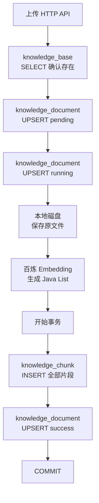
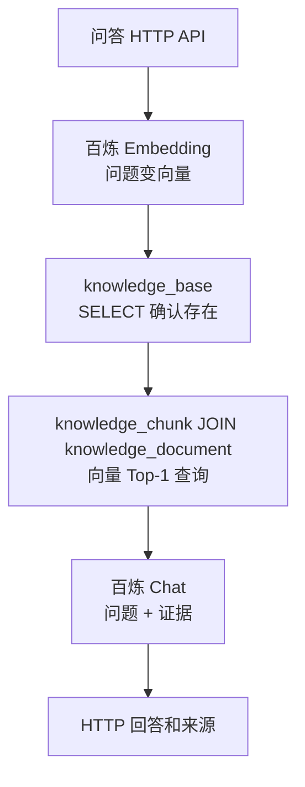
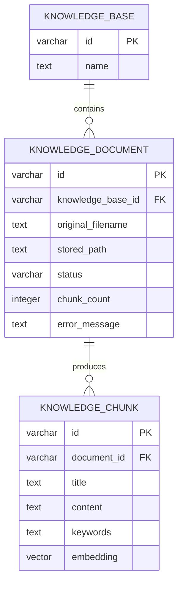

# 第 9 课：服务重启后，上传的知识不能消失

## 1. 先用三条业务通路理解本课

> 本课代码已经准备好。学生第一次运行数据库测试时暴露了容器被重复创建的问题；修复后已用一只明确管理的临时容器完整跑通，仍建议用绿色按钮再验收一次。

这一课先不要从 JDBC、SQL 或 Docker 开始。整个变化可以压缩成三条从入口走到动作结束的通路。

```text
通路一：应用启动并准备数据库
启动 Spring Boot
→ 连接 PostgreSQL
→ Flyway 检查已经执行过哪些版本
→ 执行尚未执行的 V1 SQL
→ 创建 pgvector 扩展、三张业务表和数据库索引
→ 应用开始接收 HTTP 请求

通路二：保存知识
上传 HTTP API
→ 原文件仍保存到本地磁盘
→ 文档分块
→ 每个片段调用百炼生成 1024 维向量
→ Repository 用 JDBC 把知识库、文档、片段和向量写入 PostgreSQL
→ 全部片段和 success 状态在同一个事务中提交

通路三：回答问题
问答 HTTP API
→ 百炼把问题变成 1024 维向量
→ Repository 把问题向量交给 PostgreSQL
→ pgvector 在数据库中直接选出余弦距离最近的 Top-1 片段
→ Assistant 把问题和证据交给聊天模型
→ HTTP API 返回回答和来源
```

第 8 课的核心是“文档分块向量化后放进当前 Java 进程的 Map”；第 9 课的核心是“Map 被 PostgreSQL 替换，Java 对象全部重新创建后，数据库中的关系和向量仍然存在”。

本课只持久化已经出现的知识业务数据。课程大纲原先标题提到“会话”，但当前项目还没有会话对象和会话需求，所以不能凭未来想象提前建会话表；标题和实现都收缩为“上传的知识不能消失”。

### 1.1 上传通路到底按什么顺序访问哪些表

你的概括“保存文件、改文件状态、保存 chunks”抓住了三个主要动作，不过真实顺序要再展开一点。这里的“状态”是数据库中的**文档处理状态**，不是操作系统里的文件状态。

```text
创建知识库：
POST /api/knowledge-bases
→ INSERT knowledge_base

上传文档：
POST /api/knowledge-bases/{knowledgeBaseId}/documents
→ SELECT knowledge_base，确认知识库存在
→ UPSERT knowledge_document，状态写成 pending
→ UPSERT knowledge_document，同一行改成 running
→ 保存原文件到本地磁盘（不访问数据库）
→ 解析文件并调用百炼生成每个片段的向量（暂时只放在 Java List）
→ 开启数据库事务
   → INSERT knowledge_chunk，逐条写入片段和向量
   → UPSERT knowledge_document，最后才改成 success 并写入片段数
→ COMMIT，片段和 success 一起生效
```



代码确实先 `new KnowledgeDocument(... SUCCESS ...)`，但这一步只是在 Java 内存里准备一个值，**还没有修改数据库**。真正的数据库顺序写在 `publishSuccessfulDocument` 中：先循环插入全部 `knowledge_chunk`，再调用 `saveDocument` 把 `knowledge_document` 改成 `success`。这两步由同一个事务包住。

如果处理失败，清理流程会删除该文档可能残留的 `knowledge_chunk` 和本地文件，再把 `knowledge_document` 更新为 `failed`。`knowledge_base` 不会因为一份文档失败而被删除。

### 1.2 问答通路到底按什么顺序访问哪些表

你的第二条概括“问题向量化、数据库搜索、生成回答”是准确的。把数据库动作标出来以后是：

```text
POST /api/questions
→ 百炼 Embedding：把问题变成向量（不访问数据库）
→ SELECT knowledge_base：确认指定知识库存在
→ SELECT knowledge_chunk JOIN knowledge_document：
   只查该知识库中 status=success 的片段，按向量距离取 Top-1
→ 百炼 Chat：把问题和 Top-1 证据生成回答（不访问数据库）
→ 返回 HTTP 响应（本课不保存会话，所以不写数据库）
```



这里需要连接 `knowledge_document`，是因为 `knowledge_chunk` 只保存 `document_id`；知识库归属和文档是否已经成功发布，都保存在文档表。当前还没有会话需求和会话表，因此一次问答不会写入任何业务表。

## 2. 本课需求与边界

### 2.1 完成标准

- 知识库、文档、片段和向量不再保存在内存 Map。
- PostgreSQL 保存对象之间的归属关系，pgvector 保存 1024 维向量。
- 应用启动时自动执行版本化迁移脚本，不靠开发者手工建表。
- 一份文档的全部片段和 `success` 状态在同一个事务内提交。
- 问答时由 pgvector 执行 Top-1 余弦距离查询，不再把全部向量加载进 Java 排序。
- 测试重新创建 Repository 和 Service 后，仍能恢复文档和片段。
- 本地原文件继续保留；本课不同时引入对象存储。

### 2.2 本课刻意不做什么

- 不增加会话表，因为会话功能尚未出现。
- 不增加通用 Repository 接口；当前只有 PostgreSQL 一种真实实现。
- 不使用 JPA/Hibernate，让 SQL、表、外键和向量查询保持可见。
- 不把上传改成后台任务；同步耗时问题留给第 10 课。
- 不引入云数据库；教学和测试先使用本机 Docker 容器。

## 3. 代码阅读顺序

教案中保留阅读顺序，聊天框也会再次提供可点击源码链接。

1. 先读本教案第 1 节的三条通路，确认本课没有改变文件解析和模型生成的基本顺序。
2. 看 `V1__create_knowledge_tables.sql`。先只数清三张表、三个外键/归属方向和三个索引，不要马上背 SQL。
3. 看 `KnowledgePersistenceIT.shouldRecoverKnowledgeAndSearchVectorsAfterObjectsAreRecreated`。观察测试先保存什么，丢弃哪些 Java 对象，重新创建后又读取什么。
4. 看 `KnowledgeRepository` 构造函数以及 `insertKnowledgeBase`、`saveDocument`，理解 `JdbcTemplate` 中 SQL 的 `?` 如何接收 Java 参数。
5. 看 `publishSuccessfulDocument`，重点观察 `TransactionTemplate` 包住了哪些 SQL，以及为什么最后才写 `success`。
6. 看 `findDocument`、`findChunksByDocument` 和两个 RowMapper 函数，理解数据库行怎样恢复成 Java record。
7. 看 `searchTopOne`，逐项读懂 `JOIN`、`WHERE`、`ORDER BY embedding <=> ...` 和 `LIMIT 1`。
8. 看 `KnowledgeManagementService`。与第 8 课对比：业务步骤大体不变，只是所有 Map 读写换成了 Repository。
9. 看 `BailianClient.createEmbedding`，注意新增的 `dimensions=1024` 如何与数据库 `VECTOR(1024)` 对齐。
10. 看 `BailianRagAssistant.answerFromDatabase`，理解问题向量怎样进入数据库、证据又怎样返回聊天模型。
11. 最后看 `application.properties`、测试配置和 `compose.yaml`，区分正常运行数据库与测试临时数据库。

## 4. 数据结构：三张表怎样对应第 8 课对象

第 8 课已经出现三层 Java 数据：

```text
KnowledgeBase
└── KnowledgeDocument
    └── KnowledgeChunk
```

第 9 课没有为了数据库重新发明业务结构，而是直接建立对应的三张表：



测试中的真实关系是：

```text
knowledge_base
  kb-company, 公司制度

knowledge_document
  doc-rules, knowledge_base_id=kb-company, status=success

knowledge_chunk
  chunk-leave,   document_id=doc-rules, 年假规则,   vector(1024)
  chunk-visitor, document_id=doc-rules, 访客规则,   vector(1024)
```

`knowledge_chunk` 不重复保存 `knowledge_base_id`。查询片段所属知识库时，通过 `document_id` 连接文档表，再从文档取得知识库编号。这就是关系数据库中的“关系”：编号把分散在不同表的行重新连起来。

外键保护这种关系：不存在的知识库不能凭空拥有文档，不存在的文档不能凭空拥有片段。删除文档时，`ON DELETE CASCADE` 会让数据库一起删除所属片段，避免孤儿数据。

## 5. 先把几种容易混淆的 `index` 分开

这一课至少会遇到三种中文里都可能叫“索引”的东西。

### 5.1 Java 数组下标 `index`

```java
for (int index = 0; index < vector.length; index++)
```

这里的 `index` 就是第几个元素：0、1、2……它是坐标位置或数组下标。

### 5.2 向量数据

```text
[0.9, 0.1, 0.0, ...]
```

一个向量可以理解为文本在 1024 维空间中的坐标。它是需要保存和比较的数据，不等于数据库索引。

### 5.3 数据库索引

```sql
CREATE INDEX idx_knowledge_chunk_embedding
ON knowledge_chunk USING hnsw (embedding vector_cosine_ops);
```

这是 PostgreSQL 为了更快找到相近向量而建立的辅助数据结构。表中的每个 `embedding` 是原始数据；HNSW 是组织大量向量、减少检索工作量的数据库索引。

普通 B-tree 索引则帮助按编号筛选：

```text
idx_knowledge_document_base：按知识库编号找文档
idx_knowledge_chunk_document：按文档编号找片段
```

第 8 课的 `answerFromIndex` 把“已经准备好可检索的数据”笼统叫做 index，容易误读。本课把方法改名：

```text
answerFromCandidatesWithVectors
```

表示参数是一组“已经带向量的候选知识”。数据库路径则明确叫：

```text
answerFromDatabase
```

## 6. Flyway：为什么应用不能靠手工建表

如果姐姐只告诉你打开数据库执行一段 SQL，当前电脑可能能运行，但换一台电脑、测试容器或服务器时，大家很容易拥有不同版本的表。

Flyway 把数据库结构变化保存为项目中的版本文件：

```text
src/main/resources/db/migration/
└── V1__create_knowledge_tables.sql
```

命名拆开看：

```text
V1       第 1 个数据库版本
__       版本与描述之间固定使用两个下划线
create_knowledge_tables  这次迁移做什么
.sql     PostgreSQL 要执行的 SQL
```

应用连接数据库后，Flyway 会查看自己的 `flyway_schema_history` 表：

```text
V1 没执行过
→ 执行 V1
→ 记录版本、校验值和成功状态

V1 已成功执行
→ 不重复建表
```

以后结构真的要改变时新增 `V2__...sql`，不能随意修改已经在别处执行过的 V1。否则同一个“V1”在不同环境代表不同结构，历史就不可信。

V1 的第一句是：

```sql
CREATE EXTENSION IF NOT EXISTS vector;
```

PostgreSQL 本身没有 `vector` 列和 `<=>` 运算符；pgvector 扩展把这些能力安装进当前数据库。`IF NOT EXISTS` 表示扩展已经启用时不报错。

## 7. JDBC、Driver 和 JdbcTemplate 分别做什么

可以把数据库调用分成四层：

```text
KnowledgeRepository
→ JdbcTemplate
→ PostgreSQL JDBC Driver
→ PostgreSQL 容器
```

- `KnowledgeRepository` 写当前业务需要的具体 SQL。
- `JdbcTemplate` 帮忙取得/归还连接、创建语句、绑定参数、关闭结果集，并把底层异常转换成 Spring 数据异常。
- PostgreSQL JDBC Driver 把 Java JDBC 操作转换成 PostgreSQL 网络协议。
- PostgreSQL 真正执行 SQL、事务和向量距离计算。

例如：

```java
jdbcTemplate.update(
    "INSERT INTO knowledge_base(id, name) VALUES (?, ?)",
    knowledgeBase.id(),
    knowledgeBase.name()
);
```

两个 `?` 是参数位置：

```text
第一个 ? ← knowledgeBase.id()
第二个 ? ← knowledgeBase.name()
```

不要用字符串拼接把值塞进 SQL。参数绑定能正确处理引号、编码和类型，也避免用户输入改变 SQL 结构。

## 8. 为什么现在才出现 Repository，而且暂时不是接口

第 8 课只有三个 Map，Service 自己读写很直接。第 9 课出现了许多成组的数据库动作：

- 插入知识库；
- 保存文档状态；
- 在事务中发布片段；
- 从数据库行恢复 Java 对象；
- 用 pgvector 执行 Top-1 查询；
- 失败时删除片段。

这些动作都围绕“Java 对象怎样进出 PostgreSQL”，已经形成一个真实、稳定的数据访问职责，所以现在新增具体的 `KnowledgeRepository`。

当前只有 PostgreSQL 一种实现，没有第二种实现需要替换，也没有 Mock Repository 需求，所以不创建 `KnowledgeRepository` 接口和 `PostgresKnowledgeRepository` 实现类。`@Repository` 是 Spring 组件含义，不等于“必须先有一个 Java interface”。

## 9. 上传事务：为什么片段和 success 必须一起提交

一次成功发布要执行：

```text
INSERT chunk 1
→ INSERT chunk 2
→ UPDATE document status=success, chunk_count=2
```

如果第二条片段 SQL 失败，而第一条已经永久保存，就会重现第 8 课防止过的“半份文档可查询”问题。

`publishSuccessfulDocument` 使用 `TransactionTemplate`：

```text
开始事务
→ 写入全部 Chunk
→ 更新文档 success
→ 所有动作都成功：COMMIT，一起生效
→ 任一步抛异常：ROLLBACK，一起撤销
```

`TransactionTemplate.executeWithoutResult(...)` 中传入的是一段要放在同一事务执行的行为。它和第 7 课的方法引用一样，都属于“把以后要执行的代码交给另一个对象”；但这里接收者是事务模板，它负责在行为前后开启、提交或回滚事务。

文档的 `pending` 和 `running` 在这个事务之前分别保存，因为处理期间这些状态本来就应该存在。最后“所有片段 + success”必须原子发布。

这里用到的事务语法不是 `@Transactional`，而是显式的 `TransactionTemplate`：

```java
transactionTemplate.executeWithoutResult(transactionStatus -> {
    // 先 INSERT 全部 knowledge_chunk
    // 再 UPDATE knowledge_document 为 success
});
```

`transactionStatus -> { ... }` 是 Lambda，表示“请事务模板执行大括号里的整段代码”。事务模板会在进入 Lambda 前开始事务；Lambda 正常结束就提交，异常向外抛出就回滚。这里选择显式模板，是为了让第一次学习事务时能直接看到事务边界包住了哪些 SQL。

## 10. `ON CONFLICT` 为什么能更新同一份文档

同一个文档 ID 会依次保存三次：

```text
doc-123 + pending
doc-123 + running
doc-123 + success/failed
```

`id` 是主键，第二次直接 `INSERT` 会发生主键冲突。SQL 使用 PostgreSQL 的 Upsert：

```sql
INSERT ...
ON CONFLICT (id) DO UPDATE SET
    status = EXCLUDED.status,
    chunk_count = EXCLUDED.chunk_count,
    error_message = EXCLUDED.error_message
```

直白地说：

```text
这个 id 不存在 → 插入整行
这个 id 已存在 → 只更新状态、片段数和错误原因
```

`EXCLUDED.status` 不是“被排除不要的状态”，而是“刚才准备插入、但因为主键冲突没能直接插入的那份新值”。这是 PostgreSQL 的固定命名。

## 11. Java 向量怎样进入 PostgreSQL

百炼客户端返回：

```java
double[] vector
```

pgvector 的文本输入形式是：

```text
[0.12,-0.31,0.08,...]
```

`toVectorLiteral` 用循环把 1024 个 `double` 拼成这种格式，SQL 再执行：

```sql
CAST(? AS vector)
```

意思是“这个参数目前是字符串，请 PostgreSQL 按 pgvector 的 vector 类型解析”。读取时做相反转换：去掉首尾方括号、按逗号拆开、逐个 `Double.parseDouble`，恢复成 `double[]`。

项目不额外引入 pgvector Java 封装库，是因为当前只需要一种写入格式和一种读取格式；这几十行直接代码更适合看清边界。等协议处理重复或复杂后再评估额外依赖。

## 12. 为什么 Embedding 维度现在显式写成 1024

百炼 `text-embedding-v4` 支持多个输出维度，默认是 1024。第 8 课依赖默认值还不明显；数据库列一旦声明：

```sql
embedding VECTOR(1024)
```

模型和数据库就必须明确遵守同一契约。因此请求增加：

```json
{
  "model": "text-embedding-v4",
  "input": "要向量化的文字",
  "dimensions": 1024
}
```

如果模型返回 768 维而数据库要求 1024 维，插入会失败。显式字段让错误更早、更容易定位，也让 HNSW 索引拥有固定维度。

测试不调用百炼，而是创建 `new double[1024]`，只设置前两个坐标：

```text
年假规则 = [1.0, 0.0, 0, 0, ...]
访客规则 = [0.0, 1.0, 0, 0, ...]
问题向量 = [0.9, 0.1, 0, 0, ...]
```

这与第 4 课二维例子方向完全相同，只是补了 1022 个零，以符合真实数据库维度。

## 13. pgvector 查询逐句阅读

核心 SQL 是：

```sql
SELECT c.title, c.content, c.keywords
FROM knowledge_chunk c
JOIN knowledge_document d ON d.id = c.document_id
WHERE d.knowledge_base_id = ? AND d.status = 'success'
ORDER BY c.embedding <=> CAST(? AS vector)
LIMIT 1
```

逐句翻译：

```text
FROM knowledge_chunk c
→ 从片段表开始

JOIN knowledge_document d ON d.id = c.document_id
→ 根据文档编号接上文档行，取得知识库归属和状态

WHERE d.knowledge_base_id = ? AND d.status = 'success'
→ 只保留本次指定知识库中已经成功发布的文档

ORDER BY c.embedding <=> questionVector
→ 计算每个片段向量到问题向量的余弦距离，并从小到大排列

LIMIT 1
→ 只取最接近的一条证据
```

第 4 课 Java 算的是余弦相似度：越大越相似。pgvector 的 `<=>` 算余弦距离：越小越接近。

```text
cosineDistance = 1 - cosineSimilarity
```

因此 SQL 使用默认升序 `ORDER BY`，距离最小的片段排第一。`<=>` 不是 Java 运算符，是 pgvector 在 PostgreSQL 中定义的 SQL 运算符。

## 14. RowMapper：数据库的一行怎样恢复成 record

`JdbcTemplate.query` 会遍历结果集中的每一行，并调用映射函数：

```java
private KnowledgeDocument mapDocument(ResultSet resultSet, int rowNumber)
```

`ResultSet` 可以理解为 JDBC 的“查询结果游标”。当函数被调用时，它已经指向当前这一行：

```text
resultSet.getString("id")
→ 读取当前行 id 列

resultSet.getInt("chunk_count")
→ 读取当前行 chunk_count 列
```

`rowNumber` 是当前第几行，但本次映射不需要它。函数把列值按构造顺序交给 `KnowledgeDocument` 或 `KnowledgeChunk`，数据库行就恢复成业务对象。

状态列是小写字符串，所以 `DocumentStatus.fromCode("success")` 把它恢复成 `DocumentStatus.SUCCESS`。

## 15. 测试怎样证明“重启后仍存在”

测试没有真的重启整台电脑。它做的是对持久化边界更直接的验证：

```text
创建 firstRepository
→ 保存知识库、文档、两个片段和向量
→ 不再使用 firstRepository

重新 new restartedRepository
→ 重新 new restartedService
→ 新对象没有第 8 课的任何内存 Map 数据
→ 仍能按 documentId 从 PostgreSQL 恢复文档和两个片段
→ 仍能用 pgvector 选中年假规则
```

容器数据库在两批 Java 对象之间保持不变，所以测试证明数据生命期不再绑定某个 Service 或 Repository 实例。

测试还直接查询：

```sql
SELECT vector_dims(embedding) ...
```

确认向量确实以 1024 维保存在 pgvector，而不是只把文本保存后又在 Java 中假装检索。

## 16. Testcontainers：测试为什么不要求手工安装数据库

当前测试类明确声明并管理一只临时数据库容器：

```java
private static final PostgreSQLContainer DATABASE =
        new PostgreSQLContainer("pgvector/pgvector:pg17")
                .withDatabaseName("ragent");

@BeforeAll
static void startDatabaseAndMigrate() {
    DATABASE.start();
    // DataSource、Flyway 和测试查询都使用 DATABASE 提供的同一组连接信息
}

@AfterAll
static void stopDatabase() {
    DATABASE.stop();
}
```

它能自动完成的是：

```text
本机没有镜像时拉取 pgvector/pgvector:pg17
→ 创建并启动临时 PostgreSQL 容器
→ 等待数据库可以连接
→ 把随机映射端口、用户名和密码交给测试
→ Flyway 在这只容器中执行 V1
→ 测试类结束时停止并删除容器
```

它**不能自动安装 Docker Desktop 或 Docker Engine**，也不能在 Docker 服务关闭时凭空启动容器。因此电脑需要先安装并启动 Docker，而且 VS Code 所在的 WSL 需要能执行 `docker version` 并看到 Server。

满足这个前提后，运行本测试不需要你手动执行 `docker compose up`。测试代码会自己拉镜像、启动和删除临时容器。`docker compose up -d` 是第 19 节中“正常启动应用并长期保存数据”时才使用的另一套方式。

本次第一次失败也正好说明了为什么要把容器生命周期写清楚。旧测试使用特殊 JDBC URL，让连接的创建和关闭间接控制容器：

```text
Flyway 打开第一条连接 → 启动容器 A → 创建表 → 关闭连接
测试再打开连接       → 启动容器 B → B 中没有刚才创建的表
TRUNCATE             → 报 relation "knowledge_base" does not exist
```

修复后，`@BeforeAll` 只启动一只容器，DataSource、Flyway、Repository 和断言始终复用它；`@AfterAll` 才统一停止。容器不是 Mock PostgreSQL，里面运行的是真实 PostgreSQL 和 pgvector，所以 SQL、外键、事务和 `<=>` 运算都会被真实验证。

## 17. 环境准备：在当前 Windows + WSL + VS Code 中启用 Docker

当前已经验证：Docker Desktop 的 WSL 集成可用，WSL 中能看到 Docker Client、Server 和 Compose。下面保留完整步骤，方便以后换电脑或重装环境时复现；不需要安装 VS Code Docker 插件。

### 17.1 Windows 侧操作

1. 从 Windows 开始菜单启动 Docker Desktop，等待左下角或状态区域显示引擎已经运行。
2. 打开 Docker Desktop 的齿轮 `Settings`。
3. 进入 `General`，确认使用 WSL 2 engine；新版 Docker Desktop 在支持 WSL 2 时可能默认开启且不再显示开关。
4. 进入 `Resources → WSL Integration`。
5. 打开 `Enable integration with my default WSL distro`，或者单独打开当前承载项目的发行版开关。
6. 点击 `Apply & restart`，等待 Docker Desktop 重启完成。

### 17.2 回到 VS Code WSL 窗口验证

关闭旧终端，在 VS Code 中新建一个 WSL Bash 终端，依次运行：

```bash
docker version
docker compose version
docker run --rm hello-world
```

预期：

- `docker version` 同时显示 Client 和 Server；不能再出现“activate WSL integration”。
- `docker compose version` 显示 Compose 版本。
- `hello-world` 下载一个很小的镜像、输出成功说明后自动删除容器。

如果终端仍找不到 Server，执行 VS Code 命令面板中的 `Developer: Reload Window`，再打开新终端。仍失败时，把 `docker version` 的完整输出发给姐姐，不要盲目重装 Java 或 Maven。

## 18. 用绿色按钮运行本课测试

打开：

```text
src/test/java/com/shitan/ai/KnowledgePersistenceIT.java
```

点击测试方法：

```text
shouldRecoverKnowledgeAndSearchVectorsAfterObjectsAreRecreated
```

左侧的绿色三角，选择 `Run Test`。

第一次运行需要下载 `pgvector/pgvector:pg17`，可能比普通测试慢很多。测试面板没有立即变绿时先看输出中是否正在拉取镜像，不要连续重复点击。

成功后应看到绿色对勾和：

```text
重建 Service 后恢复的文档：... status=SUCCESS ...
重建 Service 后恢复的片段数：2
pgvector Top-1 证据：年假规则
```

这个测试不调用百炼、不读取 API Key、不产生模型费用。它只验证数据库、事务、迁移和向量检索。

数据库测试类仍以 `IT` 结尾，因此普通：

```bash
mvn test
```

继续只运行 11 个不依赖 Docker 的历史自动测试。终端备用命令是：

```bash
mvn -Dtest=KnowledgePersistenceIT test
```

## 19. 正常启动应用时怎样使用持久数据库

Testcontainers 数据库在测试 JVM 结束后会删除。要手动启动应用并让数据跨应用重启保留，在 `ragent-st` 目录运行：

```bash
docker compose up -d
docker compose ps
```

`compose.yaml` 创建 PostgreSQL + pgvector，并使用命名卷：

```text
ragent-st-postgres-data
```

然后打开 `RagentApplication.java`，点击 `main` 上方绿色运行按钮。`application.properties` 默认连接：

```text
jdbc:postgresql://localhost:5432/ragent
username = ragent
password = ragent
```

这是只用于本地教学容器的固定账号，不是生产密码方案。

停止应用后，数据库容器可以执行：

```bash
docker compose stop
```

再次 `docker compose start` 后数据仍在卷中。不要随手执行：

```bash
docker compose down -v
```

其中 `-v` 会删除保存 PostgreSQL 数据的命名卷，属于真正的数据删除操作。

## 20. 本课测试中的关键中间数据

测试输入：

```text
知识库：kb-company / 公司制度
文档：doc-rules / success / 2 chunks

片段一：年假规则
向量前两维：[1.0, 0.0]

片段二：访客规则
向量前两维：[0.0, 1.0]

问题向量前两维：[0.9, 0.1]
```

数据库状态：

```text
knowledge_base = 1 行
knowledge_document = 1 行
knowledge_chunk = 2 行
flyway_schema_history 至少有 1 条成功迁移
```

重新创建对象后的输出：

```text
restoredDocument.status = SUCCESS
restoredDocument.chunkCount = 2
restoredChunks.size = 2
restoredChunks[0].vector.length = 1024
pgvector Top-1 = 年假规则
```

这次测试故意不把重点放在 HTTP 和模型上，因为第 8 课已经验证过那条完整通路。本课新风险是“数据库结构、事务、恢复和向量 SQL 是否真的工作”，因此测试集中跑满这条新增流程。

## 21. 当前限制和下一课的推动力

现在数据能跨 Java 对象和应用重启保留，但上传仍然是同步的：一个大文档需要依次保存、解析、生成许多 Embedding，再返回 HTTP 响应。用户会等待很久，也只能在最终响应看到 `success/failed`。

这是真实的新问题，但本课不顺手解决。第 10 课才会把摄取放到后台任务，让上传快速返回任务 ID，并让调用方观察 `pending → running → success/failed`。

## 22. 参考的官方资料

- Docker Desktop WSL 2 backend：`https://docs.docker.com/desktop/features/wsl/`
- Testcontainers PostgreSQL/pgvector module：`https://java.testcontainers.org/modules/databases/postgres/`
- pgvector 的 vector、`<=>` 和 HNSW：`https://github.com/pgvector/pgvector`
- 阿里云百炼 Embedding 兼容接口与维度：`https://help.aliyun.com/zh/model-studio/embedding-interfaces-compatible-with-openai`

## 23. 验收后再提交

第一次测试失败已经修复，Agent 使用 `mvn clean -Dtest=KnowledgePersistenceIT test` 验证为 `BUILD SUCCESS`。请再用绿色按钮运行一次修复后的 `KnowledgePersistenceIT`；看到绿色对勾后，按聊天框给出的命令检查、提交并推送。
