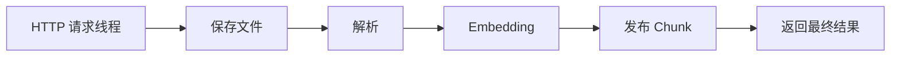
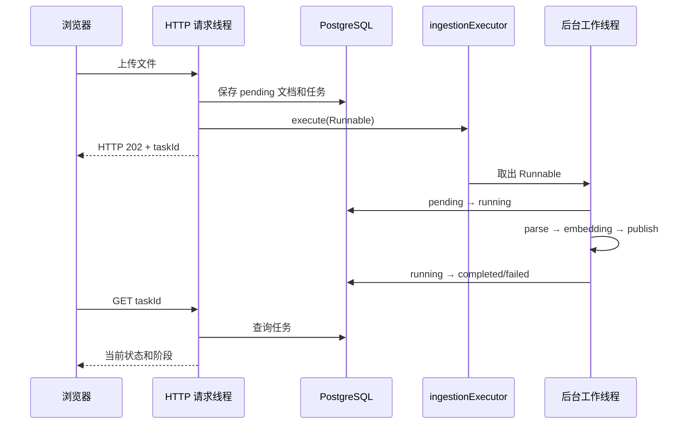
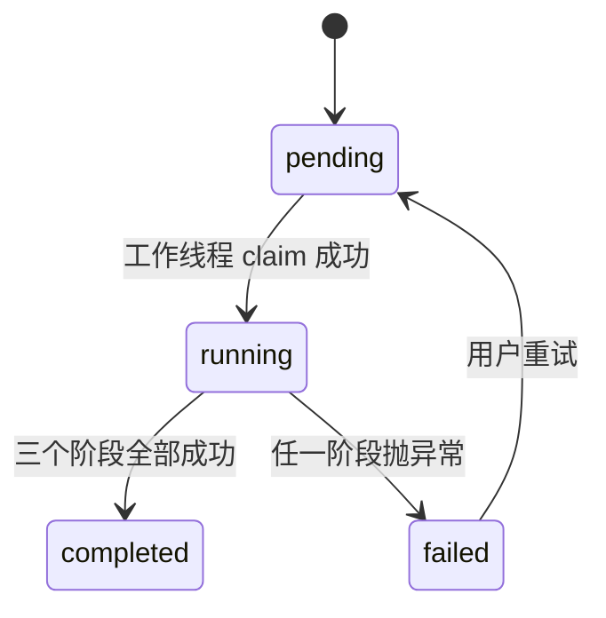
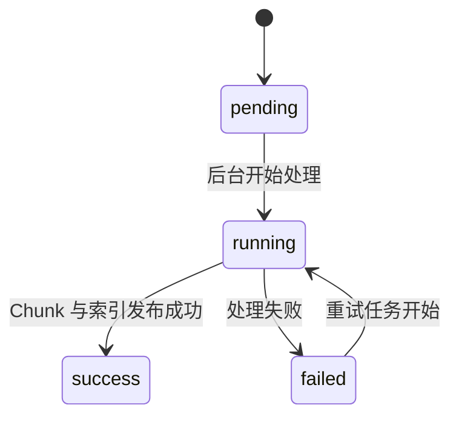
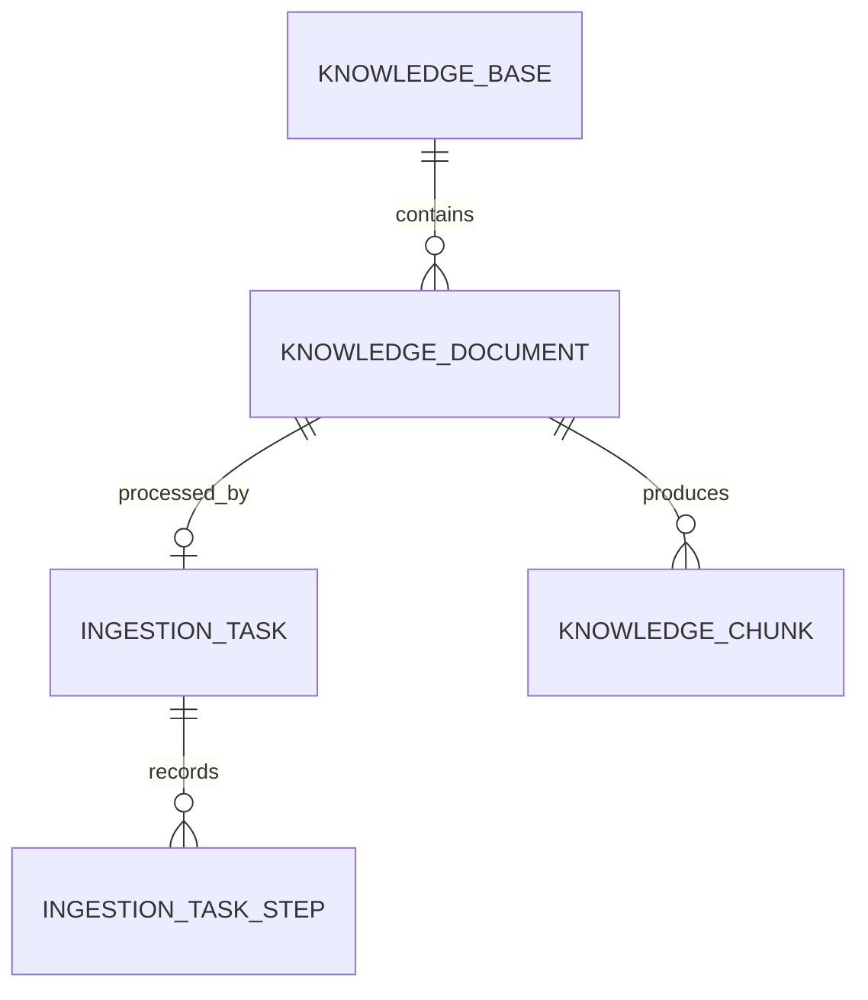

# 第 10 课：上传不能一直占着请求线程

## 1. 前言

### 1.1 先用三条通路理解本课

第 9 课的上传通路是同步的：浏览器上传文件后，这个 HTTP 请求必须一直等到文件解析、每个片段的 Embedding 和数据库发布全部完成。文件越大、片段越多，浏览器等待越久，也无法知道程序正卡在哪一步。

本课把它拆成三条通路。

```text
通路一：受理上传
POST 上传 HTTP API
→ KnowledgeController 接收 Multipart 文件
→ IngestionTaskService 保存原文件
→ knowledge_document 写入 pending
→ ingestion_task 写入 pending
→ 把 Runnable 交给 ingestionExecutor
→ 立即返回 HTTP 202、taskId 和 documentId

通路二：后台执行
ingestionExecutor 中的工作线程取出 Runnable
→ 抢占 pending 任务并改成 running
→ parse：从原文件解析 KnowledgeEntry
→ embedding：调用百炼生成 KnowledgeChunk 向量
→ publish：事务写入 knowledge_chunk，并把文档改成 success
→ 把 ingestion_task 改成 completed

通路三：查询与失败重试
GET /api/ingestion-tasks/{taskId}
→ 读取 ingestion_task，返回状态、当前阶段、尝试次数和错误
GET /api/ingestion-tasks/{taskId}/steps
→ 读取 ingestion_task_step，返回每一步状态和耗时
POST /api/ingestion-tasks/{taskId}/retry
→ 只允许 failed → pending
→ 再向线程池提交同一个 taskId
```

最短的一句话是：

> 上传请求只负责把文件和任务可靠地登记下来；真正耗时的解析、向量化和发布由后台线程继续做，浏览器拿着 taskId 查询进度。

### 1.2 从同步到异步，到底改变了什么

第 9 课是一个线程从头做到尾：



第 10 课在“登记完成”处把工作交给另一个线程：



`异步` 在这里不是“同时把所有片段一股脑并行调用百炼”，而是“HTTP 请求线程不再亲自等待耗时工作”。后台任务内部仍按照 parse、embedding、publish 的业务顺序执行，这让状态和错误比较容易理解。

## 2. 主要内容

### 2.1 本课需求和完成标准

本课需要做到：

1. 上传接口保存文件并登记任务后返回 HTTP 202，不等待 Embedding 完成。
2. 返回值中包含 `taskId` 和 `documentId`，调用方可以继续查询。
3. 后台任务依次记录 `parse → embedding → publish` 三个阶段。
4. 成功时任务变成 `completed`，文档变成 `success`。
5. 失败时任务和文档都变成 `failed`，原文件保留，供重试使用。
6. 只有 failed 任务允许重试；重复点击不能让同一文档被两个线程同时处理。

本课只使用当前进程中的固定线程池。暂时不引入消息队列，也不承诺应用突然断电后自动捞起所有 pending 任务；这些复杂度要等现实问题出现后再处理。

### 2.2 代码阅读顺序

建议严格按下面顺序阅读，先看完整链条，再看 SQL 细节。

1. `AsyncIngestionIT.shouldRunFailedTaskInBackgroundAndRetryOnlyOnce`：先通过一组具体数据理解 pending、后台执行、失败和重试。
2. `IngestionSubmission`、`IngestionTask`、`IngestionTaskStep`：认清上传响应、任务总状态和阶段明细是三种不同数据。
3. `V2__create_ingestion_tasks.sql`：把三个 Java 数据与 `ingestion_task`、`ingestion_task_step` 两张表对应起来。
4. `KnowledgeController.upload/getTask/getTaskSteps/retryTask`：看四个 HTTP 入口分别把工作交给谁。
5. `IngestionTaskService.submit`：看 HTTP 线程做到哪里就返回。
6. `RagentApplication.ingestionExecutor`：看后台线程从哪里来；同时注意它和流式问答线程池是两个不同 Bean。
7. `IngestionTaskService.execute`：沿 `parse → embedding → publish` 阅读后台主链。
8. `KnowledgeManagementService.prepareUpload/markRunning/parseDocument/createChunks/publish/markFailed`：看原来一个大 upload 方法怎样按真实阶段拆开。
9. `IngestionTaskRepository.claimPending/resetFailedForRetry`：理解条件 UPDATE 怎样防止重复执行。
10. `IngestionTaskRepository.startStep/completeStep/failStep`：理解阶段状态、耗时和错误怎样进入数据库。
11. `AsyncKnowledgeUploadApiLiveIT.shouldUploadIndexAndAnswerFromNewKnowledge`：最后看真实 HTTP、真实 PostgreSQL、真实百炼的成功流程。

### 2.3 本课新增和变化的对象

| 对象 | 负责什么 | 不负责什么 |
|---|---|---|
| `KnowledgeController` | 接收 HTTP 数据、返回 202、提供查询和重试端点 | 不执行解析和 Embedding |
| `IngestionTaskService` | 登记任务、提交后台工作、编排三个阶段、处理失败和重试 | 不直接写 SQL |
| `KnowledgeManagementService` | 保存原文件、解析文档、生成 Chunk、发布文档 | 不管理线程池和任务尝试次数 |
| `IngestionTaskRepository` | 保存任务和阶段、用条件 UPDATE 抢占任务 | 不调用百炼、不解析文件 |
| `ingestionExecutor` | 保存等待执行的 Runnable，并让工作线程运行它们 | 不知道文档业务含义 |
| `KnowledgeRepository` | 继续保存知识库、文档、Chunk 和向量 | 不保存后台任务进度 |

## 3. 技术要点

### 3.1 一次真实上传经过哪些对象

假设上传接口收到：

```text
知识库：kb-company
文件名：company-rules.txt
内容：年假规则 + 访客规则
```

HTTP 线程中的数据变化：

```text
KnowledgeController.upload
→ IngestionTaskService.submit
→ KnowledgeManagementService.prepareUpload
   → 原文件写入 data/uploads/...
   → knowledge_document = pending
→ IngestionTaskRepository.insert
   → ingestion_task = pending, attempt_count = 1
→ ingestionExecutor.execute(Runnable)
→ 返回：
   {
     "taskId": "task-123",
     "documentId": "doc-123",
     "status": "pending"
   }
```

后台工作线程中的数据变化：

```text
claimPending(task-123)
→ 只有一个线程成功执行 pending → running

parse
→ 输入：doc-123 对应的本地文件
→ 输出：2 个 KnowledgeEntry

embedding
→ 输入：每个 Entry 的标题 + 正文
→ 输出：2 个带 1024 维向量的 KnowledgeChunk

publish
→ INSERT 2 行 knowledge_chunk
→ knowledge_document = success, chunk_count = 2

完成任务
→ ingestion_task = completed
```

### 3.2 为什么返回 HTTP 202，而不是 201

第 8、9 课同步上传返回 HTTP 201，意思接近“文档和索引已经创建完成”。

现在响应到达时，后台工作通常还没有完成。HTTP 202 的正式名称是 `Accepted`，表示：

```text
服务器已经接受请求
但处理还没有最终结束
```

因此响应不能假装返回最终 `success` 文档，而是返回 `IngestionSubmission`：

```json
{
  "taskId": "task-123",
  "documentId": "doc-123",
  "status": "pending"
}
```

这里的 `Submission` 可以直译成“提交结果”或“受理结果”。它不是最终处理结果。

### 3.3 `execute(() -> execute(task.id()))` 为什么有两个 execute

这行很容易看花：

```java
ingestionExecutor.execute(() -> execute(task.id()));
```

外层 `ingestionExecutor.execute(...)` 是 Java `Executor` 的方法，意思是“请线程池以后执行这段工作”。

内层 `execute(task.id())` 是我们自己的私有方法，里面才有 parse、embedding 和 publish。

`() -> execute(task.id())` 是一个 Lambda。当前线程不会先调用里面的方法并等待结果，而是创建一个 `Runnable` 行为对象交给线程池。

```text
当前 HTTP 线程：把工作装进 Runnable → 交给线程池 → 返回
后台工作线程：从线程池取到 Runnable → 调用私有 execute(taskId)
```

### 3.4 现在到底有哪些线程

一次上传至少涉及三类线程角色：

| 线程角色 | 做什么 | 访问哪些状态 |
|---|---|---|
| 上传 HTTP 线程 | 保存原文件、登记 pending、提交 Runnable、返回 202 | 文档表、任务表、线程池队列 |
| 摄取工作线程 | claim 任务、解析、调用百炼、发布 Chunk、更新任务 | 任务表、阶段表、文档表、Chunk 表 |
| 查询 HTTP 线程 | 根据 taskId 查询进度 | 任务表和阶段表 |

不同上传请求会产生不同任务。线程池最多同时运行两个摄取任务，但不会让“多个请求天然共享同一个任务”。同一个任务可能被重复提交或重复点击重试，所以才需要数据库条件 UPDATE 做保护。

### 3.5 为什么需要 `@Qualifier("ingestionExecutor")`

现在 Spring 容器里有两个 `ExecutorService`：

```text
streamExecutor     给第 7 课流式问答使用
ingestionExecutor  给第 10 课文档摄取使用
```

如果构造函数只写：

```java
Executor executor
```

Spring 会发现两个候选对象，不知道应该注入哪一个。`@Qualifier("ingestionExecutor")` 就是在告诉 Spring：

> 这里按 Bean 名称选择文档摄取线程池。

它不是创建线程池的语法；真正创建线程池的是 `RagentApplication` 中带 `@Bean` 的方法。

### 3.6 任务状态和文档状态为什么不完全一样

任务状态：



文档状态：



任务完成叫 `completed`，文档可查询叫 `success`。两个对象描述的事情不同：

- `ingestion_task` 回答“这次后台工作结束了吗”；
- `knowledge_document` 回答“这份文档的知识可以查询了吗”。

在成功流程中，文档先在 publish 事务中变成 success，随后任务才变成 completed。不要把两个状态字段当成重复数据。

### 3.7 为什么一个任务里面还要划分 parse、embedding、publish 三个阶段

如果本课只为了“异步”，最少只需要一个任务状态：

```text
pending → running → completed/failed
```

但是 `running` 只告诉我们任务还没结束，无法回答它为什么慢、失败在哪里。同步上传时，这些细节都藏在同一个 HTTP 请求里；改成后台任务后，浏览器已经拿到 202，使用者只能通过数据库里的状态观察后台。因此，异步带来了一个新的真实需求：后台工作必须能够被观察。

本课没有按照代码行数随意切阶段，而是按照“输入输出的数据发生变化，而且依赖对象也发生变化”的边界来切：

| 阶段 | 输入 → 输出 | 主要负责对象与外部依赖 | 失败通常说明什么 |
|---|---|---|---|
| `parse` | 原始文本文件 → `KnowledgeEntry` | `KnowledgeManagementService`、本地文件系统、`KnowledgeFileLoader` | 文件格式或读取有问题 |
| `embedding` | `KnowledgeEntry` → 带向量的 `KnowledgeChunk` | `KnowledgeManagementService`、`BailianClient`、百炼 Embedding | 模型网络、额度或协议有问题 |
| `publish` | 内存中的 Chunks → 数据库里可检索的知识 | `KnowledgeRepository`、PostgreSQL 事务 | 数据库写入或发布事务有问题 |

这样划分以后，同一个 `failed` 就不再含糊。例如：

```text
task-123 / failed / currentStep=parse
```

说明连结构化知识都没有得到，不需要检查百炼；而：

```text
task-456 / failed / currentStep=publish
```

说明解析和向量化已经完成，应先检查数据库发布环节。

这里仍然只有一个任务，因为用户只提出了一次“上传并让这份文档可查询”的意图，三个阶段也必须按固定顺序完成。本课没有把三个阶段设计成三个独立任务，也没有实现“从失败阶段接着跑”；重试仍会从 parse 重新开始。把阶段独立调度、保存中间向量或断点续跑都会明显增加状态组合，等真实需求出现后再演化。

从类职责看，可以把两层关系记成：

```text
IngestionTaskService（任务管理外层）
→ 决定何时执行、当前阶段、成功失败、是否允许重试
→ 调用 KnowledgeManagementService（知识处理内层）
   → 保存文档、解析内容、生成向量、发布可查询知识
```

任务完成以后，知识仍然长期存在并参与问答；任务只是这份知识进入系统时的一段处理历史。因此二者应该分开，而不是把 `attemptCount`、`currentStep` 等任务字段塞进知识对象。

#### `currentStep` 和步骤表分别解决什么问题

任务表的 `current_step` 只回答：

```text
现在正在做哪一步，或者最后失败在哪一步？
```

阶段表保存更完整的历史：

```text
task-123 / attempt=1 / parse     / completed / 8ms
task-123 / attempt=1 / embedding / completed / 1520ms
task-123 / attempt=1 / publish   / completed / 12ms
```

如果第一次失败后重试，则使用同一个 taskId，但 `attempt` 增加：

```text
task-456 / attempt=1 / parse / failed / 格式错误
task-456 / attempt=2 / parse / failed / 格式错误
```

这样既能快速看当前位置，也不会因为重试覆盖以前的错误记录。

### 3.8 两张新表和原有三张表怎样配合



上传和后台处理每一步访问的表：

| 环节 | 表与动作 |
|---|---|
| 确认知识库 | `SELECT knowledge_base` |
| 登记文档 | `INSERT knowledge_document(pending)` |
| 登记任务 | `INSERT ingestion_task(pending)` |
| 抢占任务 | 条件 `UPDATE ingestion_task pending → running` |
| 开始阶段 | 更新 `ingestion_task.current_step`，插入 `ingestion_task_step(running)` |
| 完成/失败阶段 | 更新 `ingestion_task_step` 的状态、耗时和错误 |
| 发布知识 | 事务插入 `knowledge_chunk`，更新 `knowledge_document(success)` |
| 任务完成 | 更新 `ingestion_task(completed)` |
| 任务失败 | 清理 `knowledge_chunk`，更新文档和任务为 failed |

### 3.9 为什么不能用一个大事务包住整个后台任务

如果从 parse 开始到百炼调用结束一直保持一个数据库事务：

- 数据库连接会被长时间占用；
- 其他查询看不到中间状态；
- 外部网络等待和数据库事务绑在一起；
- 一次大文件处理可能让事务持续几十秒甚至更久。

本课使用多个短事务：

```text
登记任务：短数据库写入
开始阶段：任务 currentStep + 阶段 running 同一短事务
Embedding：外部 HTTP，不占数据库事务
发布：全部 Chunk + 文档 success 同一事务
完成任务：短数据库更新
```

这样查询接口可以看到进度，数据库连接也不会陪着百炼网络请求一直等待。

### 3.10 条件 UPDATE 怎样防止重复执行

工作线程开始时执行：

```sql
UPDATE ingestion_task
SET status = 'running'
WHERE id = ? AND status = 'pending'
```

假设两个线程几乎同时处理同一个 taskId：

```text
线程 A：看到 pending，更新 1 行 → 获得执行权
线程 B：此时已经不是 pending，更新 0 行 → 直接退出
```

重试使用同样思路：

```sql
UPDATE ingestion_task
SET status = 'pending', attempt_count = attempt_count + 1
WHERE id = ? AND status = 'failed'
```

第一次点击把 failed 改成 pending；第二次点击再执行时，条件已经不成立，所以不会再向队列增加第二个任务。这种“检查条件和修改状态由数据库一次完成”的做法比 Java 里先查询、再判断、再更新更能抵抗并发竞争。

### 3.11 为什么失败后不再删除原文件

第 8、9 课没有重试需求，失败清理会删除原文件。现在重试必须重新读取同一份输入，如果失败时把原文件删掉，重试按钮只是空壳。

因此本课失败处理是：

```text
删除可能残留的 knowledge_chunk
保留 stored_path 指向的原文件
knowledge_document → failed
ingestion_task → failed
```

重试不会重新上传文件，而是读取原来的 `storedPath`。

### 3.12 `ManualExecutor` 为什么不是模型 Stub

真实线程池一收到任务就可能立即执行。测试刚准备查询 pending，它可能已经变成 running 或 failed，测试结果会依赖电脑速度。

`ManualExecutor` 只控制“什么时候运行 Runnable”：

```text
submit
→ Runnable 先放在测试队列
→ 测试检查 pending
→ 测试主动 runNext()
→ 才发生 running/failed
```

它没有伪造 Embedding 响应，也没有模拟百炼协议。测试使用格式错误文件，让流程在 parse 阶段自然失败，因此根本不会调用模型。真实成功流程仍由 `AsyncKnowledgeUploadApiLiveIT` 调用百炼完成。

### 3.13 为什么把 Flyway 依赖改成 Starter

第 9 课的 `KnowledgePersistenceIT` 在测试代码中手工调用：

```java
Flyway.configure().dataSource(dataSource).load().migrate();
```

所以只要有 `flyway-core`，那个测试就能迁移成功。但真实 Spring Boot 应用启动时需要自动配置类主动创建 Flyway 并执行迁移。

Spring Boot 4 把 Flyway 自动配置放进独立模块。只引用 `flyway-core` 能调用 API，却不会自动获得 Spring Boot 的启动集成。因此本课真实 HTTP 测试第一次启动时出现了：

```text
relation "knowledge_base" does not exist
```

项目改用：

```xml
<artifactId>spring-boot-starter-flyway</artifactId>
```

之后应用启动顺序才真正变成：

```text
创建 DataSource
→ Flyway 自动执行 V1、V2
→ 创建 Repository/Service/Controller
→ Tomcat 开始接收请求
```

这也是一个重要经验：手工调用某个库的测试通过，不等于框架启动时已经自动接入了它。

## 4. 测试与验收

### 4.1 可控异步失败与重试测试

测试方法：

```text
AsyncIngestionIT.shouldRunFailedTaskInBackgroundAndRetryOnlyOnce
```

输入文件：

```text
这不是标题、关键词、正文三段式知识
```

重要中间数据：

```text
submit 返回：
task.status = pending
document.status = pending
ManualExecutor.queue.size = 1

第一次 runNext 后：
task.status = failed
task.currentStep = parse
document.status = failed
原文件仍存在
步骤记录 = attempt 1 / parse / failed

第一次 retry 后：
task.status = pending
attemptCount = 2
queue.size = 1

立刻再次 retry：
拒绝，提示当前状态 pending
queue.size 仍为 1

第二次 runNext 后：
步骤记录同时包含 attempt 1 和 attempt 2
```

这个测试不调用百炼，重点是让异步状态变化完全可观察。

### 4.2 真实 HTTP 成功流程

测试方法：

```text
AsyncKnowledgeUploadApiLiveIT.shouldUploadIndexAndAnswerFromNewKnowledge
```

它会真实执行：

```text
POST 创建知识库
→ POST 上传文件，收到 HTTP 202/pending
→ 轮询 GET ingestion-task
→ 后台调用两次真实百炼 Embedding
→ task = completed，document = success
→ 查询三个阶段和两个 Chunk
→ 提问并调用真实百炼 Embedding + Chat
→ 答案来源为“年假规则”
```

预期阶段数据：

```text
parse     completed
embedding completed
publish   completed
```

这个测试会读取已经永久配置的百炼 API Key，并产生少量真实模型调用。

### 4.3 真实 HTTP 失败流程

测试方法：

```text
AsyncKnowledgeUploadApiLiveIT.shouldExposeFailureAndCleanPartialData
```

格式错误在 parse 阶段失败，不访问百炼。预期：

```text
HTTP 上传先返回 202/pending
task.status = failed
task.currentStep = parse
document.status = failed
knowledge_chunk = 0 行
原文件仍存在，可供重试
```

### 4.4 环境要求

本课没有新增 VS Code 插件，也不需要重新配置 JDK、Maven、Docker 或 API Key。

- `AsyncIngestionIT`：需要 Docker，不调用百炼。
- `AsyncKnowledgeUploadApiLiveIT` 失败用例：需要 Docker，不调用百炼。
- `AsyncKnowledgeUploadApiLiveIT` 成功用例：需要 Docker和已经配置好的百炼 API Key。

## 5. 总结

第 9 课解决了“知识不能随服务重启消失”；第 10 课解决了“上传不能一直占用 HTTP 请求线程”。

系统现在多了一个真正可观察的后台任务：浏览器先收到 taskId，再查询 pending、running、completed/failed；任务内部又能看到 parse、embedding、publish 的阶段状态、耗时和错误。失败的原文件被保留，同一个任务可以安全重试，而条件 UPDATE 防止重复点击产生并行处理。

本课没有使用消息队列。当前只有一个应用进程，固定线程池已经能解决“请求不要等待”的现实问题。以后真的出现多实例调度、应用重启后任务恢复或任务堆积，才有理由继续演化。
