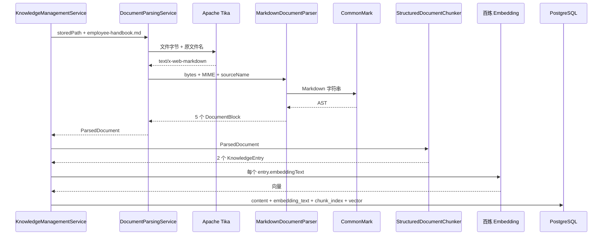

# 第 11 课：PDF、Markdown 和表格不能都按纯文本处理

## 1. 前言

### 1.1 先用三条通路理解本课

第 10 课已经把上传改成后台任务，但后台的 `parse` 阶段仍然只有 `KnowledgeFileLoader` 一种理解：文件必须由“标题、关键词、正文”三部分组成，空行就是知识边界。

这种规则只适合课程自己约定的简单文本。真实 Markdown 有一到六级标题，表格中的列名和值必须保持对应；PDF 又是二进制格式，不能按 UTF-8 文本硬读。本课先让 Markdown 成为第二种真实格式，并能识别伪装成 Markdown 的 PDF。PDF 页面布局和 OCR 暂时不实现。

```text
通路一：结构化 Markdown 上传
POST 上传 company-rules.md
→ 第 10 课的 IngestionTaskService 登记后台任务
→ KnowledgeManagementService 进入 parse 阶段
→ DocumentParsingService 读取字节并用 Tika 探测 MIME
→ MarkdownDocumentParser 用 CommonMark 生成标题、段落、表格 Block
→ StructuredDocumentChunker 沿标题路径并按预算生成 KnowledgeEntry
→ createChunks 把 embeddingText 交给百炼
→ KnowledgeRepository 按 chunkIndex 保存展示文本、向量文本和向量
→ 文档发布为 success

通路二：旧三段式文本继续上传
POST 上传 company-rules.txt
→ Tika 探测为 text/plain
→ LegacyKnowledgeTextParser 复用 KnowledgeFileLoader
→ 旧标题、关键词、正文成为 LegacyKnowledge Block
→ 进入同一个 StructuredDocumentChunker
→ 后续 Embedding、数据库发布和问答完全不变

通路三：格式伪装被拒绝
上传名为 disguised.md、内容却以 %PDF 开头的文件
→ Tika 根据字节识别为 application/pdf
→ 当前两个解析器都不支持它
→ parse 阶段明确失败，不调用百炼、不写 knowledge_chunk
→ 第 10 课任务状态记录 currentStep=parse 和错误原因
```

最短的一句话是：

> 第 10 课负责“把解析工作可靠地放到后台”，第 11 课负责“先认出文件是什么，再保留文档结构，最后生成稳定、可检索的片段”。

### 1.2 本课在课程递进中的位置

第 3 课第一次读取文件时，只有一种人工约定格式，所以一个 `KnowledgeFileLoader` 足够。第 8 课允许运营人员上传后，这种格式开始接触 HTTP。第 9 课把结果保存到数据库，第 10 课把耗时处理移到后台。

直到现在出现第二种真实格式，下面这些职责才成为现实问题：


本课没有在第 3 课提前设计 `DocumentParser` 接口。因为当时只有一个实现，接口只是猜测；现在同时存在旧文本和 Markdown 两个实现，共同契约才有真实价值。

## 2. 主要内容

### 2.1 本课需求和完成标准

本课需要做到：

1. 使用文件字节和原文件名探测 MIME，不由业务代码自己截取扩展名决定解析方式。
2. 继续支持前十课的 `.txt` 三段式知识。
3. 使用成熟 Markdown 库解析标题、段落和 GFM 表格，不用正则重新实现 Markdown。
4. 解析器统一输出 `DocumentBlock`，分块器不再读取 Markdown 标记。
5. 标题不单独成为空知识，而是形成后续片段的章节路径。
6. 普通段落按字符预算切分；表格以完整数据行为最小单位，每个表格 Chunk 重复表头。
7. `content` 保存给人查看的正文，`embeddingText` 保存真正交给向量模型的文本。
8. 数据库保存 `chunkIndex`，读回片段时仍保持原文顺序。
9. PDF 字节即使使用 `.md` 名称，也必须在调用百炼和发布 Chunk 前明确失败。

本课只新增 Markdown 结构化解析。PDF 解析、Word、Excel、多模态图片和 OCR 都会显著扩大依赖与数据结构，不在本课顺手加入。

### 2.2 代码阅读顺序

先沿测试中的一份具体文件建立整体认识，再进入库 API 和分块循环：

1. `StructuredDocumentProcessingTest.shouldPreserveMarkdownHeadingsAndTableMeaningWhenChunking`：先看输入 Markdown、5 个 Block、2 个 Chunk 以及打印出的中间数据。
2. `DocumentBlock` 和 `ParsedDocument`：分清原文件、解析后的结构块、最终知识片段不是同一层数据。
3. `DocumentParser`：看第二种实现出现后才建立的共同契约。
4. `DocumentParsingService.parse`：看 Tika 怎样得到 MIME，再怎样从两个解析器中选择一个。
5. `LegacyKnowledgeTextParser.parse`：看前十课格式怎样接入新链，而不是被删掉。
6. `MarkdownDocumentParser.parse` 和 `BlockVisitor`：看 CommonMark AST 怎样转换成 Heading、Paragraph 和 Table。
7. `StructuredDocumentChunker.chunk`：先读外层遍历，回答每种 Block 分别交给哪个方法。
8. 同一文件的 `updateOutline`、`addParagraphChunks`、`addTableChunks`：理解章节路径、字符预算和表格整行边界。
9. `KnowledgeEntry`、`KnowledgeManagementService.parseDocument/createChunks`：看展示正文与向量文本在哪里分开，又在哪里真正调用百炼。
10. `V3__store_embedding_text.sql`、`KnowledgeRepository.publishSuccessfulDocument/findChunksByDocument`：看新数据进入哪些列，读取顺序如何保持。
11. `AsyncKnowledgeUploadApiLiveIT.shouldUploadIndexAndAnswerFromNewKnowledge`：最后看真实 HTTP、后台任务、PostgreSQL、百炼和问答完整链。

### 2.3 本课新增职责为什么这样划分

| 对象 | 新增职责 | 明确不负责什么 |
|---|---|---|
| `DocumentParsingService` | 读文件、用 Tika 探测 MIME、选择解析器 | 不理解 Markdown 标题，不决定 Chunk 大小 |
| `LegacyKnowledgeTextParser` | 把旧三段式文本转换成结构块 | 不调用百炼，不写数据库 |
| `MarkdownDocumentParser` | 把 Markdown AST 转成标题、段落和表格 Block | 不决定章节路径怎样进入 Chunk |
| `DocumentBlock` | 作为解析器和分块器之间的结构化数据 | 不包含向量，不代表数据库实体 |
| `StructuredDocumentChunker` | 维护标题路径、执行预算、保持表格行完整 | 不识别 MIME，不解析 Markdown 语法 |
| `KnowledgeManagementService` | 编排解析、分块、Embedding 和发布 | 不再亲自实现某种格式的语法 |
| `KnowledgeRepository` | 保存展示文本、向量文本、顺序和向量 | 不知道这些文本如何从 Markdown 得到 |

这组划分不是为了套设计模式，而是因为每个对象变化的原因不同：新增文件格式时修改解析器；改变片段预算时修改分块器；改变数据库列时修改 Repository；任务的 pending/running/failed 仍由第 10 课任务层管理。

`DocumentParsingService` 名字中虽然有 `Service`，但当前没有加 Spring `@Service`。这里的 Service 表示它承担“探测并路由解析”这一组业务职责，不等于必须由 Spring 创建。当前解析器固定、没有配置和网络资源，`KnowledgeManagementService` 直接创建它更容易沿代码阅读；等以后确实需要由配置决定解析器时，再让 Spring 注入也不迟。

## 3. 技术要点

### 3.1 一份 Markdown 在重要对象之间怎样交接

测试文件是：

```markdown
# 员工手册

## 年假规则

员工连续工作满一年后，每年享有 5 天带薪年假。

## 差旅住宿标准

| 城市级别 | 每晚住宿上限 |
| --- | --- |
| 一线城市 | 600 元 |
| 其他城市 | 400 元 |
```

完整数据链是：



实际中间数据：

```text
MIME：text/x-web-markdown

Blocks：
0 Heading(level=1, 员工手册)
1 Heading(level=2, 年假规则)
2 Paragraph(员工连续工作满一年后……)
3 Heading(level=2, 差旅住宿标准)
4 Table(headers=[城市级别, 每晚住宿上限], rows=2)

Chunks：
0 title=员工手册 / 年假规则
1 title=员工手册 / 差旅住宿标准
```

### 3.2 MIME 是什么，为什么不能只相信 `.md`

MIME 可以理解为“内容的媒体类型标签”。本课会看到：

```text
普通文本：text/plain
Markdown：text/x-web-markdown
PDF：application/pdf
```

扩展名只是文件名的一部分，用户可以把 `report.pdf` 改名为 `report.md`。如果程序只写：

```java
filename.endsWith(".md")
```

它会把 PDF 二进制字节当 UTF-8 Markdown 读取。

本课调用：

```java
tika.detect(content, sourceName)
```

`content` 提供真实字节特征，`sourceName` 提供辅助线索。测试把 `%PDF-1.7` 字节放进 `disguised.md`，Tika 仍返回 `application/pdf`，因此没有解析器认领它。

这里也要避免另一个误解：MIME 探测不是绝对可靠的安全扫描。对纯文本格式，文件名仍可能是重要提示；它解决的是“比手写扩展名判断更懂格式”，不是替代病毒扫描和权限检查。

### 3.3 为什么引入 Tika，而不是自己写几个 if

手写扩展名判断能应付两个后缀，但很快会遇到：

- 扩展名与真实字节冲突；
- 同一格式存在多个 MIME 名称；
- PDF、Office 文件需要查看魔数或容器结构；
- 外部 HTTP 的 Content-Type 与上传文件名可能不一致。

Apache Tika 已经负责这些格式识别规则。本课只引入 `tika-core` 做探测，没有引入完整解析器包，也没有让 Tika 替代 Markdown AST。第三方库边界是：

```text
Tika：回答“这是什么类型”
CommonMark：回答“Markdown 内部有哪些结构”
我们的代码：回答“业务上怎样分块和保存”
```

### 3.4 为什么第二种解析实现出现后才有 `DocumentParser`

第 3 课只有旧三段式文本：

```text
KnowledgeFileLoader.load
```

如果当时提前增加 Parser 接口、注册表和工厂，学生只能相信“以后可能有用”。现在有两个确实不同的实现：

```text
LegacyKnowledgeTextParser
MarkdownDocumentParser
```

它们都需要回答两个相同问题：

```java
boolean supports(String mimeType);
ParsedDocument parse(byte[] content, String mimeType, String sourceName);
```

接口此时解决了具体重复：路由层不需要知道某个解析器的内部类名和语法，只需要逐个询问是否支持 MIME，然后调用相同的 `parse`。

本课解析器列表仍在 `DocumentParsingService` 中直接创建。没有引入 Spring 插件注册、Factory 或配置化 Pipeline，因为当前只有两种固定实现，第 12 课的需求也不能倒过来提前影响本课。

### 3.5 CommonMark、AST 和 Visitor 分别是什么

CommonMark 收到 Markdown 字符串后，不是直接给我们一段清理后的文本，而是生成一棵 AST（抽象语法树）：

```text
Document
├── Heading(level=1)
│   └── Text("员工手册")
├── Heading(level=2)
│   └── Text("年假规则")
├── Paragraph
│   └── Text("员工连续工作……")
└── GFM TableBlock
    ├── TableHead
    └── TableBody
```

`BlockVisitor` 是沿树访问节点的对象。CommonMark 遇到 `Heading` 会调用我们的 `visit(Heading)`，遇到 `Paragraph` 会调用 `visit(Paragraph)`。这种写法比一层层手写 `getFirstChild()` 更适合不同节点混排。

第一次看到以下代码时：

```java
if (customBlock instanceof TableBlock tableBlock)
```

它是 Java 的模式匹配：先判断 `customBlock` 是否真的是 GFM 表格；如果是，同时创建已经转成正确类型的局部变量 `tableBlock`，不需要再强制类型转换。

### 3.6 为什么需要 Block 中间层，不能解析后直接生成 Chunk

解析器懂格式，分块器懂业务预算。若 Markdown 解析器直接产生最终 Chunk，它必须同时决定：

- 标题是否进入正文；
- 字符预算是多少；
- 表格一块放几行；
- 展示文本和向量文本怎样不同；
- 章节路径使用什么分隔符。

以后 PDF 解析器又要重复这些决定。

`DocumentBlock` 把两个步骤分开：

```text
格式解析：Markdown 字符串 → Heading/Paragraph/Table
业务分块：Heading/Paragraph/Table → KnowledgeEntry
```

本课的 `DocumentBlock` 是 `sealed interface`。`sealed` 表示允许实现它的类型被明确限制为 Heading、Paragraph、Table 和 LegacyKnowledge。这样阅读 `chunk` 方法时，可以看到当前全部结构类型，不会有某个未知实现悄悄进入却无人处理。

四种实现写成接口内部的 `record`，是因为它们只是不可变数据，例如：

```java
new DocumentBlock.Heading(2, "年假规则")
```

它没有独立业务服务职责，不需要各自占用一个很长的文件。

### 3.7 标题为什么不直接成为一个 Chunk

标题“差旅住宿标准”单独拿去 Embedding，信息太少；真正有价值的是标题给后面的段落或表格提供语境。

分块器维护一个 `outline`：

```text
读到 # 员工手册
outline = [员工手册]

读到 ## 年假规则
outline = [员工手册, 年假规则]

读到年假段落
生成 title = 员工手册 / 年假规则

读到 ## 差旅住宿标准
替换同级标题
outline = [员工手册, 差旅住宿标准]
```

`updateOutline` 中的循环不是为了炫技：一级标题回来时，要删除旧的二级、三级标题；跳到三级标题时，要为缺少的中间层保留位置。最终会过滤空位置。

### 3.8 字符预算是什么，当前边界在哪里

Embedding 模型和数据库都不适合接收无限长文本。本课用 `maxChars` 表示单个向量文本的目标字符预算。默认是 500，测试用 140 让边界更容易观察。

普通段落的可用正文预算是：

```text
maxChars - 章节路径字符数 - 换行
```

超长段落按这个长度继续切分。当前实现使用字符数，不是模型 Token 数；它足够解释预算与稳定边界，但中英文 Token 比例并不相同。真实项目以后如果需要精确控制模型上限，再引入 Tokenizer。

表格的最小单位是完整数据行。分块器会尝试向当前 Chunk 添加下一行；若加入后超过预算，就先结束当前 Chunk，再从下一行开始。单行本身已经超长时，本课宁可暂时超过预算，也不在一个单元格中间截断。

### 3.9 表格为什么需要两种文本

给运营人员看的 `content` 保留 Markdown：

```markdown
| 城市级别 | 每晚住宿上限 |
| --- | --- |
| 一线城市 | 600 元 |
```

这种格式适合前端展示，但向量模型看到很多竖线，且需要自己推断每个值对应哪一列。因此 `embeddingText` 改写为：

```text
员工手册 > 差旅住宿标准
城市级别：一线城市；每晚住宿上限：600 元
```

两者表达相同事实，但面向不同消费者：

| 字段 | 消费者 | 目标 |
|---|---|---|
| `content` | 运营页面、检索结果、聊天模型上下文 | 人类可读并保留表格形状 |
| `embeddingText` | 百炼 Embedding 模型 | 明确章节语境以及列名和值的关系 |

问答返回的证据仍使用 `content`，不会把专门为向量模型展开的文本冒充原文。

### 3.10 为什么必须保存 chunkIndex

前十课的 Chunk 使用 UUID 作为主键，读取时曾按 UUID 排序。但 UUID 是随机编号：

```text
原文顺序：年假 → 访客表格
随机 UUID 排序：可能变成访客表格 → 年假
```

本课分块器已经保证输出列表稳定，如果数据库丢掉顺序，这份保证就没有真正到达 API。因此 `KnowledgeManagementService.createChunks` 使用列表下标生成：

```text
年假 chunkIndex=0
访客表格 chunkIndex=1
```

Repository 再使用：

```sql
ORDER BY c.chunk_index, c.id
```

`id` 仍负责唯一身份，`chunkIndex` 负责原文位置，两者职责不同。

### 3.11 V3 数据库迁移具体改变什么

V3 只改变 `knowledge_chunk`：

```text
新增 embedding_text TEXT NOT NULL
新增 chunk_index INTEGER NOT NULL
新增 (document_id, chunk_index) 索引
```

迁移需要兼容已经存在的前十课数据，所以 SQL 顺序是：

```text
1. embedding_text 先允许 NULL
2. 用 title + 换行 + content 回填旧行
3. 再设置 NOT NULL
4. chunk_index 对旧行暂用 0
5. 去掉新写入时的默认值，要求 Java 明确提供顺序
```

上传发布事务中的 SQL 顺序仍是：

```text
INSERT 全部 knowledge_chunk
→ UPDATE knowledge_document 为 success
```

MIME 探测、CommonMark 解析和百炼调用都发生在发布事务之外，不会长时间占用数据库事务。

## 4. 测试与验收

### 4.1 结构解析与分块测试

测试类：`StructuredDocumentProcessingTest`

第一个测试不启动 Spring、不需要 Docker、不调用百炼。它打印并断言：

```text
MIME = text/x-web-markdown
Block 数 = 5
Chunk 数 = 2
年假标题 = 员工手册 / 年假规则
表格展示文本保留 Markdown
表格向量文本包含“城市级别：一线城市；每晚住宿上限：600 元”
```

第二个测试将 `%PDF-1.7` 字节伪装成 `.md`，应得到包含 `application/pdf` 的“不支持”异常。

### 4.2 真实 HTTP、数据库和百炼流程

测试方法：

```text
AsyncKnowledgeUploadApiLiveIT.shouldUploadIndexAndAnswerFromNewKnowledge
```

它会：

```text
创建知识库
→ 上传带章节和访客表格的 company-rules.md
→ 收到 202/pending
→ 轮询 parse/embedding/publish
→ 查询数据库返回的两个稳定顺序 Chunk
→ 检查 content 与 embeddingText
→ 提问年假问题
→ 真实百炼检索并生成答案
```

模型视角的重要输入：

```text
第一次 Embedding：
公司制度 > 年假规则
员工连续工作满一年后，每年享有 5 天带薪年假。

第二次 Embedding：
公司制度 > 访客预约时限
访客类型：外部访客；最晚预约时间：到访前一天
访客类型：面试候选人；最晚预约时间：到访前两小时

提问时的 Embedding：
员工工作满一年后，每年有几天带薪年假？

Chat 看到的证据使用展示正文：
员工连续工作满一年后，每年享有 5 天带薪年假。
```

### 4.3 环境和绿色按钮

本课新增 Java 依赖，不新增 VS Code 插件，也不用手工下载 jar。Maven 会下载：

- `tika-core`；
- `commonmark`；
- `commonmark-ext-gfm-tables`。

如果新类出现红线，先等待 VS Code 右下角 Maven 导入完成；仍未恢复时，在命令面板执行 `Maven: Reload Projects`。

建议按以下顺序点击绿色按钮：

1. 运行 `StructuredDocumentProcessingTest` 整个类：不需要 Docker 和百炼。
2. 运行 `KnowledgePersistenceIT`：需要 Docker，验证 V3 迁移，不调用百炼。
3. 运行 `AsyncKnowledgeUploadApiLiveIT.shouldUploadIndexAndAnswerFromNewKnowledge`：需要 Docker 和已配置的百炼 Key，会产生真实模型调用。

失败时不要只复制第一行。请在 Test Results 或 Debug Console 中找到最后一个 `Caused by`，并同时告诉姐姐失败发生在第几个测试。

## 5. 总结

本课不是简单增加一个 Markdown `if`，而是由第二种真实格式推动出清晰的处理层次：

```text
字节与文件名
→ MIME 探测和解析器路由
→ 格式专属解析
→ 统一结构 Block
→ 结构感知分块
→ 展示文本与向量文本
→ Embedding
→ 按原文顺序持久化
```

你需要重点掌握的不是 CommonMark 的全部节点，而是每个对象为什么存在：路由器解决格式选择，解析器解决语法，Block 保存中间结构，分块器解决业务预算，知识服务与仓库继续解决模型和持久化。职责之间用明确数据交接，后续增加格式时才不会把一个方法继续拉长。
