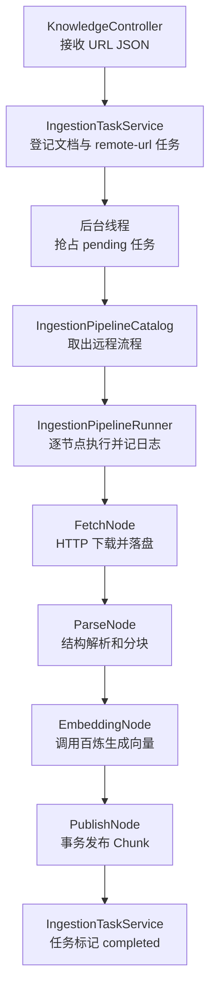

# 第 12 课：不同知识源需要不同的加工步骤

## 1. 先用两条业务通路理解本课

第 11 课结束时，所有文档都必须由浏览器上传，因此后台处理顺序只有一种。现在运营人员希望只填写一个 Markdown 网址，让服务器自己下载并建立知识。系统第一次出现两条不同的摄取通路：

```text
本地上传通路
POST /api/knowledge-bases/{id}/documents
→ KnowledgeController 接收 Multipart 文件
→ IngestionTaskService 保存原文，登记 uploaded-file 任务
→ IngestionPipelineRunner 按定义执行 parse → embedding → publish
→ 原文在本地目录，文档、任务、步骤、Chunk 和向量在 PostgreSQL

远程地址通路
POST /api/knowledge-bases/{id}/remote-documents，正文是 {"url":"..."}
→ KnowledgeController 接收 URL
→ IngestionTaskService 只登记文档和 remote-url 任务，不在 HTTP 请求线程下载
→ IngestionPipelineRunner 按定义执行 fetch → parse → embedding → publish
→ fetch 把远程字节保存成本地原文，后面三个节点与上传通路共用
→ 文档、任务、步骤、Chunk 和向量仍在 PostgreSQL
```

最短的一句话是：

> 两条通路的后半段完全相同，远程 URL 只是在最前面多一个 `fetch`；本课把原来写死在一个方法里的三个阶段，变成可以由一条经过校验的线性流程组织的节点。

这里的 `pipeline` 可以直译为“加工流水线”。它不是一个神秘框架，而是一张很小的步骤清单：从哪个节点开始，每个节点之后是谁。

## 2. 为什么现在才重构

第 10 课的 `IngestionTaskService.execute` 直接依次调用：

```text
parse
→ embedding
→ publish
```

当时所有任务步骤完全相同，这就是最直白、最容易理解的实现。若那时先创建节点接口、流程配置和上下文，只是在猜未来。

本课加入远程地址后，如果继续在长方法中写判断，代码会逐渐变成：

```java
if (task.sourceType() == URL) {
    fetch(...);
}
parse(...);
embedding(...);
publish(...);
```

这一个 `if` 本身并不可怕。真正的问题是：阶段日志、耗时、失败记录以及后续重试都要围绕每个可选步骤重复；以后再出现清洗或问题增强，判断会分散在任务方法中。本课已经有四种真实节点和两条真实顺序，所以现在抽出最小节点契约是由需求推动的重构。

边界仍然很克制：

- 只支持一条起点到终点的线性链；
- 流程写在 Java 中，启动时固定，不做数据库后台配置；
- 不支持分叉、汇合、任意 DAG、脚本节点或插件；
- URL 只支持第 11 课已有的 `.txt` 和 `.md`；
- 远程下载上限暂定 1 MB，不做断点下载和对象存储。

## 3. 代码阅读顺序

先从完整远程测试看结果，再沿调用链倒回各层，最后看结构校验：

1. `RemoteKnowledgeApiLiveIT.shouldFetchRemoteDocumentIndexAndAnswer`：先看测试输入 URL、四个节点日志和最终问答。
2. `KnowledgeController.addRemoteDocument`：看 HTTP JSON 怎样交给任务层。
3. `IngestionTaskService.submitRemote`：看文档、来源类型、来源地址和流程名怎样成为持久化任务。
4. `IngestionTaskService.execute`：看它不再亲自写四个阶段，而只负责抢占任务、创建上下文、调用 Runner 和收尾。
5. `IngestionPipelineCatalog`：直接比较上传链和远程链的唯一差异。
6. `IngestionPipeline`：看节点配置怎样在启动阶段被排成唯一顺序，并拒绝断链、环和多个入口。
7. `IngestionNode` 与 `IngestionContext`：理解节点共同约定和节点之间传递的数据包。
8. `IngestionPipelineRunner.run`：看外层循环怎样逐节点执行、传递新上下文并统一记录日志。
9. `FetchIngestionNode`、`ParseIngestionNode`、`EmbeddingIngestionNode`、`PublishIngestionNode`：逐个看节点真正委托给谁工作。
10. `RemoteDocumentFetcher.fetch`：看 JDK `HttpClient` 请求、状态码、超时、大小上限和主机白名单。
11. `KnowledgeManagementService.prepareRemote/saveFetchedContent`：看远程文档在下载前如何登记，下载后如何落盘。
12. `IngestionTaskRepository` 与 `V4__store_ingestion_source_and_pipeline.sql`：看来源和流程为什么必须保存，步骤查询为什么改按真实开始时间排序。
13. `IngestionPipelineTest`：最后用两个很小的坏配置理解“断链”和“成环”。

## 4. 重要对象怎样交接工作



按对象逐层说，就是：

1. `KnowledgeController` 只处理 HTTP：把 JSON 中的 `url` 取出来，不下载内容。
2. `IngestionTaskService` 创建 pending 文档和任务，给任务保存 `sourceType=url`、完整 URL 和 `pipelineName=remote-url`，然后交给线程池。
3. 后台线程把任务从 pending 抢成 running，并创建最初的 `IngestionContext`。此时上下文只有任务和文档，没有 entries 和 chunks。
4. `IngestionPipelineRunner` 从 Catalog 取得四节点顺序。每一步开始前写 running 步骤日志，成功后写 completed 和耗时，失败时写 failed 和原因。
5. `FetchIngestionNode` 从任务读取 URL，交给 `RemoteDocumentFetcher` 下载，再让 `KnowledgeManagementService` 把字节保存到文档路径。
6. `ParseIngestionNode` 复用第 11 课解析能力，把 `List<KnowledgeEntry>` 放入一份新上下文。
7. `EmbeddingIngestionNode` 消费 entries，调用百炼，产生 `List<KnowledgeChunk>` 并放进新上下文。
8. `PublishIngestionNode` 消费 chunks，在第 9 课已有事务中写数据库并把文档改成 success。
9. 全部节点结束后，`IngestionTaskService` 把任务改成 completed。任何节点异常都会返回任务层，任务层把文档和任务一起标记 failed。

### 对象职责表

| 对象 | 本课职责 | 不负责什么 |
|---|---|---|
| `IngestionTaskService` | 选择流程、后台调度、任务终态 | 不再展开每个处理阶段 |
| `IngestionPipelineCatalog` | 保存两条当前真实流程 | 不执行节点，不动态读数据库配置 |
| `IngestionPipeline` | 校验结构并得到唯一顺序 | 不下载、解析或调用模型 |
| `IngestionPipelineRunner` | 循环执行节点，传上下文，统一记步骤日志 | 不实现四种业务动作 |
| `IngestionNode` | 约束所有节点的输入输出形状 | 不规定节点内部怎么做 |
| `IngestionContext` | 在节点之间携带任务、文档和中间数据 | 不主动执行动作 |
| 四个 Node 类 | 各自完成一个数据阶段 | 不管理线程池和任务终态 |
| `RemoteDocumentFetcher` | 安全边界内发送 HTTP GET | 不解析 Markdown，不写数据库 |
| `KnowledgeManagementService` | 管文档、本地原文、解析、向量化和发布能力 | 不决定这次应该按什么顺序调用 |

## 5. 用真实测试数据看状态和数据变化

测试先启动一个很小的本地资料站点，它返回：

```markdown
# 差旅制度

## 高铁报销

员工出差乘坐高铁二等座可以据实报销。
```

随后向教学应用发送：

```http
POST /api/knowledge-bases/{knowledgeBaseId}/remote-documents
Content-Type: application/json

{"url":"http://localhost:45129/travel-policy.md"}
```

立即返回的数据是：

```json
{
  "taskId": "6f0a...",
  "documentId": "950a...",
  "status": "pending"
}
```

后台处理中，`IngestionContext` 依次变化：

```text
初始：task + document + entries=[] + chunks=[]

fetch 后：文件已经落盘；上下文对象中的四个字段不变

parse 后：entries=[
  title="差旅制度 / 高铁报销",
  content="员工出差乘坐高铁二等座可以据实报销。",
  embeddingText="差旅制度 > 高铁报销\n员工出差……"
]

embedding 后：chunks=[
  上述文本 + 百炼返回的 1024 维向量
]

publish 后：knowledge_chunk 已写入，knowledge_document.status=success
```

任务最终数据的重要部分是：

```json
{
  "sourceType": "url",
  "sourceLocation": "http://localhost:45129/travel-policy.md",
  "pipelineName": "remote-url",
  "status": "completed"
}
```

步骤日志按实际开始顺序返回：

```text
fetch(completed) → parse(completed) → embedding(completed) → publish(completed)
```

最后问题“出差坐高铁二等座可以报销吗？”先向量化，再从新保存的 Chunk 中检索，聊天模型得到问题和证据，测试中的一次真实回答是：

```text
可以报销。根据《差旅制度 / 高铁报销》规定：员工出差乘坐高铁二等座可以据实报销。
```

模型的措辞可以变化，因此测试只约束回答非空，并约束证据来源必须是“差旅制度 / 高铁报销”。

## 6. 数据库交互结合流程看

远程请求线程：

1. 读 `knowledge_base`，确认目标知识库存在。
2. 写 `knowledge_document`，状态为 pending；此时原文文件尚未下载。
3. 写 `ingestion_task`，保存 URL、来源类型和流程名。
4. 返回 HTTP 202。

后台线程：

1. 条件更新 `ingestion_task`：只有 pending 才能改成 running，防止重复执行。
2. 更新 `knowledge_document` 为 running。
3. 每个节点开始和结束都写 `ingestion_task_step`；同时更新任务的 `current_step`。
4. fetch 只访问远程 HTTP 并写本地文件，不写 Chunk 表。
5. parse 只读本地文件并在内存形成 entries，不写 Chunk 表。
6. embedding 调用百炼并在内存形成 chunks，不写 Chunk 表。
7. publish 沿用第 9 课事务：先替换 `knowledge_chunk`，再把 `knowledge_document` 改成 success。
8. 最后更新 `ingestion_task` 为 completed。

V4 为 `ingestion_task` 增加三列：

| 列 | 为什么必须持久化 |
|---|---|
| `source_type` | 重启或重试后仍知道来源是 upload 还是 url |
| `source_location` | URL 任务重试 fetch 时仍知道去哪里取；上传任务则记录本地原文路径 |
| `pipeline_name` | 重试必须继续采用登记任务时选中的处理链 |

V4 还给 `ingestion_task_step` 增加 `step_position`。查询日志不能按节点名字母排序，也不能假设数据库时间戳一定不同；Runner 在执行时把真实位置写下来，读取时才能稳定还原当前流程的顺序。

这些字段不是为未来预留，而是当前远程任务在后台执行和失败重试已经需要。

## 7. 技术问题逐个讲清楚

### 7.1 为什么不直接在 `execute` 中加一个 `if`

一个判断当然能完成功能，但任务日志代码会把每个动作包成相同的“开始计时 → startStep → 执行 → completeStep/failStep”。有两条顺序后，业务动作和通用记账开始交错。

现在的分工是：

```text
Catalog 决定“按什么顺序”
Runner 决定“每一步怎样统一执行和记账”
Node 决定“这一步具体做什么”
Context 决定“步骤之间交接哪些数据”
```

这就是本课形成的 Pipeline 思想。重点不是用了接口，而是把“顺序、通用执行规则、具体动作、流动数据”分开了。

### 7.2 `IngestionContext` 为什么存在，不能用局部变量吗

旧长方法可以直接写 `entries` 和 `chunks` 局部变量，因为所有步骤都在同一个方法里。节点拆成独立对象后，parse 的返回值必须交给 embedding，embedding 的返回值又必须交给 publish。

如果每种节点都有不同的方法参数，Runner 就必须认识每种业务数据，节点抽取失去意义。统一上下文相当于流水线上的工作篮：每一步从篮子里拿需要的数据，再把结果放回篮子交给下一步。

本课 Context 使用 Java `record`，并且不修改旧实例：`withEntries`、`withChunks` 都创建新 Context。这让我们容易知道每个阶段新加了什么，也避免共享可变集合。这里没有为了未来做万能 `Map<String,Object>`，只放当前四节点确实需要的字段。

### 7.3 `IngestionNode` 接口解决了什么具体问题

Runner 需要对 fetch、parse、embedding、publish 做同一件事：接收 Context，执行，拿回 Context。四个真实实现已经出现，所以共同契约是：

```java
IngestionNodeType type();
IngestionContext execute(IngestionContext context) throws Exception;
```

`type()` 用来让 Runner 按流程中的枚举找到实现；`execute()` 让 Runner 不必写四种不同调用语法。Spring 会把四个带 `@Component` 的实现收集成 `List<IngestionNode>` 注入 Runner。Runner 再放进 `EnumMap`，启动时拒绝重复类型或缺失实现。

### 7.4 流程定义为什么保存 `nextNodeId`，最后又变成列表

Catalog 中的配置写出关系，例如：

```text
fetch.next=parse
parse.next=embedding
embedding.next=publish
publish.next=null
```

这种写法能明确暴露断链和环。`IngestionPipeline` 构造时先校验，再从唯一入口沿 `nextNodeId` 排出 `orderedNodes`。运行阶段直接遍历列表，不需要每个任务重新查找和校验。

`IngestionPipelineTest` 中：

- `fetch → missing` 是断链，因为 `missing` 根本不存在；
- `parse → embedding → parse` 是环，后台若执行它会永远循环；
- 两个互不相连的起点也不属于本课允许的单链。

所以非法结构在应用创建流程对象时就失败，不等下载或模型调用产生副作用后才暴露。

### 7.5 `::id` 是什么 Java 语法

测试中：

```java
.map(IngestionPipelineNode::id)
```

它是方法引用。这里等价于：

```java
.map(node -> node.id())
```

意思是“流中的每个节点都调用一次 `id()`，把节点流变成字符串流”。它传递的是如何取 id 的行为，不是在这一行提前调用某一个固定节点。

### 7.6 为什么 URL 必须有主机白名单

服务器根据用户给的 URL 主动发请求，这类功能可能产生 SSRF（服务端请求伪造）：恶意用户可能让服务器访问内网管理接口、云元数据地址或其他不应公开的服务。

本课做了最小安全边界：

- 只允许 `http` 和 `https`；
- 主机必须出现在 `ragent.remote-allowed-hosts`；
- 不自动跟随重定向；
- 连接和请求都有超时；
- 响应必须是 2xx；
- 文档最大 1 MB。

这仍不是完整生产防护。例如当前代码先把响应读进内存再检查 1 MB，也没有处理 DNS 重绑定。课程先建立“不能无条件请求任意 URL”的意识，不在本课扩张成完整网络安全网关。

### 7.7 测试里的 `HttpServer` 是不是又在写大段 Stub

它只替代“存放 Markdown 的资料网站”，不替代百炼，也不伪造我们的业务对象。它固定返回几十字节 Markdown，让测试不依赖某个公网网页是否改版或下线。

真实链路仍然包含：

```text
真实 HTTP GET
→ 真实文件保存
→ 真实 Tika/CommonMark
→ 真实 PostgreSQL/pgvector
→ 真实百炼 Embedding 和 Chat
```

阅读本课时只需知道 `@BeforeAll` 启动随机端口、`@AfterAll` 关闭即可，不必研究测试服务器 API。

## 8. 环境和永久配置

本课没有新增 Maven 依赖、VS Code 插件或语言运行环境。它使用已有 JDK 17 自带的 `HttpClient` 和测试用 `HttpServer`；Docker、Java、Maven、百炼 Key 都沿用前几课已经成功配置的环境。

测试类通过：

```text
ragent.remote-allowed-hosts=localhost
```

只允许访问测试自己启动的本地资料站点，所以点击绿色按钮不需要额外配置。

如果以后正常启动应用并访问真实资料站点，需要把允许的域名永久写入 `src/main/resources/application.properties`，例如：

```properties
ragent.remote-allowed-hosts=docs.example.com,handbook.example.com
```

这里写纯主机名，不写 `https://`、端口和路径。它不是密钥，可以进入配置文件；但不要为了省事填写任意主机通配符。若只做本课测试，不需要修改该文件。

## 9. 本课测试与绿色按钮

先运行 `IngestionPipelineTest`：

1. 打开测试文件。
2. 点击类名左侧绿色三角，选择 **Run Test**。
3. 预期 3 个测试全部绿色；它们不启动 Spring、Docker或百炼。

再运行 `RemoteKnowledgeApiLiveIT`：

1. 确认 Docker Desktop 正在运行，VS Code 已重新打开并能读取永久百炼环境变量。
2. 点击类名左侧绿色三角。
3. 它会自动启动临时 pgvector、随机端口 Spring 应用和随机端口资料站点，并真实调用百炼。
4. 预期测试绿色；测试输出末尾能看到 remote-url 任务、四个 completed 节点和最终回答。
5. 若失败，请展开第一条红色测试，复制最底层 `Caused by`，同时说明失败时任务停在哪个 `currentStep`。

最后回归旧上传通路：打开 `AsyncKnowledgeUploadApiLiveIT`，只点击 `shouldUploadIndexAndAnswerFromNewKnowledge` 方法旁绿色三角。预期仍是三个节点，不会凭空出现 fetch。

备用命令只用于绿色按钮信息不足时：

```bash
mvn -Dtest=IngestionPipelineTest test
mvn -Dtest=RemoteKnowledgeApiLiveIT test
mvn '-Dtest=AsyncKnowledgeUploadApiLiveIT#shouldUploadIndexAndAnswerFromNewKnowledge' test
```

## 10. 你读完后应该能回答

1. 本地上传和远程 URL 两条通路唯一的节点差异是什么？
2. `IngestionTaskService`、Runner、Node、Context 各自负责什么？
3. parse 产生的 entries 和 embedding 产生的 chunks 怎样交给下游？
4. 为什么 `sourceLocation` 和 `pipelineName` 需要落库？
5. 断链和成环分别会造成什么问题，系统在什么时候拒绝？
6. 为什么 URL 白名单是业务功能的一部分，而不是多余配置？
7. 测试中的本地资料站点替代了什么，又有哪些组件仍是真实的？

本课是否完成，以你亲自运行测试、能沿两条链说清对象和数据交接、并提出或解决自己的疑问为准。尚未进入提交阶段；提交信息由你在验收完成后指定。

## 11. 学员验收后的心智模型

学员将本课的核心准确归纳为：Node 的现实价值来自步骤已经需要扩展；节点拆开以后，必须统一处理相邻节点的输入输出，因此 Context 才出现。Context 不能为了“通用”变成什么都塞的巨大对象，只应携带当前链条确实会产生和消费的数据。

`IngestionContext` 也不只是被动字段集合。`start`、`withEntries` 和 `withChunks` 都复用已有属性，只补充本阶段的新结果，再调用构造器产生一个新的同类对象。因此链条上传递的不是同一个对象被四处原地修改，而是一代代完整快照：旧信息被保留，新信息被加入。学员把它形容为 Context 在流动中“新陈代谢”，这比只记住“Context 是参数包”更接近当前代码的真实行为。

对于链条选择，还需保留一个细微但重要的边界：HTTP API 的不同入口让来源类型已经明确，因此不需要 Runner 猜测；但 `submit` 与 `submitRemote` 仍会在登记任务时分别写入 `uploaded-file` 或 `remote-url`。后台 Runner 只服从持久化的 `pipelineName`，不再根据 URL、文件名或来源类型重新判断。

执行阶段的主角已经从第 10 课的 `IngestionTaskService` 转为 `IngestionPipelineRunner`：TaskService 管受理、后台调度和任务终态；Runner 接受命令，使用 Spring 注入的节点实现，沿已校验顺序执行并统一记录步骤日志。
