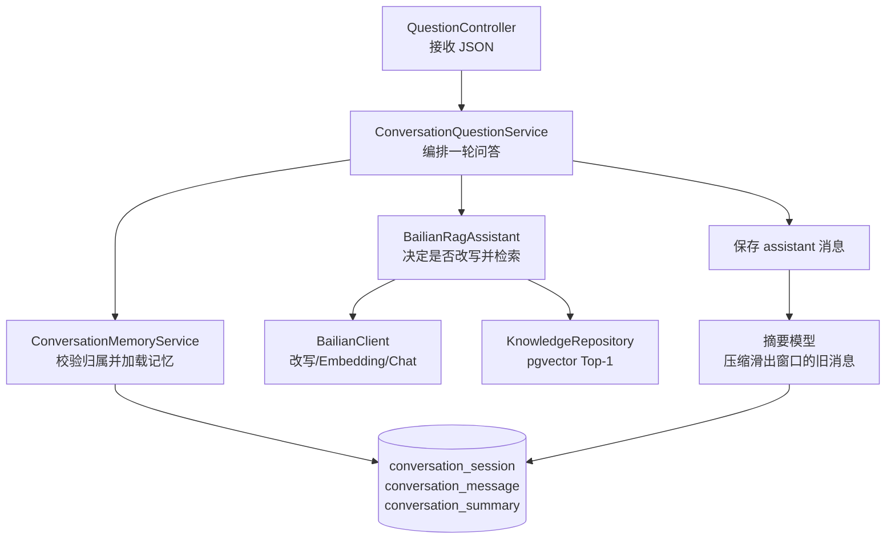

# 第 13 课：用户追问时，系统要知道“那”是什么

## 1. 先看两条问答通路

第 12 课解决的是知识怎样进入系统。本课不改变知识库和向量检索的后半段，而是解决一个新问题：用户连续提问时，第二句经常省略主语；如果每次都从零开始，模型不知道“那”指什么。

本课先把同步 `POST /api/questions` 做成有记忆版本，SSE 流式消息的中断终态暂时保持第 7 课行为。

```text
第一轮问答
POST /api/questions
  {question, knowledgeBaseId, userId}
→ ConversationQuestionService 创建 conversationId
→ ConversationMemoryService 保存 user 消息
→ BailianRagAssistant 没有历史，直接把原问题向量化
→ KnowledgeRepository 用 pgvector 找证据
→ 百炼根据证据生成回答
→ ConversationMemoryService 保存 assistant 消息
→ 返回 conversationId，供下一次追问使用

后续追问
POST /api/questions
  {question, knowledgeBaseId, conversationId, userId}
→ ConversationMemoryService 校验会话属于 userId
→ 读取“旧摘要 + 最近一轮原文”
→ BailianClient 把“那可以拆开用吗？”改写成独立问题
→ 只把改写后的问题交给 Embedding 和 pgvector
→ 百炼根据命中的证据生成回答
→ 保存本轮 user/assistant 消息

历史变长
→ 最近窗口之外的旧消息交给摘要模型
→ conversation_summary 保存摘要和最后覆盖的 messageId
→ 下一次只加载摘要 + 最近原文，不把全部历史发给模型
```

一句话概括：

> 数据库保存完整会话，模型每轮只看到一份有界记忆；旧内容用摘要保留，最近内容保留原文，省略追问先改写再检索。

## 2. 本课需求为什么现在出现

第 6～12 课的问答请求互相独立。下面两次请求在服务端没有任何关系：

```text
问题一：连续工作满一年有几天年假？
问题二：那可以拆开用吗？
```

第二句单独拿去做向量检索时，“那”和“拆开用”没有明确对象，可能找不到年假规则，也可能命中其他“拆分”内容。

最简单的修复是把全部历史直接拼到每次模型请求里，但历史会不断变长，带来三个具体问题：

1. 请求越来越大，模型输入成本和延迟增加。
2. 历史越多，真正重要的新问题越容易被淹没。
3. 服务重启后如果历史只在内存，连续对话又会断掉。

因此本课加入三种当前确实需要的数据：

- `conversation_session`：会话归属和标题；
- `conversation_message`：完整 user/assistant 原文及稳定顺序；
- `conversation_summary`：已经滑出近期窗口的压缩结果和水位。

本课不实现登录、权限系统、长期记忆事实抽取，也不做第 14 课的意图识别和多知识库路由。`userId` 暂时由请求字段传入，只用于教学演示“不同用户不能读取同一个会话”；真实系统应该由认证后的身份上下文提供，而不是相信客户端随便填写的字符串。

## 3. 代码阅读顺序

先沿一条两轮真实 HTTP 流程建立全局认识，再看每层为什么这样分工：

1. `ConversationQuestionApiLiveIT.shouldRememberFollowUpAndIsolateAnotherUser`：看第一问、第二问的 JSON，模型改写结果，四条消息、摘要水位和 Bob 的 404。
2. `QuestionRequest`、`QuestionResponse`：看 `conversationId`、`userId` 和 `rewrittenQuestion` 如何进入/离开 HTTP。
3. `QuestionController.ask`：看有 `userId` 时进入会话问答，没有时保持旧的无记忆兼容路径。
4. `ConversationQuestionService.ask`：按顺序读“开会话 → load → append user → RAG → append assistant → compact”。
5. `ConversationMemoryService.open/load/append/compactIfNeeded`：看窗口大小、用户归属和摘要水位。
6. `ConversationMemory`、`ConversationMessage`、`ConversationSummary`：分清一次加载快照、完整消息和摘要不是同一类数据。
7. `ConversationRepository`：沿每条 SQL 看 `conversation_session`、`conversation_message`、`conversation_summary` 三张表读写。
8. `BailianRagAssistant.answerFromDatabase(..., ConversationMemory)`：看有历史才改写，没有历史直接检索。
9. `BailianClient.rewriteQuestion`：看模型收到的摘要、原文角色消息和当前追问。
10. `BailianClient.summarizeConversation`：看旧消息如何变成摘要，摘要不会替代完整消息表。
11. `V5__create_conversation_memory.sql`：最后回看表结构、索引和 `BIGSERIAL` 顺序编号。
12. `ConversationController`：看测试为什么可以读取消息和当前记忆窗口；它是观察入口，不是另一条问答链。

## 4. 重要对象怎样交接工作



按对象平铺直叙地说：

1. Controller 只负责把 JSON 交给正确的服务。它不读历史，也不拼 Prompt。
2. `ConversationQuestionService` 是本课的问答编排者。它先拿到会话编号，再加载本轮记忆，保存用户原话，调用 RAG，保存助手回答，最后触发摘要。
3. `ConversationMemoryService` 负责“哪些历史可以给模型看”。它不做向量检索，也不生成最终答案。
4. `BailianRagAssistant` 负责判断是否需要改写，并继续复用第 9～12 课已有的“问题向量 → pgvector → 证据 → Chat”链。
5. `BailianClient` 只负责百炼 HTTP/JSON 协议。它现在多了两个具体动作：查询改写和摘要生成。
6. `ConversationRepository` 负责把会话、消息和摘要可靠地读写 PostgreSQL。

### 对象职责表

| 对象 | 负责什么 | 不负责什么 |
|---|---|---|
| `QuestionController` | HTTP JSON 入口和兼容路径判断 | 不拼历史、不调用 SQL |
| `ConversationQuestionService` | 一轮问答的先后顺序 | 不实现数据库查询细节 |
| `ConversationMemoryService` | 会话归属、近期窗口、摘要水位 | 不决定知识证据 |
| `ConversationRepository` | 三张会话表的 JDBC 读写 | 不调用百炼 |
| `BailianRagAssistant` | 改写问题并复用 RAG | 不保存消息 |
| `BailianClient` | 改写/摘要/Embedding/Chat 的外部协议 | 不知道会话属于谁 |
| `ConversationMemory` | 本轮模型可以看到的有界快照 | 不代表数据库全部历史 |

## 5. 用测试输入观察中间数据

### 5.1 第一问

发送：

```json
{
  "question": "连续工作满一年有几天年假？",
  "knowledgeBaseId": "知识库编号",
  "userId": "alice"
}
```

因为没有 `conversationId`，服务生成 UUID，例如：

```text
conversationId = dbf52f10-...
```

数据库先写：

```text
conversation_session：id=dbf52f10...，user_id=alice
conversation_message：id=1，role=user，content=连续工作满一年有几天年假？
```

这次没有旧记忆，所以 `rewrittenQuestion` 与原问题相同。随后问题向量化，pgvector 命中：

```text
公司制度 / 年假规则
连续工作满一年后，每年有 5 天带薪年假，年假可以拆开使用。
```

模型回答后再写：

```text
conversation_message：id=2，role=assistant，content=连续工作满一年后，每年有 5 天带薪年假。
```

响应中携带 `conversationId`，客户端必须保存它。

### 5.2 第二问

发送：

```json
{
  "question": "那可以拆开用吗？",
  "knowledgeBaseId": "同一个知识库编号",
  "conversationId": "dbf52f10-...",
  "userId": "alice"
}
```

改写前加载到内存的是：

```text
summary = null
recentMessages = [
  user: 连续工作满一年有几天年假？
  assistant: 连续工作满一年后，每年有 5 天带薪年假。
]
```

发给“查询改写”模型的核心输入是：

```text
system：结合历史，把当前追问补全成可以独立检索的一句话，只输出改写后的问题。
user：连续工作满一年有几天年假？
assistant：连续工作满一年后，每年有 5 天带薪年假。
user：当前追问：那可以拆开用吗？
```

一次真实返回是：

```text
连续工作满一年后享有的5天年假是否可以拆分使用？
```

只有这句改写后的问题进入 Embedding 和 pgvector。模型最终回答是“可以拆分使用”，然后数据库新增 `id=3 user` 和 `id=4 assistant`。

### 5.3 摘要水位

为了让测试清楚观察摘要，测试临时配置：

```text
recent-turns=1
summary-trigger-turns=2
summary-max-chars=200
```

第二轮结束后，最近 1 轮是消息 3、4，所以消息 1、2 滑出窗口。摘要模型看到消息 1、2，返回例如：

```text
用户询问连续工作满一年的年假天数，已确认为5天带薪年假。
```

数据库保存：

```text
conversation_summary.last_message_id = 2
conversation_summary.content = 上面的摘要
```

下一次加载的记忆就会变成：

```text
summary：用户询问连续工作满一年的年假天数，已确认为5天带薪年假。
recentMessages：消息3、消息4
```

这里的 `last_message_id` 是水位，不是“摘要表的自增主键”。它表示摘要已经覆盖到消息 2；下次只摘要这个水位之后、再次滑出窗口的部分。

## 6. 三张表沿业务通路看

第一问创建会话：

1. `conversation_session` 写入会话编号、`user_id` 和标题。
2. `conversation_session` 与 `conversation_message` 没有跨模型调用的大事务；模型调用不能放在数据库事务里长时间占用连接。
3. `conversation_message` 先写 user，再调用模型，再写 assistant。
4. 每次追加消息时，`appendMessage` 用一个短事务同时插入消息并更新 `last_active_at`。

后续追问：

1. 从 `conversation_session` 读取归属，SQL 同时带 `id` 和 `user_id`。
2. 从 `conversation_summary` 读取最新摘要。
3. 从 `conversation_message` 按 `id DESC LIMIT recentTurns*2` 取最新原文，再在 Java 中翻转成升序。
4. 改写、Embedding、pgvector 检索和 Chat 都只在内存/外部模型中进行，不写会话表。
5. 生成回答后追加 assistant 消息。

摘要：

1. 统计 `conversation_message.role='user'` 的轮数。
2. 取最近窗口之前且大于旧水位的消息。
3. 调用摘要模型，仍不在事务中包住网络请求。
4. 用 `INSERT ... ON CONFLICT (conversation_id, user_id) DO UPDATE` 原子替换摘要正文和水位。

Bob 的请求即使知道 Alice 的 `conversationId`，所有读取都带 `user_id='bob'`，`conversation_session` 查不到归属，因此统一返回 404，不把“这个会话存在但你无权看”泄漏出去。

## 7. 技术问题逐个讲清楚

### 7.1 会话和一次请求有什么区别

一次请求是“现在问什么”；会话是“这些请求属于同一个连续话题”。`taskId` 只标识一次后台或流式运行，不能替代 `conversationId`：一个会话可以有很多轮，每一轮又可能产生一个不同的任务。

### 7.2 为什么要同时保存完整消息和摘要

摘要适合控制模型输入长度，但它可能丢失原句、顺序和细节。完整消息用于审计、回看、重新摘要和排错；摘要只是给下一轮模型使用的压缩视图。

所以本课不是“把旧消息改写后删除”，而是：

```text
完整消息表：长期事实
摘要表：当前模型的压缩入口
近期窗口：当前模型仍需看到的原文
```

### 7.3 `BIGSERIAL` 为什么比时间排序可靠

多条消息可能在同一毫秒写入，数据库时间戳不能单独保证顺序。本课用 PostgreSQL `BIGSERIAL` 自动生成递增 `id`，查询按 `id` 排序，摘要水位也记录这个 id。

### 7.4 为什么 `ConversationMemory` 不是简单的数据库 DTO

数据库里有完整消息、摘要和会话元数据；模型本轮需要的是“摘要 + 最近原文”这个加工后的视图。`ConversationMemory` 表示的是一次加载结果，不能直接当成整张消息表。

它的 `hasContext()` 也有具体职责：第一问没有旧内容时不调用查询改写模型，避免无意义的一次外部调用；第二问有历史时才进入改写链。

### 7.5 为什么先保存 user，再调用模型

这样服务即使在模型超时后重启，也知道用户已经提出过什么问题。代价是可能出现“只有 user、暂时没有 assistant”的不完整一轮；本课保留这个真实状态，后续如果需要重试和消息终态，再单独引入状态字段。

### 7.6 `record`、`List.copyOf` 和不可变快照

本课继续用 Java `record` 表达消息、摘要和记忆快照。它自动生成构造器、访问方法和 `equals`，适合“数据已经确定”的对象。

`ConversationMemory` 的 `recentMessages` 来自 `List.copyOf`，表示服务返回的窗口不应被调用方随意添加或删除。它和第 12 课 Context 的共同思想是：每次加载得到一份清楚的快照，而不是让多个层共享一只会被随意修改的列表。

### 7.7 为什么 userId 暂时放在请求里

教学项目还没有登录和 JWT，所以必须显式放一个用户标识，才能观察 Alice 和 Bob 的隔离。它只解决“数据库查询必须带谁的条件”这个本课问题，不是安全认证。真实系统应从已验证的登录上下文得到 userId，不能让客户端自己冒充别人。

### 7.8 查询改写和答案生成为什么是两次 Chat

两次调用解决不同问题：

```text
查询改写模型：把“那可以拆开用吗？”变成可检索的问题
答案模型：拿问题 + 检索证据，组织用户最终看到的回答
```

改写结果不是答案，也不应该直接展示给用户作为最终回复。本课把 `rewrittenQuestion` 放进响应，主要为了学习和测试观察；生产接口可以隐藏它。

### 7.9 为什么摘要失败不能让已经生成的答案失败

本轮回答已经生成并保存后，摘要只是为“下一轮”缩短输入的整理动作。`compactIfNeeded` 调用摘要模型时如果发生网络错误，就先保留完整消息和旧摘要，当前回答仍然正常返回；如果线程被中断，则恢复中断标记后结束本次压缩。这样把“主结果”和“后处理”分开，下一次满足条件时仍可以再次尝试摘要。

## 8. 环境与配置

本课没有新的插件或运行时安装。Docker、JDK、Maven、VS Code WSL 工作区和百炼永久 Key 沿用前面课程。

默认配置已写入 `src/main/resources/application.properties`：

```properties
ragent.memory.recent-turns=2
ragent.memory.summary-trigger-turns=4
ragent.memory.summary-max-chars=300
```

它们分别表示保留最近 2 轮、达到第 4 个用户问题后开始摘要、摘要最多 300 个字符。测试类用 `@SpringBootTest(properties=...)` 临时覆盖成 1、2、200，以便一条测试就看到摘要；这不会修改你的永久配置。

摘要和查询改写都会调用百炼，因此点击真实测试前确认 API Key、Docker Desktop 都正常。测试不会打印 API Key。

## 9. 用 VS Code 绿色按钮验收

1. 打开 [ConversationQuestionApiLiveIT.java]，点击类名左侧绿色三角。
2. 等待临时 pgvector 容器、Spring 随机端口和百炼调用完成。预期 1 个测试全绿。
3. 测试输出应看到：第一问响应、第二问的 `rewrittenQuestion`、4 条按顺序消息、摘要和近期窗口，以及 Bob 的 404。
4. 若模型改写用词变化，只要 `rewrittenQuestion` 补回“年假”、来源仍为“公司制度 / 年假规则”即可。
5. 你也可以单独点击 [QuestionApiLiveIT.java] 中原有的无 `userId` 测试，确认旧的无记忆兼容路径仍然工作。

备用命令：

```bash
mvn -Dtest=ConversationQuestionApiLiveIT test
mvn -Dtest=QuestionApiLiveIT test
```

失败时请复制最底层 `Caused by`，并说明失败发生在上传、第一问、改写、摘要还是用户隔离请求。

## 10. 本课完成标准

- 同一 `conversationId` 的两轮消息能按 user → assistant → user → assistant 保存；
- 第二问在进入 Embedding 前已经补回第一问主题；
- 摘要有明确 `lastMessageId` 水位，模型记忆只包含摘要和近期窗口；
- Bob 不能读取 Alice 的会话；
- 旧的无 `userId` 请求仍能走前面课程的无记忆路径；
- 你能解释完整消息、摘要、近期窗口和一次问答任务的区别。

本课测试和理解完成后，姐姐会暂停等你指定提交文本；没有你的提交信息，不会替你编写 commit message。
