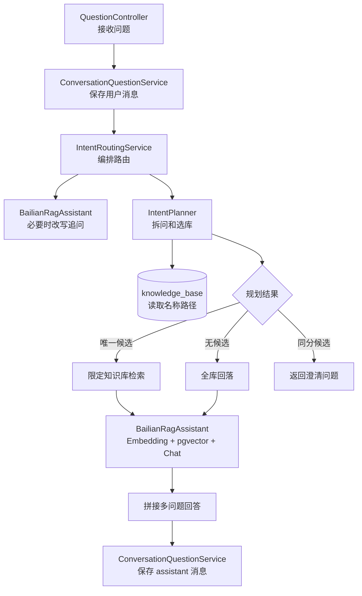

# 第 14 课：知识库变多后，先弄清用户到底在问什么

## 1. 先看三种问答通路

第 13 课让系统记住了上下文，但现在出现了新的规模问题：知识库不再只有一个，用户的一句话还可能同时问两个领域。

本课新增的不是另一套 RAG，而是 RAG 前面的“意图规划”步骤。它先决定问题应该查哪里，再把决定交给原来的 Embedding、pgvector 和 Chat 链。

```text
多问题定向通路
POST /api/questions
  {question: "年假有几天，并且报销需要什么材料？", userId: "alice"}
→ ConversationQuestionService 读取会话记忆
→ BailianRagAssistant 必要时把追问改写成完整问题
→ IntentPlanner 按“并且”拆成两个子问题
→ 根据知识库名称“人事/年假”和“财务/报销”选择作用域
→ 每个子问题只在自己的知识库中做 Embedding 和 pgvector 检索
→ 每个子问题生成一个回答
→ IntentRoutingService 编号拼接回答并保存本轮消息

低置信度回落通路
问题没有命中任何知识库名称
→ 不武断地拒绝
→ IntentPlan 的 knowledgeBaseIds 为空
→ KnowledgeRepository 把空列表解释为全部知识库
→ 全库向量检索后再生成回答

歧义澄清通路
“年假怎么申请？”同时命中“人事/年假”和“福利/年假”
→ 两个候选得分相同
→ 标记 clarificationRequired=true
→ 直接返回“请先选择知识库”
→ 本轮不调用错误知识库的 Embedding 和 Chat
```

一句话概括：

> IntentPlanner 决定“查哪里”，BailianRagAssistant 继续负责“怎么查和怎么回答”；没有把两个职责揉进同一个大方法。

## 2. 为什么第 13 课之后还需要这一课

如果所有知识都放在一个全库里，向量检索只能从“所有片段”中找最相似的一条。知识库变多后，会出现三个具体问题：

1. 人事库和财务库可能都有“申请”“规则”“额度”等相似词，全库 Top-1 可能把无关部门的内容送给模型。
2. 用户一句话可能同时问“年假”和“报销”，整句只做一次检索时，一个主题可能把另一个主题压掉。
3. 两个知识库都叫“年假”时，系统如果偷偷挑一个，用户无法知道回答来自哪个部门。

因此本课加入一个很小但清晰的中间结果 `IntentPlan`。它不是最终答案，而是“这一小段问题应该查哪些库”的计划：

```text
用户问题
  ↓
子问题：年假有几天
作用域：人事/年假
信心：0.9

子问题：报销需要什么材料
作用域：财务/报销
信心：0.9
```

本课暂时采用知识库名称路径中的词作为可解释规则，例如 `人事/年假`。这是教学上故意选择的最小实现：先把数据流、作用域和失败边界跑通，再考虑让模型参与更复杂的分类。否则一开始就让模型返回一棵不可预测的意图树，出了错很难知道是拆问错、选库错还是检索错。

本课不实现动态意图树管理页面、复杂权限、最终答案二次合成，也不改造第 7 课的流式接口。多问题回答先分别生成，再由 Java 编号拼接，避免提前引入又一个模型调用。

## 3. 代码阅读顺序

请先沿一条真实 HTTP 流程建立全局认识，再看每个新增对象：

1. `IntentRoutingApiLiveIT.shouldRouteSubQuestionsAndExplainAmbiguity`：看两个知识库、三个请求和响应中的 `intentPlans`。
2. `QuestionRequest`、`QuestionResponse`、`IntentPlan`：看请求怎样允许省略 `knowledgeBaseId`，响应怎样把规划中间数据带出来。
3. `QuestionController.ask`：看带 `userId` 的会话请求现在可以不指定知识库；无状态旧请求仍保持原路径。
4. `ConversationQuestionService.ask`：看它把 RAG 前置工作交给 `IntentRoutingService`，消息保存顺序没有改变。
5. `IntentRoutingService.answer`：看“改写 → 规划 → 歧义短路 → 分别回答 → 拼接”的主流程。
6. `IntentPlanner.plan`：看连接词拆分、知识库名称打分、低置信度和同分歧义。
7. `KnowledgeRepository.findAllKnowledgeBases`：看规划器从哪里得到候选知识库名称。
8. `KnowledgeRepository.searchTopOneInKnowledgeBases`：看非空列表生成 `IN (?, ?)` 作用域，空列表不拼条件而回落全库。
9. `BailianRagAssistant.answerFromDatabase(List<String>)`：看原有 RAG 怎样复用新的作用域列表。
10. `V5` 以前的知识库表结构：本课没有新增表，作用域来自已有 `knowledge_base.id/name`。

## 4. 新增对象怎样交接工作



按对象平铺直叙地说：

1. `QuestionController` 只判断请求是否进入会话问答，不负责理解问题。
2. `ConversationQuestionService` 仍然负责一轮会话的先后顺序：开会话、读记忆、保存 user、执行回答、保存 assistant、整理摘要。
3. `IntentRoutingService` 是本课新增的编排者。它不写 SQL，也不组装百炼 JSON，只把几个动作按顺序连起来。
4. `IntentPlanner` 只负责规划，不负责实际向量检索。它输出 `IntentPlan`，让后续对象知道每个子问题能查哪些库。
5. `KnowledgeRepository` 负责两类数据库动作：读取所有知识库名称，以及按照规划出的 ID 做 Top-1 检索。
6. `BailianRagAssistant` 继续复用原有的 Embedding、pgvector 和答案生成；它只是把“一个知识库编号”扩展成“一个允许访问的编号列表”。
7. `ConversationMemoryService` 和第 13 课职责不变。它只提供上下文，不参与知识库路由。

| 对象 | 本课新增或保留的职责 | 明确不负责什么 |
|---|---|---|
| `IntentPlanner` | 拆分子问题、按名称路径评分、标记回落或歧义 | 不调用模型、不做向量检索 |
| `IntentPlan` | 保存一个子问题的作用域决定和置信状态 | 不代表最终答案 |
| `IntentRoutingService` | 编排改写、规划、检索和多答案拼接 | 不直接写数据库 |
| `KnowledgeRepository` | 读取知识库名称，按 ID 列表检索 | 不判断用户意图 |
| `BailianRagAssistant` | 在给定作用域中完成 Embedding、检索、回答 | 不拆分问题、不处理澄清 |
| `ConversationQuestionService` | 保存会话消息并调用路由服务 | 不把路由细节塞进 Controller |

## 5. 用测试输入观察中间数据

### 5.1 一个请求拆成两个子问题

测试先创建：

```text
人事/年假
财务/报销
```

再发送：

```json
{
  "question": "年假有几天，并且报销需要什么材料？",
  "userId": "alice"
}
```

`IntentPlanner` 输出两个计划：

```text
计划一：
question = 年假有几天，
knowledgeBaseIds = [人事/年假的 ID]
confidence = 0.9

计划二：
question = 报销需要什么材料？
knowledgeBaseIds = [财务/报销的 ID]
confidence = 0.9
```

之后发生两次“问题向量化 → 作用域内 Top-1 → Chat”：

```text
人事/年假 → 年假规则 → 连续工作满一年有 5 天带薪年假
财务/报销 → 报销规则 → 需要发票和出差申请单
```

最后 Java 直接拼接：

```text
根据不同知识库分别回答：
1. 根据提供的证据，连续工作满一年有 5 天带薪年假。
2. 报销需要发票和出差申请单。
```

这里的 `intentPlans` 是教学观察字段。它让你能看到系统究竟把问题送到了哪一个库；生产接口可以只返回答案和来源。

### 5.2 没有命中时为什么回落全库

发送：

```json
{
  "question": "公司制度如何更新？",
  "userId": "carol"
}
```

如果问题没有命中任何知识库名称，规划结果是：

```text
knowledgeBaseIds = []
confidence = 0.0
fallbackToAll = true
```

这里空列表有特别含义：不是“禁止查询”，而是“不要在 SQL 中添加知识库过滤条件”。因此 SQL 仍然可以从所有成功片段中做向量排序。

低置信度回落的核心原则是：

> 不能因为规划器没有认出领域，就比全库检索更早地拒绝用户；先扩大范围，再让证据门槛决定是否能回答。

### 5.3 同名候选为什么先澄清

再创建一个空知识库：

```text
福利/年假
```

此时发送：

```json
{
  "question": "年假怎么申请？",
  "userId": "bob"
}
```

“年假”同时命中两个名称路径，两个候选分数相同：

```text
clarificationRequired = true
knowledgeBaseIds = [人事/年假 ID, 福利/年假 ID]
answer = 你提到的“年假”可能属于多个知识库，请选择...
```

本轮不会执行 Embedding，也不会把两个库的内容混在一起交给 Chat。先问清楚作用域，下一次请求再带上用户选择的 `knowledgeBaseId`。

## 6. SQL 和数据流怎么对应

本课没有新建数据库表，因为知识库已经有编号和名称：

```text
knowledge_base
  id   → 作用域过滤条件
  name → 意图规划器可观察的领域路径

knowledge_document
  status=success → 只有成功文档的片段参与检索

knowledge_chunk
  embedding → 在限定库或全库中进行 pgvector Top-1
```

规划器先执行：

```sql
SELECT id, name
FROM knowledge_base
ORDER BY name, id
```

如果得到唯一候选，例如人事库，检索 SQL 会附加：

```sql
AND d.knowledge_base_id IN (?)
```

如果有两个允许库，则是：

```sql
AND d.knowledge_base_id IN (?, ?)
```

如果是低置信度回落，作用域列表为空，SQL 不附加这条条件。这样“回落全库”不是另写一条几乎相同的 SQL，而是由同一个查询根据列表决定是否增加过滤条件。

本课没有把百炼网络请求放进数据库事务。每个子问题都是：读取库名 → 规划 → Embedding → 短 SQL 查询 → Chat；数据库连接不会被外部模型调用长时间占用。

## 7. 技术问题逐个讲清楚

### 7.1 “意图”在这里到底是什么

这里的意图不是用户的情绪，也不是完整的业务流程。它只表示：

```text
用户这句话要查哪个领域、哪个知识库作用域？
```

例如：

```text
年假有几天 → 人事/年假
报销需要什么材料 → 财务/报销
```

所以本课要区分两个问题：

- “查哪里”：`IntentPlanner`
- “怎么查”：`BailianRagAssistant`

### 7.2 为什么不让 `BailianRagAssistant` 自己拆问

`BailianRagAssistant` 已经负责向量化、检索和答案生成。如果再把连接词拆分、候选库评分、歧义判断塞进去，它会同时承担“理解问题”和“执行检索”两个变化方向。

本课把规划单独放在 `IntentPlanner`，以后可以替换规则而不改 RAG 主链。哪怕未来把本地规则换成模型分类器，`IntentRoutingService` 仍然只接收 `IntentPlan`。

### 7.3 为什么低置信度是全库回落，不是直接报错

规划只是一个前置判断，不是真理。知识库名称可能没有写出用户使用的同义词，或者用户问题本来就很泛。如果此时直接返回“无法识别意图”，会把本来能由向量检索回答的问题挡住。

因此本课使用三个状态：

```text
唯一候选 → 定向检索
没有候选 → 全库回落
同分候选 → 先澄清
```

### 7.4 为什么同分候选必须澄清

把两个同分知识库的片段一起交给模型，看起来“信息更多”，实际上会让答案来源混杂。更危险的是，系统可能只取其中一条 Top-1，却不告诉用户它是随机选中的。

澄清是一种可观察的状态：`clarificationRequired=true`。它不是异常，也不是 HTTP 500；它表示当前信息不足，需要用户补充选择。

### 7.5 `IN (?, ?)` 为什么不能直接把列表拼成字符串

`KnowledgeRepository` 使用 JDBC 参数占位符。知识库 ID 必须作为参数传入，而不是直接拼接到 SQL 字符串里：

```java
String placeholders = String.join(",", Collections.nCopies(ids.size(), "?"));
```

这段代码只生成 `?,?` 的形状，真实 ID 仍然放在参数列表里。这样保留了 JDBC 的参数绑定能力，不把外部输入直接拼进 SQL。

### 7.6 为什么 `IntentPlan` 是 record

规划结果是已经确定的一组数据：问题、候选库、置信度、回落标志、澄清信息。使用 `record` 可以自动生成构造器、访问方法和结构化的 `toString`，测试输出中能直接看到完整计划。

它不是一个会自己访问数据库或调用模型的“智能对象”。真正的动作仍由 `IntentPlanner` 和 `IntentRoutingService`完成。

### 7.7 为什么多问题先分别回答，而不是马上再调一个总结模型

本课主要学习“拆问和作用域”，如果再加一次最终答案合成，就会同时引入第三种模型输入和新的失败点。当前 Java 直接编号拼接，能清楚看见：每个答案分别来自哪个知识库。

以后如果用户体验需要统一语气，可以在证据都准备好以后再增加一个明确的合成步骤；那应该作为新的需求推动下一课，而不是提前设计。

## 8. 环境和测试说明

本课没有新的插件或语言运行环境。继续使用 JDK 17、Maven、VS Code Java 扩展、Docker Desktop、Testcontainers 和百炼永久配置。

真实测试会：

1. 自动启动临时 pgvector 容器；
2. 启动随机端口的 Spring Boot；
3. 真实上传两个 Markdown 文档；
4. 真实调用百炼 Embedding 和 Chat；
5. 打印三个路由结果。

打开 [IntentRoutingApiLiveIT.java]，点击类名左侧绿色三角。预期整个测试类只有 1 个测试通过。

也可以在终端运行：

```bash
mvn -Dtest=IntentRoutingApiLiveIT test
```

普通回归测试仍然可以运行：

```bash
mvn test
```

如果失败，请优先复制最底层 `Caused by`，并说明失败是在上传、规划、定向检索、全库回落还是澄清请求。

## 9. 本课完成标准

- 一个请求可以拆成两个子问题，并分别生成 `IntentPlan`；
- 两个子问题分别进入对应知识库，而不是全库混检；
- 没有命中领域词时，`knowledgeBaseIds=[]` 表示全库回落；
- 同名候选不会静默选择，而是返回澄清提示；
- 旧的指定 `knowledgeBaseId` 请求和第 13 课会话记忆仍然工作；
- 你能清楚说出“查哪里”的规划层和“怎么查”的 RAG 层分别由谁负责。

本课测试和理解完成后，姐姐会等你指定提交文本；没有你的提交信息，不会擅自编写 commit message。
